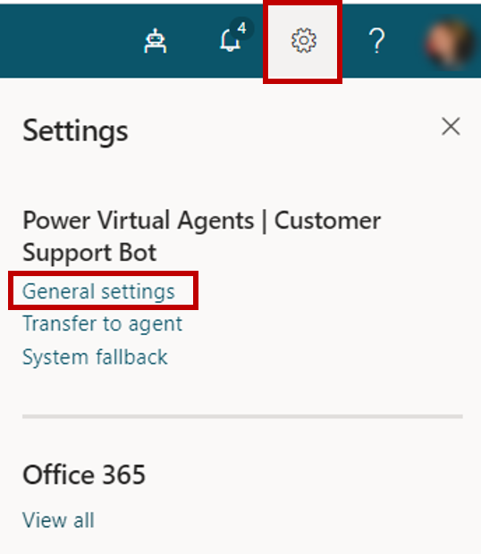
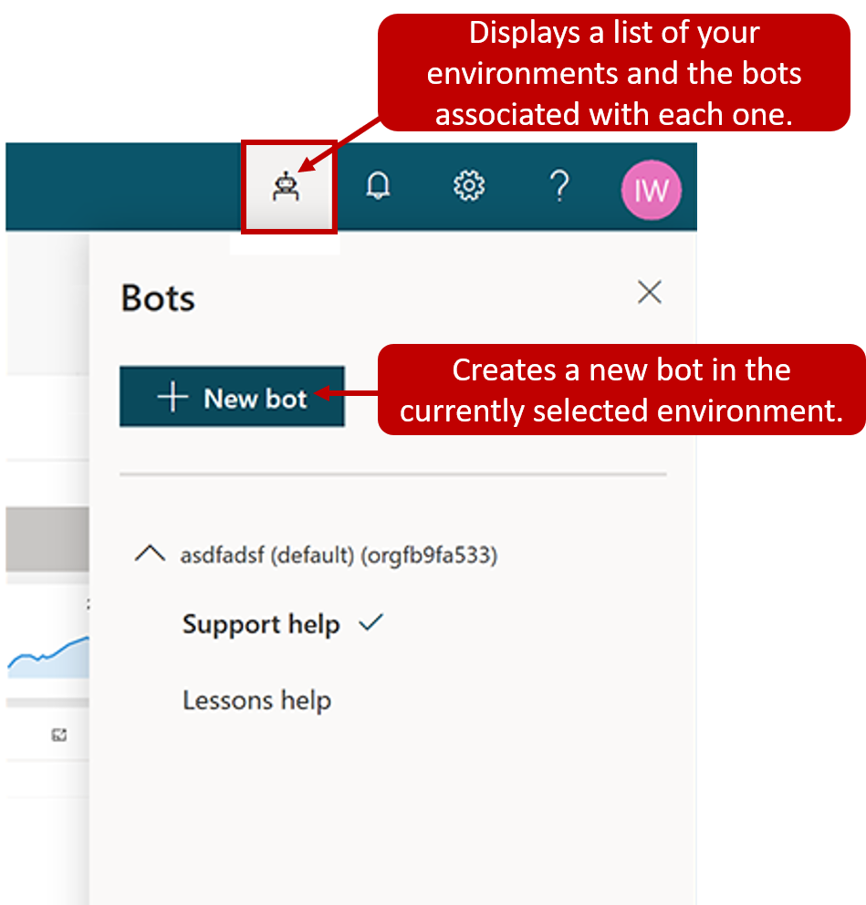
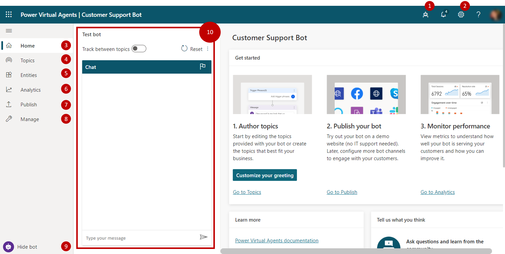

Before you start creating bots, it is important to consider what the bot is going to be used for. For example, will it be used to handle account inquiries? Will it be used for self-service support scenarios such knowledge base access? Not only will this help as you define and plot out conversation paths, but it helps to determine how many topics the bot will handle. Should it be able to look up basic account details, perform more advanced account operations, or will it be able to execute some type of action? The more you consider initially, the easier it is to determine the topics needed by your bot to facilitate it.

Bots are created by selecting the bot icon in the PVA interface. As mentioned previously, bots are created per environment. By default all bots will be created in the [default Power Apps environment for your organization or tenant](https://docs.microsoft.com/power-virtual-agents/environments-first-run-experience/?azure-portal=true) unless otherwise specified. You can select which environment to use by selecting more options to see a list of available environments.

> [!div class="mx-imgBorder"]
> 

In the **Create a new bot** dialog box, enter a name for your bot. Select **Create** to begin the bot-building process, which can take up to 15 minutes for the first bot you create in an environment. Subsequent bots take less than a few minutes to create.

> [!div class="mx-imgBorder"]
> 

## Deleting a bot

Bots that are no longer needed can be removed from your environment. This may happen in scenarios where it is being replaced with a different bot, or if the bot just does not fit the needs of your organization anymore. Use the bot icon on the top menu bar, and then select the bot you want to delete. The Delete Bot option is available from the Settings icon on the top menu bar and selecting general settings.

> [!div class="mx-imgBorder"]
> 

## Working with the Power Virtual Agents user interface

The Power Virtual Agent interface provides you with all the tools necessary to author, test, publish, and monitor the performance of your bot. When the application is loaded after the bot is created, you will see multiple areas that can be used to assist throughout process of working with your bot.

The image below, provides an example of what the user interface looks like:

> [!div class="mx-imgBorder"]
> 

1.  **Bots Panel:** Used to create and open existing bots across all your environments.

1.  **Settings:** Provides access to different PVA settings such as fallback topics and defining transfer to agent settings.

1.  **Home**: Navigates you to the main page of your bot. Here there are tools to assist in bot authoring, publishing, and performance monitoring. Learning content and training videos can also be accessed from here.

1.  **Topics:** Provides access to all user and system topics available for this bot.

1.  **Entities:** Provides access to all pre-built and custom entities that are available to be used by this bot.

1.  **Analytics:** Provides analytical details related to the performance and usage of the bot.

1.  **Publish:** Provides tools for publishing your bot and deploying it to different channels.

1.  **Manage:** Toolset that assists in management items such as which channels your bot is deployed to, bot authentication, and skills management.

1.  **Test/Hide bot:** Opens the test bot dialog where you can engage bot topics in real time.

1. **Test Bot panel:** Lets you test your bot topics to ensure that they are performing as expected.
