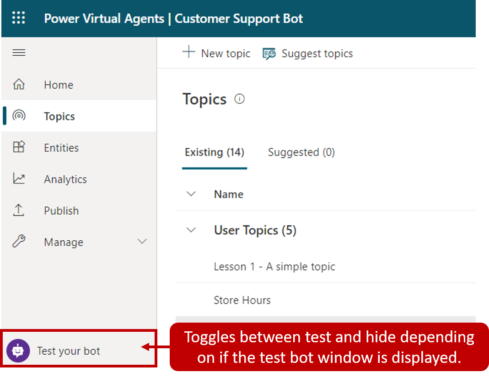
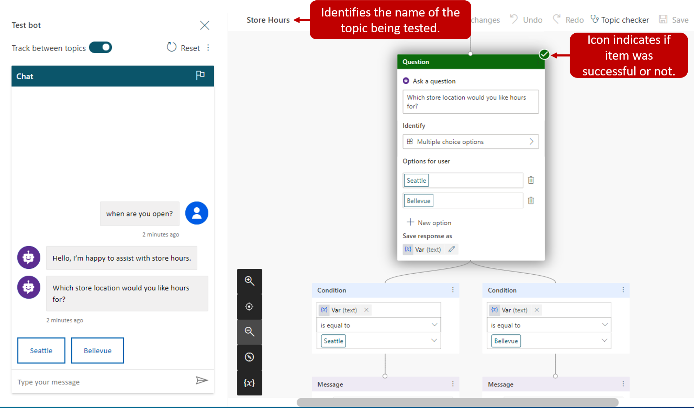

Since a bot is made up of multiple topics, it is important to ensure that each topic is working appropriately and can be interacted with as intended. For example, if you want to make sure that your 'Store Hours' topic is triggered when someone enters text asking about store hours, you can test your bot to ensure it responds appropriately.

You can test your bot in real time using the test bot panel. This is enabled by selecting Test your bot at the bottom of the side navigation pane. Once it is displayed, the button changes to Hide your bot so you can hide it if more space is needed while authoring.

> [!div class="mx-imgBorder"]
> 

The test bot window interacts with your bot topics just as an end user would. As you enter text into the test bot window, information will be presented as it would to an end user. Your bot is likely going to contain multiple topics. As you engage with a specific topic, it can be handy to have the application take you to that topic. This is done by turning on Track between topics at the top. This follows along with the bot as it executes the different topics. For example, typing 'hello' would fire the greeting topic, the application will open the Greeting topic and display its conversation path in the window. If you were to type 'When are you open?' the application will switch, and the Store Hours topic will be displayed. As each topic is displayed, you can see how the path is progressing and evaluate how your topics are doing.

> [!div class="mx-imgBorder"]
> 

In the Image below, we sent the message "when are you open?' to the bot. You can see that we are automatically taken to the Store Hours topic. The conversation path is highlighted in green. The bot is now waiting for you to respond and has provided two suggestion buttons on how to respond. These suggestion buttons reflect the Seattle and Bellevue user options we defined when the topic was authored. In the test bot, you can select either of these suggestion buttons to continue.

> [!div class="mx-imgBorder"]
> 

As you select an option, you continue down the conversation path until you reach the end. The chat will stop once you reach the bottom of this branch.

By testing your bots often throughout the both creation process, it is easy to ensure that the conversation is always flowing as anticipated. If the dialog does not reflect your intention, you can change the dialog, and save it. The latest content will be pushed into the test bot, and you can try it out again.
