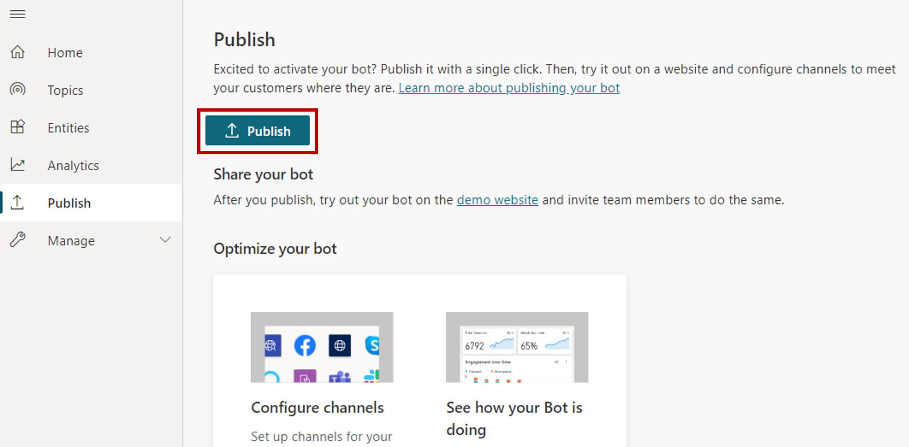

After your bot content has been authored, it needs to be published to allow customers to engage with it. Published bots can be made available across multiple platforms and channels. Before a bot can be added to channels, interacted with, or shared with team members, it will need to be published at least once. For example, a bot can be deployed to organizational websites, mobile applications, and messaging platforms such as Microsoft Teams or Facebook.

Publishing bots as you make changes also ensures customers are engaging with the latest bot content. For example, let's say that your organizations store hours change. After you edit the Store Hours topic to reflect the changes, you will need to publish it again from within the Power Virtual Agents application itself. Once published again, the updated content will be used by all channels the bot is inserted in or connected to.

## Publishing a bot

Once you are ready to publish your bot, select the Publish tab on the side navigation pane. During publishing, the bot will be checked for errors. Bot publishing typically takes less than a few minutes. Once the publish is successful, a green banner on the top of the page will be displayed that indicates everything worked correctly. If any errors are detected, you will be notified via a message displayed in the application.

> [!div class="mx-imgBorder"]
> 

Before the bot is deployed to the different channels that consum it, you might want to gain feedback from other team members. Once a bot is published the first time, it can be made available to the demo website. The demo websites URL can be provided to team members or stakeholders to try it out. The advantage to using the demo website is that the experience is different than testing the bot during the authoring process. Since the test bot experience is only intended to allow bot authors to test it, the demo website link increases the pool of users that can test and provide feedback related to the overall experience of the bot.

To add a bot to the demo website, click the demo website link under Share your bot. This is a webpage that demonstrates what your bot looks like to an end-user who comes to your webpage. The bot canvas is at the bottom. You can interact with it by typing into the window or by selecting a starter phrase from the provided options.

> [!div class="mx-imgBorder"]
> 

Now that the bot is published, you can begin to deploy it to other channels.

More information on [publishing your bot](https://docs.microsoft.com/power-virtual-agents/publication-fundamentals-publish-channels/?azure-portal=true) to other channels. 

## Analyze the performance of your bot

After a bot is deployed and customers are interacting with it, statistics related to the bot will become available. You can access this information through the Analytics tab in the side navigation pane. Here, you can find key performance indicators (KPIs) showing the volume of sessions your bot has handled, how effectively your bot was able to engage end-users and resolve issues, escalation rates to human agents, and abandonment rates during conversations. You will also find customer satisfaction information at the KPI level as well as in the Customer Satisfaction tab.

> [!div class="mx-imgBorder"]
> 

You can view detailed session history and transcripts by selecting Sessions from the Analytics tab. This enables you to download a file with the full session transcript. This can be a helpful way for you to tune the performance of your bot and change the content in your topics to improve your bot's efficiency.
