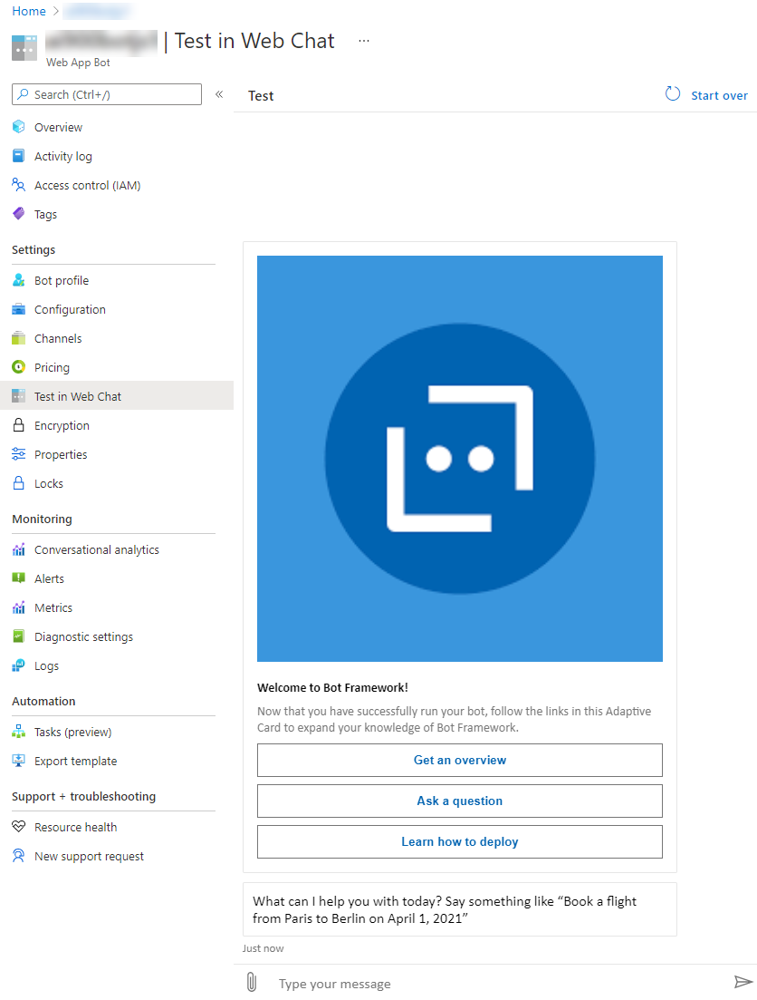
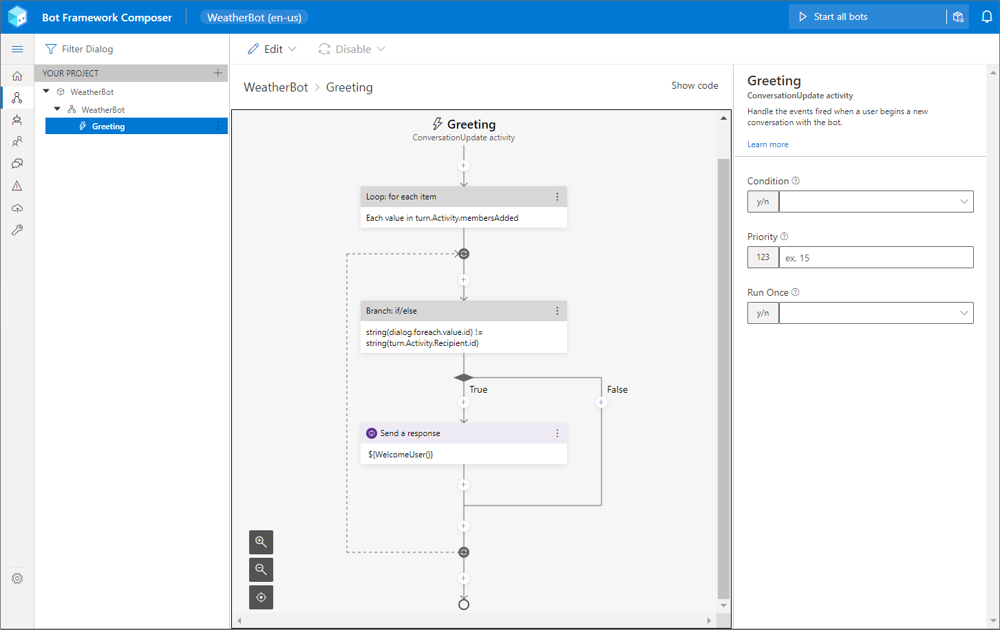
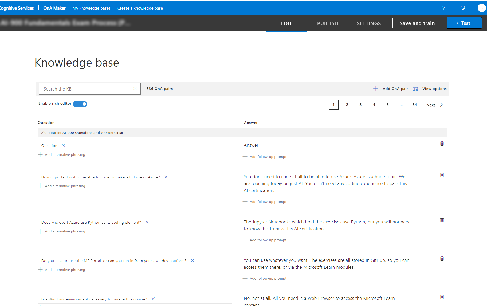
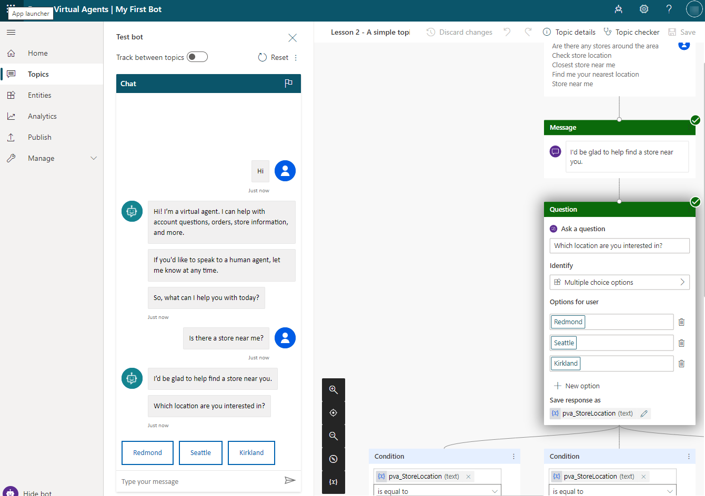

Microsoft provides many options for building chatbots:

- Azure Bot Framework
- Azure Bot Framework Composer
- Power Virtual Agents

## Azure Bot Framework

Microsoft Azure Bot Service is part of the Azure Bot Framework, a series of SDKs and tools that allows developers to create and deploy custom bots and virtual assistants by using code. Azure Bot Service is a managed service for developing bots.

A bot communicates by receiving messages and sending responses by using the Web Apps feature of Microsoft Azure App Service to handle communications. Bots are similar to web applications; they take requests and return responses. A bot can perform operations like other applications, such as accessing databases, calling APIs to other services, reading files, and performing calculations.

The process of receiving a message and sending a response back to the user is known as a *turn*. Consider how conversations between humans work, where each person speaks one at a time, that is, in turn. Bots operate the same way, responding to user input in turn.

A developer can connect an Azure Bot Service bot with the Language Understanding (LUIS) service within Azure Cognitive Services to add language understanding to a bot to allow for a conversational experience. A developer can also enable their bot to use a knowledge base that was created in QnA Maker.

An advantage of Azure Bot Service is that, after developers have built the bot, the bot can be deployed to one or more channels, such as Facebook or Slack, without having to change the bot’s code. Azure Bot Service manages the communication between these channels and your bots, and it adapts the messages that your bot generates to the format of the channel that it's connected to.

Bots that are created with Azure Bot Framework can be integrated with Power Virtual Agents bots.

### Bot Service templates

Bot Service includes templates to help developers get started with building bots. If you create a bot in the Azure portal, you can select the **Echo Bot** template that will only return user input, or you can select the **Core Bot** template that includes LUIS.

## Bot Framework Composer

Bot Framework Composer is a tool to build bots that uses a visual user interface to create the conversational flow and generate responses. Bot Framework Composer is a recent addition to Azure Bot Services and is the subject of ongoing development to add further features. 

Bot Framework Composer includes:

- A visual editing canvas for conversation flows.
- Tools to create and manage LUIS and QnA components.
- Powerful language generation and template system.
- A ready-to-use bot runtime executable program.

Bot Framework Composer can be used to build bots without the need to write code and it supports both LUIS and QnA Maker.

> 

Similarities exist between Power Virtual Agents and Bot Framework Composer. Both provide a no-code authoring canvas for users to build bots. However, key differences are present in the functionality and look of both technologies. For instance, topics in Power Virtual Agents are similar to dialogs in Bot Framework Composer.

Bot Framework Composer is an open source and multi-platform service with support for Microsoft Windows, Linux, and macOS. For more information, see [Bot Composer on GitHub](https://github.com/microsoft/BotFramework-Composer/?azure-portal=true).

Bot makers can use Bot Framework Composer to create custom content and add it to Power Virtual Agents.

## QnA Maker

QnA Maker is a service that creates a searchable knowledge base from existing documents and websites. This knowledge base contains built-in natural language processing. The QnA Maker knowledge base can then be used in bots and other applications to respond to FAQ-type questions.

> 

QnA Maker does not provide a bot, but you can generate an Azure Bot Service bot from your QnA Maker knowledge base in a few minutes without having to write code.

A knowledge base consists of question-and-answer pairs. You can create the questions and answers in many different ways:

- Extraction from existing documents
- Extraction from webpages
- Manual input

QnA Maker knowledge bases can be integrated with Power Virtual Agents bots with Power Automate.

## Power Virtual Agents

Power Virtual Agents chatbots are powered by AI, which allows users to focus on more complex and higher-value work while the chatbots handle simple repetitive interactions. With Power Virtual Agents, you can create chatbots by using a straightforward, no-code, graphical interface from within a web browser.

Power Virtual Agents chatbots interact with customers and employees, answer questions, and provide information. You can deploy Power Virtual Agents chatbots to multiple channels, including your own website, Facebook, and Microsoft Teams.

You can create Power Virtual Agents chatbots without the need for data scientists or developers.

> 

Power Virtual Agents is built on top of Azure Bot Framework and uses the capabilities of the Bot Framework in a no-code environment.

Power Virtual Agents can meet many simple internal and external requirements for chatbots, and it is designed to be built with, or by, subject matter experts (SMEs).

Power Virtual Agents is licensed for each tenant and you are charged based on the number of billed sessions for each tenant each month. Additionally, you can purchase an initial entitlement of 2,000 sessions and more capacity.

Solution architects need to determine which bot technology, or combination of technologies, to use in the solution. This decision will depend on the available skills, if existing bots have already been deployed, and the complexity of the required bots.
