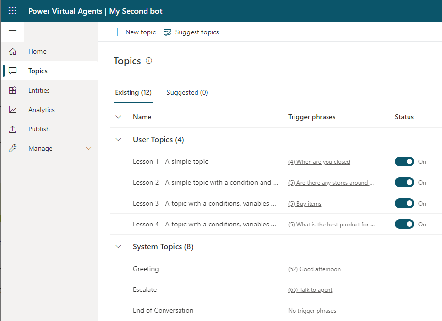
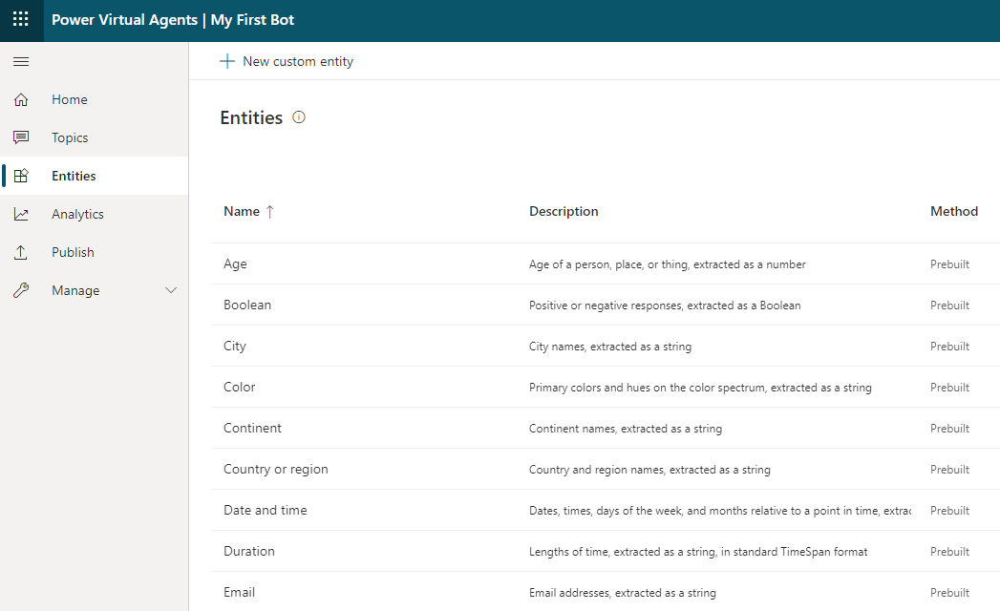
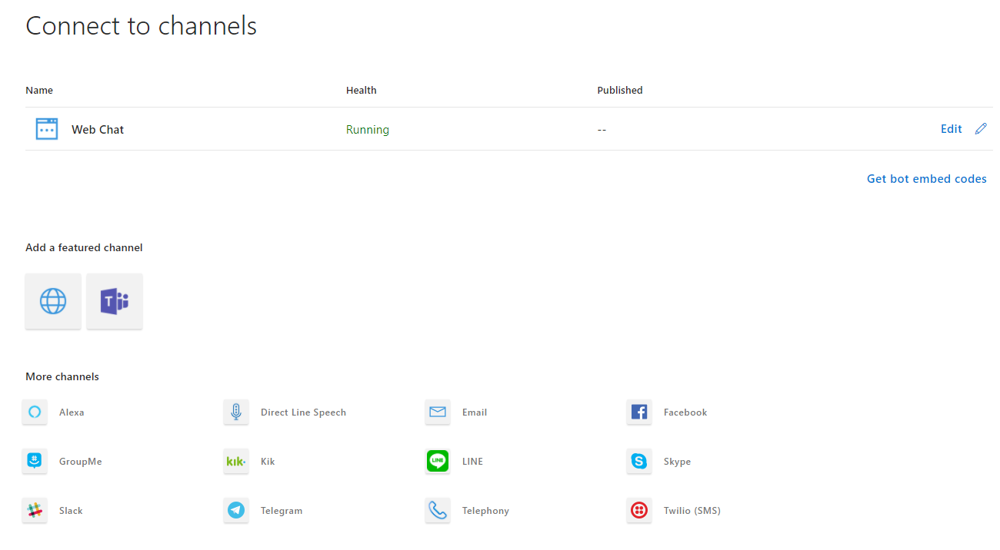

When creating chatbots, you need to consider some import concepts before building your chatbot.

## Language understanding

When humans interact with a computer application by using text or speech, they should not be expected to use the application’s internal instructions. A computer application must be able to handle language that is provided in a natural way and react accordingly to the meaning that the human has expressed. Natural language processing, an AI capability, provides a connection between human and computer language, and it allows humans and computer applications to work together in a natural way.

Power Virtual Agents hosts multiple AI models and AI capabilities, the core of which is a transformer-based natural language processing model. Power Virtual Agents uses the natural language processing of the Language Understanding (LUIS) service, which is part of Azure Cognitive Services.

Power Virtual Agents employs a language understanding model that uses an example-based approach that is powered by a deep neural model. This type of large-scale model only needs to be trained once with large amounts of data; afterward, it can be used for specific tasks that use fewer examples and no training. Specifically, for Power Virtual Agents, the use of this model allows for an intuitive way for bot makers to confidently work on their bot content without having to involve AI experts.

## Topics

Power Virtual Agents works by identifying the subject that the user is asking about and then having a conversation about that subject.

Topics are the main subjects of the conversation. A Power Virtual Agents chatbot can have up to 1,000 topics. Each topic is a separate conversation path. It is the combination of topics in a chatbot that provides a natural conversational flow. You can create topics for the tasks or requests that you need your chatbot to respond to.

Topics define the purpose of your chatbot and are the first step in creating your chatbot. A topic has two parts:

- **Trigger phrases** - The keywords, phrases, or utterances that the user will enter.
- **Conversation nodes** - Determine how your bot should respond.

Each topic has its own conversation flow with the bot. When a bot identifies a trigger for a topic, the conversation for that bot is initiated.

The use of the natural language processing model means that, in Power Virtual Agents, when you craft trigger phrases for a topic, you only need to provide a few examples, usually in the range of five to ten phrases for a single topic. Shorter trigger phrases are better, and you should aim for two to ten words. Additionally, you need to make sure that trigger phrases are semantically different; changing a single verb or noun could be enough to expand a topic's coverage. Adding elements like new articles (changing or adding *the* or *a* or *an*), changing capitalization, adding contractions (you're or don't), or adding plurals won't improve the triggering because contractions are already considered in the natural language processing model.

### Generate topics

Many organizations will have procedures, product information, frequently asked questions (FAQs), and other information in documents or on websites. Power Virtual Agents can extract information and create topics with trigger phrases by using the **Suggest topics** option.

> [!NOTE]
> If you are using Microsoft Dynamics 365 Customer Service Insights, you can select the topics from within Customer Service Insights and then add the topics and trigger phrases to your Power Virtual Agents chatbot.

## Entities

Power Virtual Agents attempts to extract information from the phrases that the user enters. This extracted information can be used to control the conversation's path. Power Virtual Agents uses entities to identify information in a textual phrase, such as names, dates, and numbers. Then, your chatbot can use this information to decide on the appropriate next step in the conversation.

Entities are people, places, and things that a chatbot can identify from the phrases that are entered into a chatbot. Power Virtual Agents includes a set of prebuilt entities for the most commonly used objects, and you can create custom entities for the domain of the business solution that you are building.

## Channels

Azure Bot Framework separates the logic of the bot from the communication with different services. When you create a bot, you can only use the bot when it's embedded on websites with the Web Chat channel. You can add channels to your bot to make it available on other platforms and services, known as channels.

One major benefit of Azure Bot Service is that you can develop your bot once and then connect to multiple channels without needing to change the code for each channel to handle the specific requirements and formats of that channel. Azure Bot Service handles those requirements and converts the formats.

The following channels are available for connection to bots:

- Alexa
- Direct Line
- Direct Line Speech
- Email
- Facebook
- GroupMe
- Kik
- Line
- Microsoft Teams
- Skype
- Slack
- Telegram
- Telephone
- Twilio (SMS)
- Web Chat

Power Virtual Agents can be deployed to the same channels.
