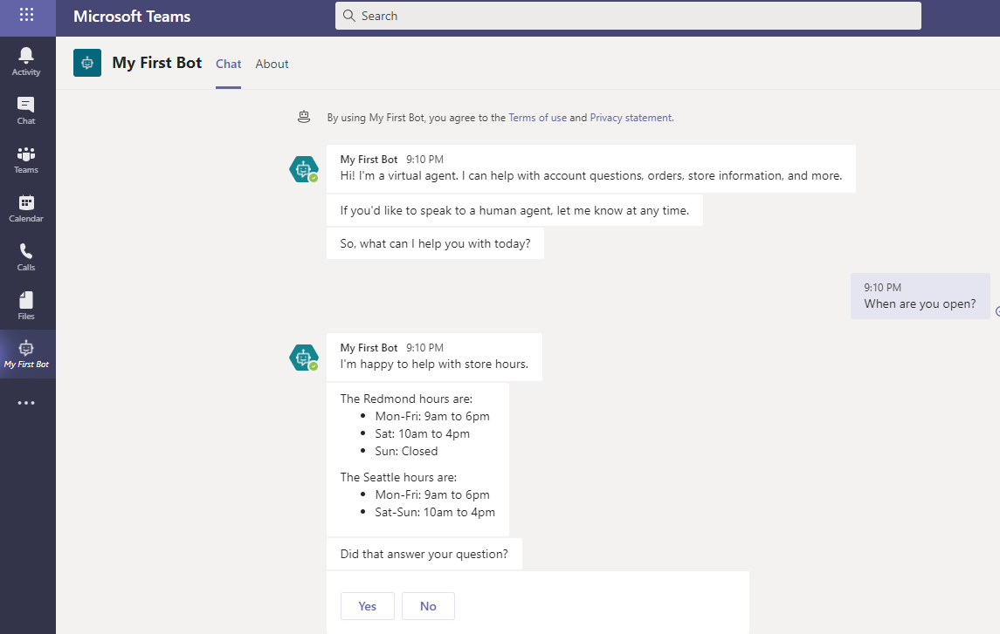

Power Virtual Agents is available as a standalone web app and as a discrete app within Microsoft Teams. Most functionality between the two apps is the same. However, you might have different reasons for choosing one version or the other based on your requirements.

## Power Virtual Agents web app

You will use the standalone Power Virtual Agents web app if you:

- Are an IT administrator or consultant and want to create bots for your customers to engage with.
- Want to create bots for external customers.
- Have used chatbot services in the past and want to trial or test Power Virtual Agents.
- Are familiar with advanced chatbot concepts, such as entities and variables, and want to create complex chatbots.

Access the [standalone web app](https://powerva.microsoft.com).

## Power Virtual Agents app in Microsoft Teams

You will use the Power Virtual Agents discrete app in Microsoft Teams if you:

- Are an employee or member of an organization or team and want to create chatbots to answer common questions that are posed by other employees or teammates.
- Want to use advanced concepts, such as entities and variables, but have the chatbot available only internally.
- Want to create and distribute a chatbot in the shortest time possible.

The Power Virtual Agents app in Microsoft Teams supports single sign-on (SSO), which means that chatbots can sign in the user silently without having the user enter their credentials.

Power Virtual Agents in Microsoft Teams does not require more licensing because the license is included with Microsoft 365 subscriptions.

> [!IMPORTANT]
> Access is limited to membership of the Microsoft team that the chatbot is deployed to. The chatbot can't be deployed to other channels.

### Limitations

Limitations of Power Virtual Agents in Microsoft Teams are that it:

- Is limited to the standard Power Automate connectors that are available for flows that are triggered from Power Virtual Agents.
- Can be integrated with Azure Bot Framework Skills, but it requires a Power Virtual Agents standalone license.
- Can't integrate Microsoft Bot Framework dialogs and it can't be used with Azure Bot Framework Composer.
- Can't be included in solutions.

### Service limits

Power Virtual Agents in Microsoft Teams is limited to 10 sessions for each user every 24 hours.
