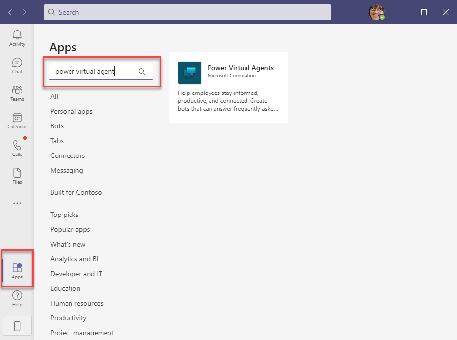
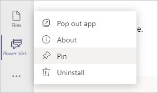
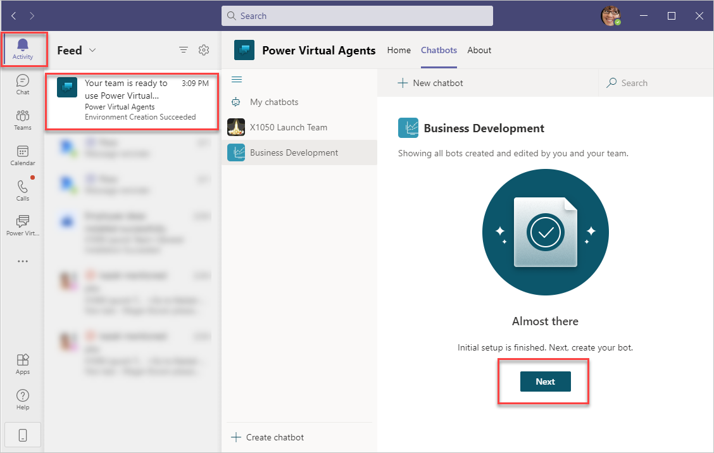
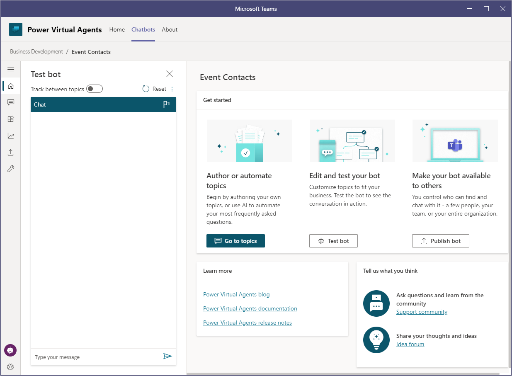

To create chatbots (also referred to as *bots*), first install the Power Virtual Agents app in Microsoft Teams. Power Virtual Agents allows you to:

-   Create and edit chatbots.

-   Test the chatbot to see how well it works.

-   Publish the chatbot to your team or organization.

-   Review the bot's performance over time, note the questions that are asked, and assess how well it's answering questions.

To install Power Virtual Agents for Teams:

1. Open Teams and then select **Apps** from the left navigation bar.
1. Enter **Power Virtual Agents** in the search box and then select it from the search results.
    
    > [!div class="mx-imgBorder"]
	> 

1. Select **Add** to install the Power Virtual Agents app in Teams.

> [!NOTE]
> Pin the **Power Virtual Agents** app in Teams for easier access. Select the app by selecting the ellipsis (**...**) and then selecting **Power Virtual Agents**. Right-click the **Power Virtual Agents** icon and select **Pin**.

> [!div class="mx-imgBorder"]
> 

## Create a new chatbot

To create a new chatbot, follow these steps:

1. Open the Power Virtual Agents for Teams app.

1. Select **Start now**.

1. Select the team to own and manage your chatbot from the drop-down list and then select **Continue**.
    
    When you're creating a new chatbot, team owners and the bot creator have read/write access by default. Team members only have read access to the chatbot.

    If this is your first time creating a chatbot or Power Apps application in the team, you'll receive a notification that the process will be slightly longer than usual while the system sets up. Select **Close** to continue and then wait a few minutes for Teams to notify you that the chatbot is ready. After setup has been completed, open the notification under **Activity** and then select **Next**.
    
	> [!div class="mx-imgBorder"]
	> 

1. Provide a **Name** and select the **Language** for the chatbot. For this example, use **Event Contacts** for the name. After you have set the chatbot's language, it can't be changed.

1. Select **Create** to complete creating a new chatbot.

From the Power Virtual Agents editor, you can manage topics, edit and test your chatbot, and then publish it to the rest of the team or the entire organization. Topics are how chatbot conversations transpire and they're covered in the next section.

> [!div class="mx-imgBorder"]
> 
