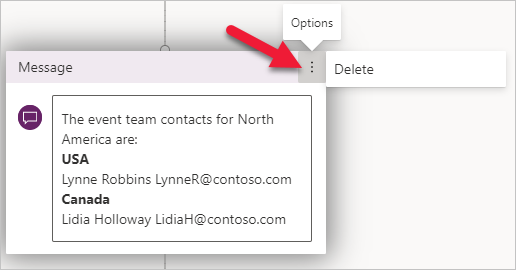
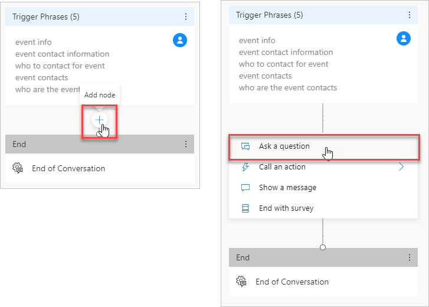
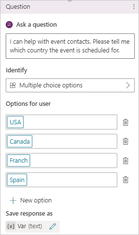
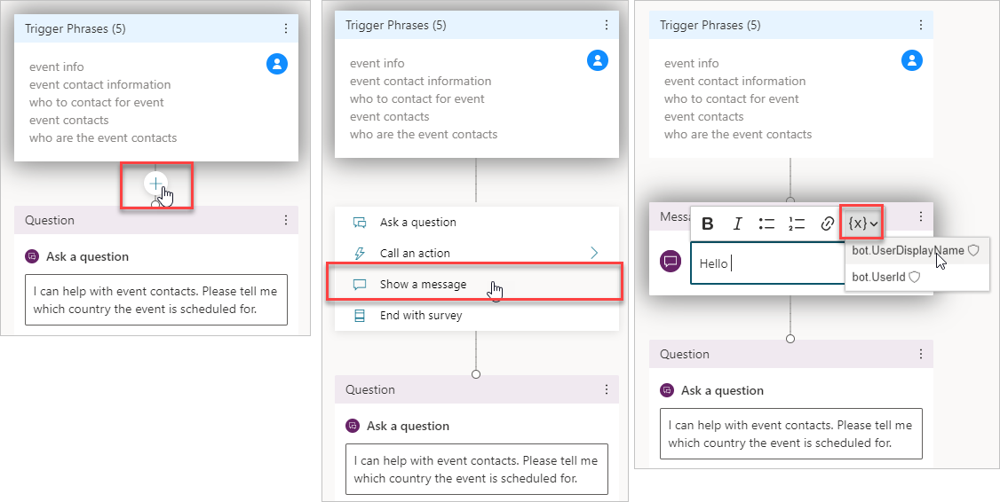
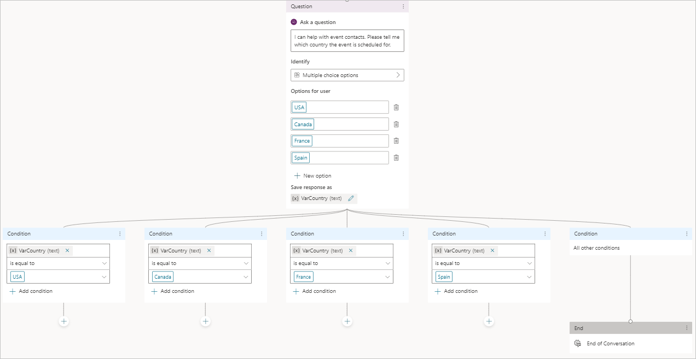
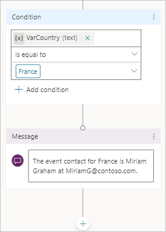
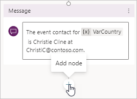
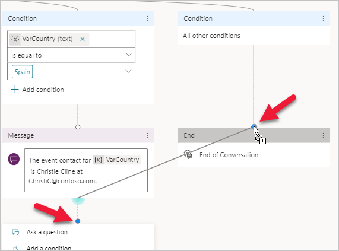
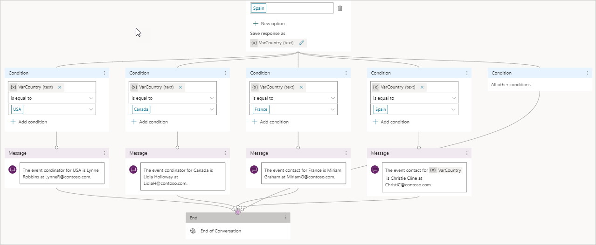

For your **Event Contacts** chatbot, you need to expand the number of countries that have contacts. Instead of listing all countries in the message node, you want to ask the user which country they need contact information for. To accomplish this task, you'll use inputs, variables, and conditions.

- **Inputs** - The user's response in the **Ask a question** node.

- **Variables** - Store the **Inputs** to use in later conversation nodes.

- **Conditions** - Define the branching logic based on variables.

For your chatbot, you need to delete the current message node because it will be replaced. Select the options ellipsis (**...**) for the message node and then select **Delete**.

> [!div class="mx-imgBorder"]
> 

## Add inputs and variables with the question node

To add inputs and variables with the question node, follow these steps:

1. Use the mouse to hover over the upper half of the line that connects the **Trigger Phrases** to the **End** node. Select the **Add node** plus **+** sign that appears and then select **Ask a question**.
    
    > [!div class="mx-imgBorder"]
	> 

1. Fill out the question node with the following information:

	  **Ask a question** - Enter the phrase, "I can help with event contacts. Please tell me which country the event is scheduled for."
	
	  **Identify** - Select **Multiple choice options**. The **Identify** field is where you indicate what type of response the chatbot is listening for. Other responses that you can select include a number or a string. You can even have the chatbot detect entities such as state names, phone numbers, or street addresses. To learn more about the different available options, see the links in the Summary unit at the end of this module.
	
	  **Options for user** - Enter **USA**, **Canada**, **France**, and **Spain** by selecting **+ New option** between each word.

	  Notice how the question box moves to the right of the screen as your options increase, and the child conditions populate the canvas below the question pane.  To recenter your canvas, you can left click and drag it, you can scroll, or you can use the screen view controls on the lower left of the canvas.  These controls include buttons to increase/decrease magnification, recenter the view, or even bring up a clickable mini map to help you navigate on your bot canvas.

	> [!div class="mx-imgBorder"]
	> 

1. To set the **variable** name, currently shown as **Var (text)**, select the text under **Save response as** and replace **Var** with **VarCountry** in the **Variable properties** fly in menu. Select the **X** to close the **Variable Properties** screen. The variable name stores the user's selection and will be used when the user configures the branching logic under the condition node.
    
    > [!div class="mx-imgBorder"]
	> 

Two variables are available by default: **bot.UserDisplayName**, which provides the user's name, and **bot.UserID**, which provides the user's sign in name. By using **bot.UserDisplayName**, the chatbot can call the user by name, which personalizes the experience. You can use **bot.UserID** to create a condition node to take actions based on which user whom the bot is interacting with.

To have the **Event Contacts** chatbot greet the user by name, add a new message node at the chatbot's beginning. Move your canvas so that you can view the Trigger Phrases node and add a node, then select **Show a message**. When entering information in the message node, select the **{X} insert variable** drop-down menu and select **bot.UserDisplayName**.

> [!div class="mx-imgBorder"]
> 

## Condition node

For each multiple-choice option in the question node, Power Virtual Agents creates a new condition node. You need to configure each condition node to provide the next appropriate response in the conversation.

> [!div class="mx-imgBorder"]
> 

For your **Event Contacts** chatbot, you need to respond with the event contact for the country. For example, if the user selects **USA**, then the chatbot should respond with Lynne Robbins' contact information.

|     Country    |     Name                 |     Email                    |
|----------------|--------------------------|------------------------------|
|     USA        |     Lynne Robbins        |     `LynneR@contoso.com`     |
|     Canada     |     Lidia   Holloway     |    `LidiaH@contso.com`       |
|     France     |     Miriam Graham        |     `MiriamG@contoso.com`    |
|     Spain      |     Christie   Cline     |     `ChristieC@contoso.com`  |

For each condition node, add a new message node after the condition that provides the correct contact and email address. For example, "The event coordinator for France is Miriam Graham at `MiriamG@contoso.com`."

> [!div class="mx-imgBorder"]
> 

For all four message nodes, you want to use the same **End of Conversation** system topic. Your chatbot already has this topic defined under the **All other conditions** node. To link other nodes to this one, perform the following steps:

1. After one of the message nodes, select the **Add node** plus **+** symbol.

    > [!div class="mx-imgBorder"]
	> 

1. Press and hold the left mouse button on the point where the line connects to the new node and drag it over to the same spot on the **End** node.
    
    > [!div class="mx-imgBorder"]
	> 

1. The editor adjusts the nodes to show that both are connected. Repeat the same steps for the other three message nodes. Your editor should now look like the following image.
    
    > [!div class="mx-imgBorder"]
	> 

To test the chatbot, select **Save**. Select the **Test bot** option if the chatbot testing pane isn't visible.
