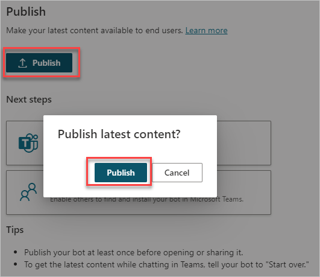
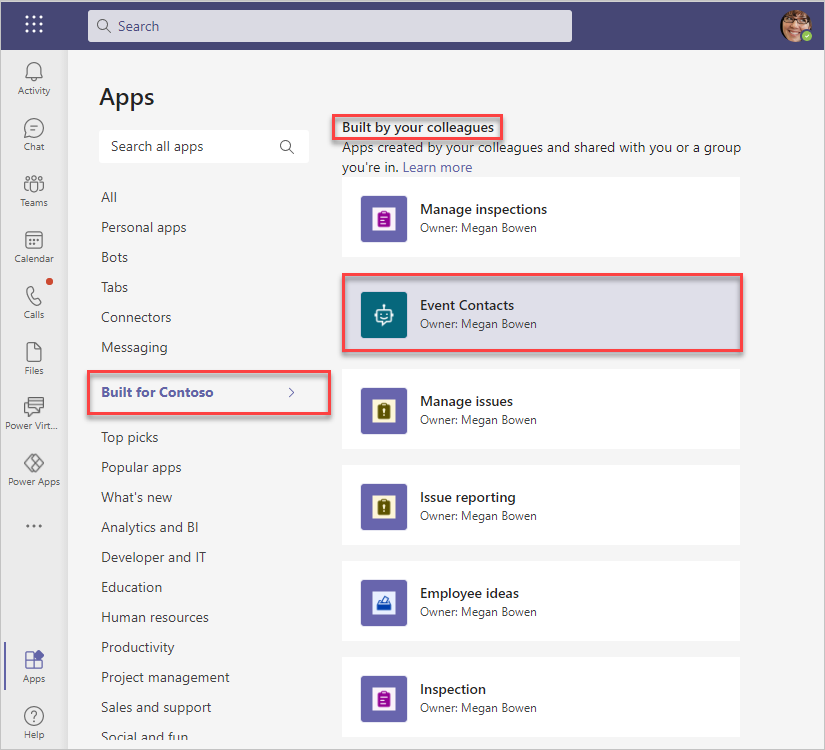
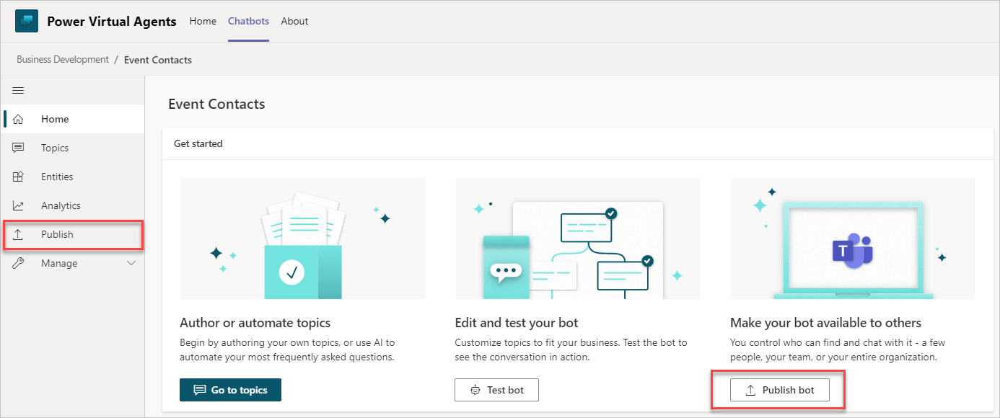
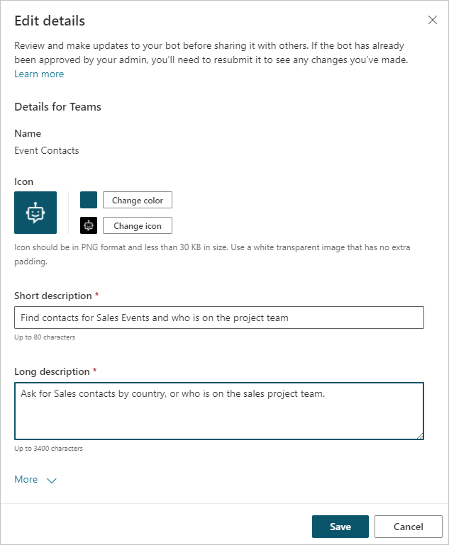
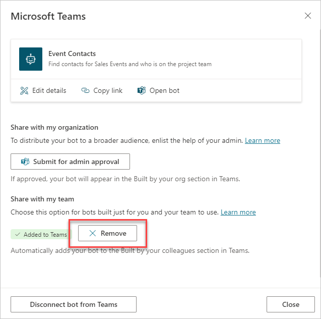

When the chatbot is ready, it needs to be published so that users can interact with it. Publishing is also required after you've edited the chatbot and you want users to be able to access the latest content. By having a published version, you can make future updates to the chatbot without impacting users.

The first time that the chatbot is published, only members of the team that the chatbot is associated with can access it. You can direct team members to the chatbot by providing them a link or by adding the chatbot to the **Built by your colleagues** section in Teams.

If the chatbot is for the whole organization, you'll submit it for review by your Teams admin. After it has been approved, the chatbot will be accessible to all users and will appear in the **Built by your org** section in Teams.

## Publish the chatbot

To publish the chatbot, follow these steps:

1. Open the chatbot for editing in the Power Virtual Agents app.

1. Select the **Publish bot** menu option or button.

1. Select the **Publish** button. In the **Publish latest content** confirmation window, select **Publish** to confirm.

   > [!div class="mx-imgBorder"]
   > 

If this is the first time that the chatbot is published, only team members can access it. If the chatbot is only intended for team members, you'll need to direct users on how to access it. Select **Share the bot** to select the best method for your situation:

-   **Copy link** - Send users a link to the chatbot.

-   **Add to a team** - Add the bot to a particular team. With this option selected, anyone in your team will be able to find the bot in the **Built by your colleagues** section in the Teams app store. 

-   **Show in Teams app store** - Make your bot appear in the Teams app store, with options to show to your teammates and shared users, or show to everyone in your org.  
    
> [!NOTE]
> - Only team members can use the link or see the chatbot that is listed in the **Built by your colleagues** section in Teams. 
>- Publishing to the entire organization requires administrative approval, whereas adding your bot to a team does not require admin involvement.

> [!div class="mx-imgBorder"]
> 

To make the chatbot accessible to the entire organization, continue on to the next section.

## Edit chatbot details

Before publishing a chatbot to the whole organization, you should provide more information to your users by editing the details that will appear in the **Built by your org** section in Teams.

1. Open the chatbot for editing in the Power Virtual Agents app.

1. Select the **Publish bot** menu option or button.

	> [!div class="mx-imgBorder"]
	> 

1. Select **Share the bot** and then **Edit details**.

1. From the **Edit details** pane, change the chatbot's icon, color, and description. Make sure that the description helps your users understand the information that the chatbot provides.

	> [!div class="mx-imgBorder"]
	> 

	> [!IMPORTANT]
	> After a user has installed the bot from the Teams app store, changes to the bot icon and color will not apply to them. Users will have to uninstall and then reinstall the bot to see the changes.

1. Select **More** to edit additional information like developer name and links to a website, privacy statement, and terms of use.

1. Select **Save** to close the **Edit details** pane.

## Publish the chatbot to the organization

For the entire organization to access the chatbot, a **request for admin approval** is needed. This process will send a request to your organization's Teams admin. After the request has been approved, all users will have access and the chatbot will appear in the **Built by your org** section in Teams. Any users can then discover and install the chatbot through the Teams app store.

To submit the request:

1. Open the chatbot for editing in the Power Virtual Agents app.

1. Select the **Publish bot** menu option or button and then select **Share the bot**.

1. Confirm that the app isn't already published to the app store for team members so they won't see the app twice in the Teams app store. Select **Remove** under **Share with my team** if it has been published.
    
	> [!div class="mx-imgBorder"]
	> 

1. Select **Submit for admin approval**.

1. Review the requirements for submission and then select **Submit for admin approval**.

1. Review the app details such as icon, color, and description, and then select **Submit for admin approval**.

1. A final confirmation window will appear. Select **Yes** to continue.

The request is sent to the Teams admin for approval. You can check the request's status by opening the **Publish** page and then selecting **Share the bot**. After the bot has been approved, it will appear in the **Built by your org** section of the Teams app store for everyone in your organization.
