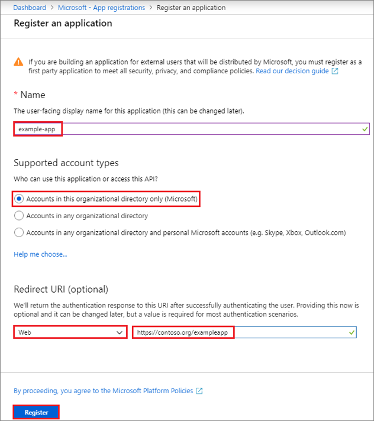
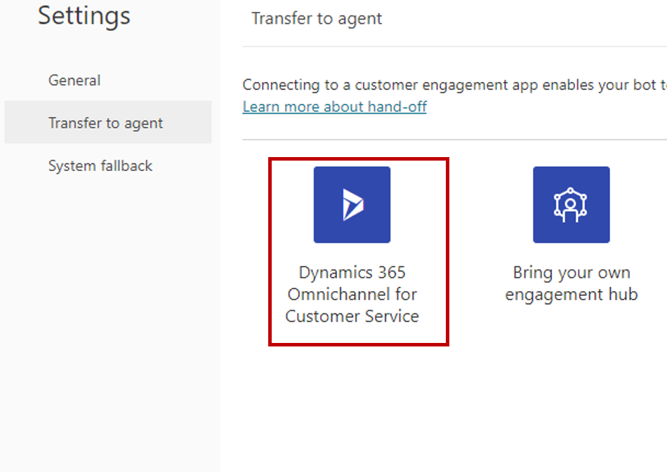

Situations might occur where a bot needs to hand off a conversation to a live agent. This situation often happens when a user has asked for information that the bot doesn't know, or after the bot has captured the necessary information that is required to ensure that the conversation can be routed correctly to a live agent. When a bot hands off a conversation to live agent, it shares the full history of the conversation (the context) and any variables with the agent. Power Virtual Agents bots can be configured to hand off conversations to agents for organizations that use Omnichannel for Customer Service and to conduct a generic handoff, as described in [configure generic handoff](https://docs.microsoft.com/power-virtual-agents/configure-generic-handoff). This feature allows Omnichannel for Customer Service to route incoming escalations to the appropriate live agent queue, and it also allows the live agents to review exactly what occurred in the prior conversation so that they can resume at that point. This process prevents agents from potentially asking for information that was previously captured by the bot.

### Transfer conversations to agents

Two primary components that are involved when a bot transfers to an agent are:

- Telling the bot when to transfer the conversation to an agent.

- Telling the bot where to transfer the conversation.

### Tell the bot when to transfer the conversation to an agent

The way that Power Virtual Agents tells the bot that it is time to transfer a conversation to an agent is always the same. Power Virtual Agents includes the **End the conversation** node, which signifies the end of the entire conversation and provides two actions that can be initiated:

- **End with survey** - A survey appears that asks the user if their question or issue was answered or resolved correctly.

- **Transfer to agent** - Escalates the conversation [to a live agent](https://docs.microsoft.com/power-virtual-agents/advanced-hand-off/?azure-portal=true).

> [!div class="mx-imgBorder"]
> 

Bot authors can end a conversation and transfer to an agent from within a specific topic. For example, if a customer indicates to the bot that their entire point-of-sale system is down, the bot can automatically call the **End the conversation** node and transfer it to an agent. Another way to accomplish this task is through the **Escalate** topic. All bots include a conversation topic called **Escalate**, which includes a message that is presented to the customer and then calls the **End the conversation** node to transfer to an agent. The **Escalate** topic is automatically triggered when someone types content such as, "speak to agent." You can also trigger the **Escalate** topic from within another topic by selecting **Go to another topic** and then selecting it.

### Configure where to hand off the conversation

To facilitate the transfer of a conversation to an agent, you will need to configure the bot to send the conversation to a specific Omnichannel for Customer Service instance. Only published bots can be used to ensure that the end-to-end capabilities work as expected. Make sure that you have [published your bot](https://docs.microsoft.com/power-virtual-agents/getting-started-deploy/?azure-portal=true) prior to validating the integrated experience.

When you create the connection between Power Virtual Agents and Omnichannel for Customer Service, a Microsoft Azure Active Directory (Azure AD) application registration is used to call the bot. Creating the application registration is done on the [Azure portal](https://portal.azure.com/?azure-portal=true). You can register your apps by going to Azure Active Directory and creating a new registration under **App registrations**.

Three primary areas that can be defined when you create the application registration are:

- **Name** - User-facing name of the application. This name can be changed later, if necessary.

- **Supported account types** - This area defines who can access the application.

- **Redirect URI (optional)** - This area contains the URL for where the app is located.

> [!div class="mx-imgBorder"]
> 

After you have defined the parameters, select the **Register** button.

For more information, see [Microsoft Docs](https://docs.microsoft.com/azure/active-directory/develop/howto-create-service-principal-portal#create-an-azure-active-directory-application/?azure-portal=true).

### Configure transfer to agent

Each bot can only be configured to send conversations to one Omnichannel for Customer Service instance. You can define the Dynamics 365 instance in the individual bot. If conversations from multiple bots will be sent to your Dynamics 365 instance, each bot will need to be configured individually.

To configure the handoff, select **Settings > Transfer to agent**. This screen allows you to define how the bot will facilitate handoff to different applications. Select the Dynamics 365 Omnichannel for Customer Service tile to begin the configuration process.

> [!div class="mx-imgBorder"]
> 

The primary component that you need to provide is the application ID for the app that you previously created for the Azure AD registration. Omnichannel for Customer Service models bots as application users in the application. Modeling bots as application users ensures that the bot can have conversations sent to it like a human agent would. It is important that the application ID is unique to your organization (your Common Data Service organization or environment). Each bot that will interact with the same Omnichannel for Customer Service environment will need to use a different application ID. You might need to create multiple application registrations to support multiple bots.

In your Azure portal, go to Azure Active Directory and select **App registrations**. All registered applications will be displayed. Select the application that you want to use with the bot. The application ID will be on the **Applications overview** page. Copy the ID and paste it into the **Power Virtual Agents Application ID** field.

Power Virtual Agents uses a Microsoft [Teams channel](https://docs.microsoft.com/power-virtual-agents/getting-started-deploy/?azure-portal=true) to communicate with Omnichannel for Customer Service. As you go through the setup wizard, if a Teams channel has not been enabled, one will be enabled automatically.

> [!div class="mx-imgBorder"]
> 

The last part of the configuration process is to select the Omnichannel for Customer Service environment that you want to use with the bot. Make sure that you select an environment where your Omnichannel for Customer Service instance is provisioned. The list shows all available environments, even if Omnichannel for Customer Service is not provisioned.

When the connection has been established, you can select the **Go to Omnichannel** link to [continue configuring the bot connection in Omnichannel for Customer Service](https://docs.microsoft.com/dynamics365/omnichannel/administrator/configure-bot-virtual-agent/?azure-portal=true).

### Remove Omnichannel for Customer Service connection

As of the time when this course was published, it was not possible to remove the connection setting after it was already set up. If you erroneously connected to the wrong instance or environment, a new bot will need to be created and then connected to Omnichannel for Customer Service again.

After the handoff has been configured, you will need to finish the remaining configuration in Omnichannel for Customer Service.

For more information, see [Microsoft Docs](https://docs.microsoft.com/dynamics365/omnichannel/administrator/configure-bot-virtual-agent/?azure-portal=true) and [configure generic handoff](https://docs.microsoft.com/power-virtual-agents/configure-generic-handoff/?azure-portal=true).
