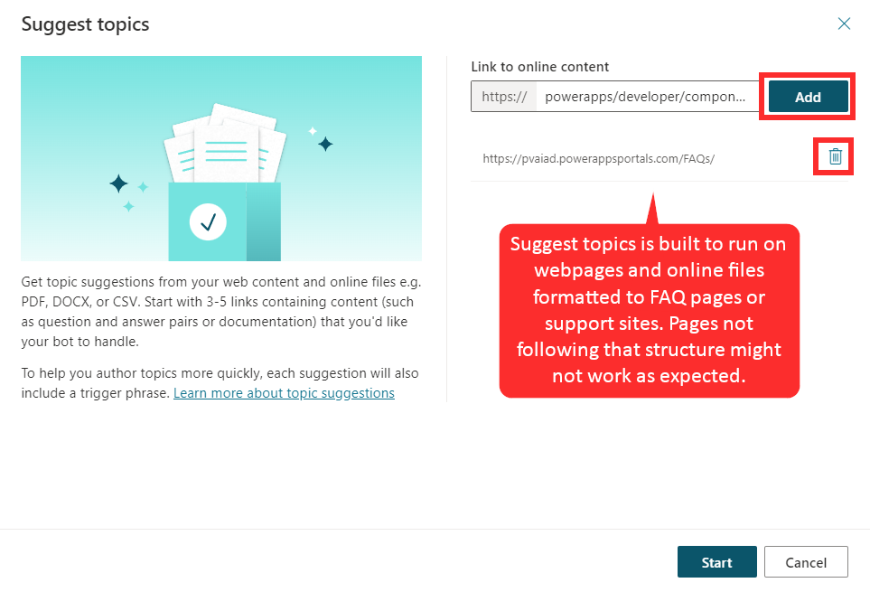
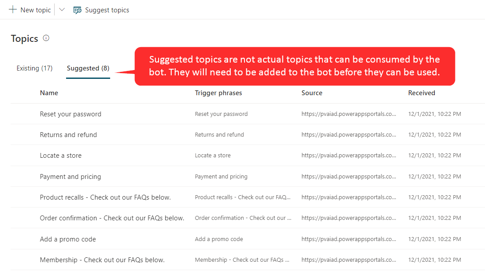
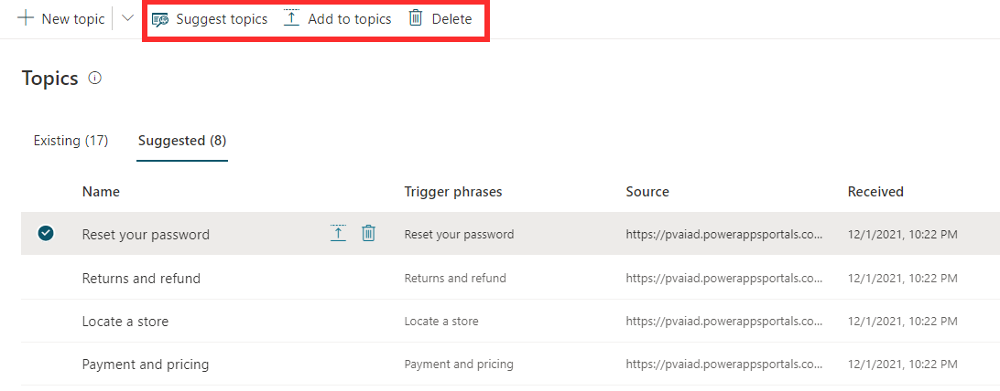
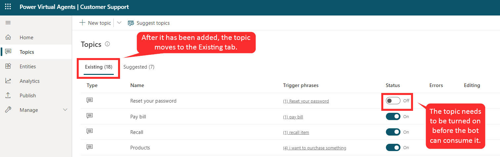

Many organizations want to create bot topics that use existing content. This approach can provide organizations with several advantages from the time saved in creating the topic to ensuring that topics are aligned with the types of issues that are being reported. 

Two ways that organizations can automatically generate topics for a bot are from Customer Service Insights topics and for existing web content such as FAQ pages. 

Power Virtual Agents uses AI-assisted authoring to help organizations automatically extract and insert relevant content from existing web content topics into your bot. This feature eliminates the need to copy and paste or manually recreate content into topics.

AI evaluates the page and determines structure and content. It isolates content blocks that relate to a support issue or question and classifies them into topics. Each identified topic will follow the same structure as other topics. They will contain [trigger phrases that are identified during the process and an initial Message node](https://docs.microsoft.com/power-virtual-agents/authoring-create-edit-topics/?azure-portal=true). These topics appear as suggested topics that can be modified and deleted like other topics.

## Extract content from Customer Service Insights 

Dynamics 365 Customer Service Insights uses AI to automatically group your organization's cases into topics. Because topics are already defined based on your organization’s caseload, it would make sense to align the topics in a customer support bot with those topics. When deciding on which topics to automate from Customer Service Insights, you should consider topics that include: 

- Items that are straightforward to resolve, which helps make it more likely that a bot can handle or resolve the issue. For example, topics that have lower average resolution time, higher resolution rate, and/or fewer escalations are items that could be considered straightforward to resolve.

- Topics that have a high volume. These types of topics allow the automation to potentially bring you more business benefit and impact. 

For more information, see [Automate topics for a Power Virtual Agents bot](https://docs.microsoft.com/dynamics365/ai/customer-service-insights/automate-topics/?azure-portal=true).

## Extract content from webpages

The three main steps for autocreating topics are:

1. Extract content from existing FAQ or support pages.

1. Add the suggested topics to your bot.

1. Enable the topics in your bot.

The first step in creating topics from existing content is to extract topic suggestions from existing pages that contain the support content that you want to use. To complete this step, use the **Suggest topics** command in Power Virtual Agents. The **Suggest topics** command is built to run on webpages that are in the form of FAQ pages or support sites. After the extraction is complete, the suggested topics are displayed for further review.

Content can be extracted by using the **Suggested** tab on the **Topics** page. When you first receive suggestions, this page will likely be blank. When topics have been extracted, the list will be displayed. To suggest topics, you will need to enter a URL for each webpage that you want to extract content from. The URLs must be secure (they must start with *https://*). If you add a page by mistake, you can remove it by selecting **Delete**.

> [!div class="mx-imgBorder"]
> 

Depending on the complexity of the pages and the number of pages that you add, it can take a few minutes to extract the content. The "Getting your suggestions, this may take several minutes" message will appear at the top of the screen while the extraction is in progress. If errors are encountered during this process, the tool provides explicit feedback about errors so that you can understand and address the issue. For example, you might be unable to extract content because the site that you referenced is down. After the content has been extracted, suggestions will appear that you can review to help you decide if the topics should be added to your bot.

> [!div class="mx-imgBorder"]
> 

### Add suggested topics to an existing bot

Extracted topics are not automatically added as topics in your bot. After the extraction process has been completed, any topic suggestions will appear on the **Suggested** tab. This process will allow you to review the topics and determine whether you want to include them in your bot or not. You can also review the trigger phrases and message nodes that were created and make edits, if necessary.

Three options for dealing with the topic include:

- **Add to topics and edit** - Opens the topic so you can edit the trigger phrases or enter the authoring canvas to make changes to the conversation flow. After you have completed editing, the topic will be removed from the list of suggestions.

- **Add to topics** - Topic is automatically added to the list of topics and is removed from the list of suggested topics.

- **Delete suggestion** - Does not add to your list of topics and deletes the topic from the suggested topics.

> [!div class="mx-imgBorder"]
> 

### Enable topics in your bot

After a suggested topic has been added to the **Existing** tab, the status is set to **Off**. This setting will ensure that the topic is not prematurely added to your bot before you have had time to make the necessary changes to it, such as modifying trigger phrases or adding more conversation nodes to enhance the topic as required. When a topic is ready to be used, you can set the status to **On**.

> [!div class="mx-imgBorder"]
> 
