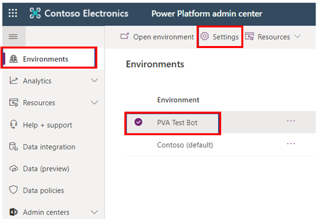
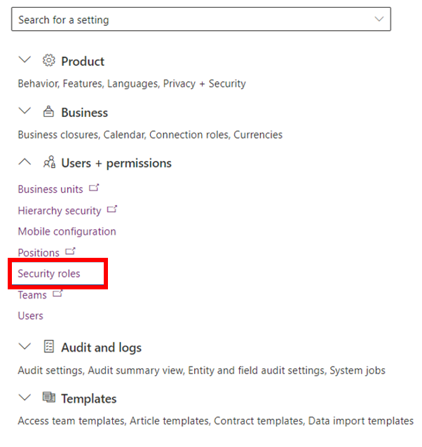
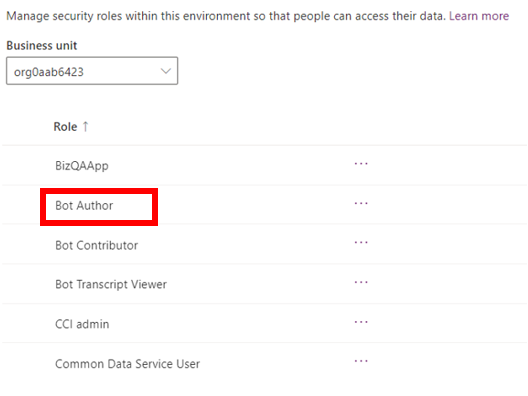
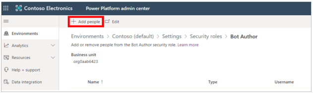
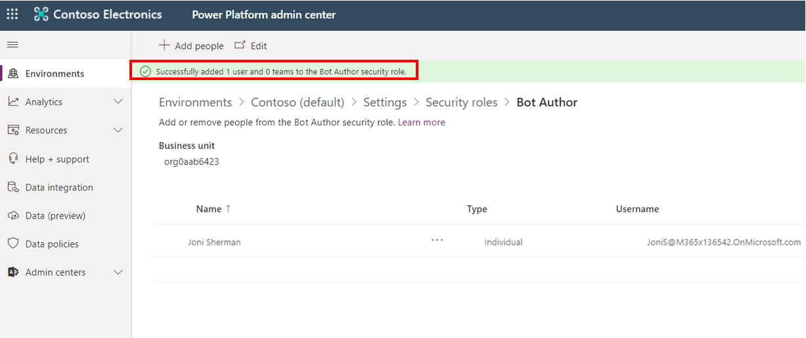

Power Virtual Agents gives you the flexibility to create bots in different environments. An environment is a space to store, manage, and share your organization's business data. The bots that you create are stored in an environment. Apps and flows are also stored in environments. Environments might have different roles, security requirements, and target audiences, and each environment is created in a separate location.

When creating a bot, you can select from only the list of environments that you have access to.

> [!div class="mx-imgBorder"]
> 

To create a bot in an environment where you don't have access, you'll need to be a system administrator or contact the system administrator. Then, you will need to complete the following steps:

- Create a bot in the environment (this step will install the necessary Power Virtual Agents solutions).

- Assign the security role of "bot author" to you in the environment.

To assign the security role of "bot author," Microsoft Power Platform admin must go to Microsoft Power Platform admin center, select the environment, and then select **Settings**.

> [!div class="mx-imgBorder"]
> 

In **Users + permissions**, select **Security roles**.

> [!div class="mx-imgBorder"]
> 

Select **Bot Author**.

> [!div class="mx-imgBorder"]
> 

Select **+ Add people**.

> [!div class="mx-imgBorder"]
> 

You can search for the person whom you are looking for, select the name, and then select **Add**.

> [!div class="mx-imgBorder"]
> 

The upper part of the screen will show a successful notification ribbon and the name of the user.

> [!div class="mx-imgBorder"]
> 

You have now successfully given a user bot maker access in an environment.
