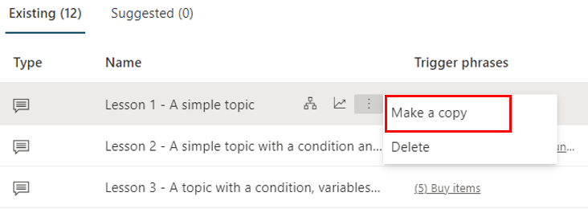
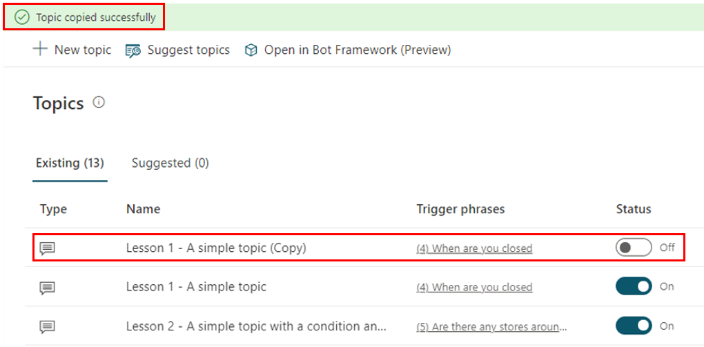
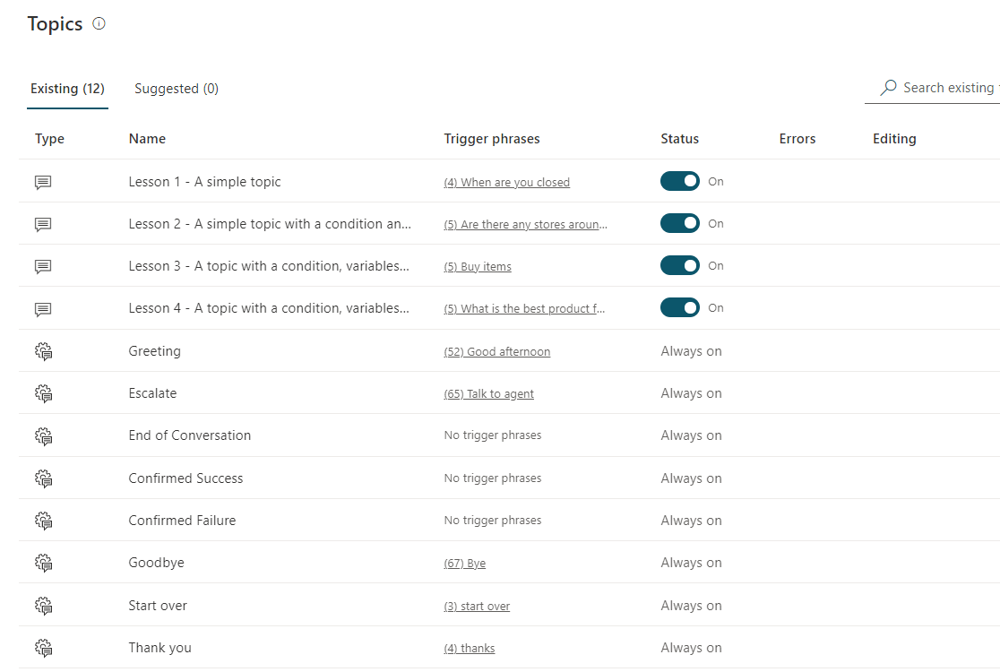

Topics are the no-code way to create discrete conversation paths that, when used together within a single bot, allow for users to have a conversation with a bot that feels natural and flows appropriately.

Topics are siloed in each Bot and cannot be shared even if they're part of the same environment. You do have the option to copy an existing topic, which is automatically created and saved in the same Bot and by default the status is set to off.

> [!div class="mx-imgBorder"]
> 

> [!div class="mx-imgBorder"]
> 

By default, each bot comes with 12 topics of which only 4 can be turned off. The remaining will always be on and cannot be deleted.

> [!div class="mx-imgBorder"]
> 

Currently, the only way to export and import topics from one environment to another is by using Solutions and migrating the entire chatbot. In Solutions, you add your existing chatbot and it will include all its topics automatically.
