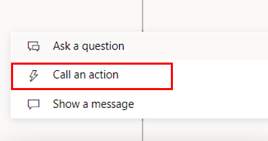

Power Virtual Agents chatbots come with prebuilt entities that are provided by the system and help the bot identify common information such as age, colors, numbers, and names. Chatbot makers in the environment don't have access to the tables that they see in the same environment in Microsoft Power Apps or Power Automate.

Currently, the only option to connect with tables is by using Power Automate flow. To trigger the flow, use the **Call an action** feature in the chatbot authoring canvas.

> [!div class="mx-imgBorder"]
> 

Only flows that are part of the solution are visible in the **Call an action** feature. We recommend that you have System Administrator level access for an environment to build bots that can connect with the flows that, in turn, connect with tables.