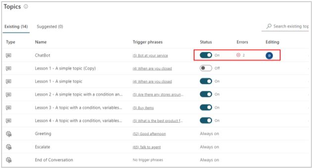
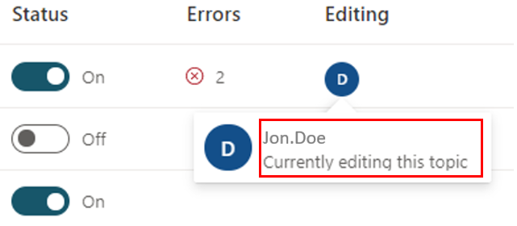
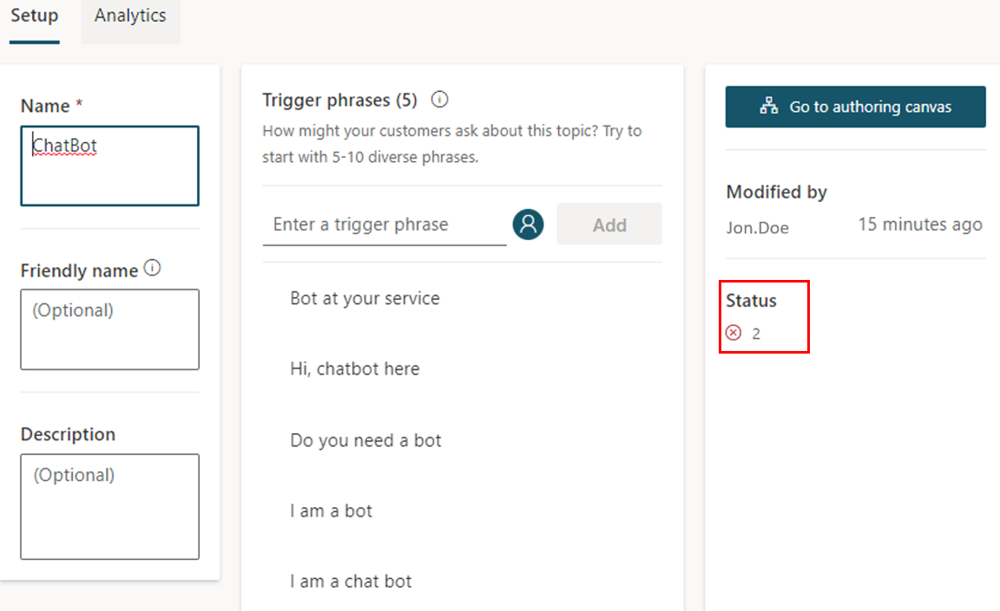
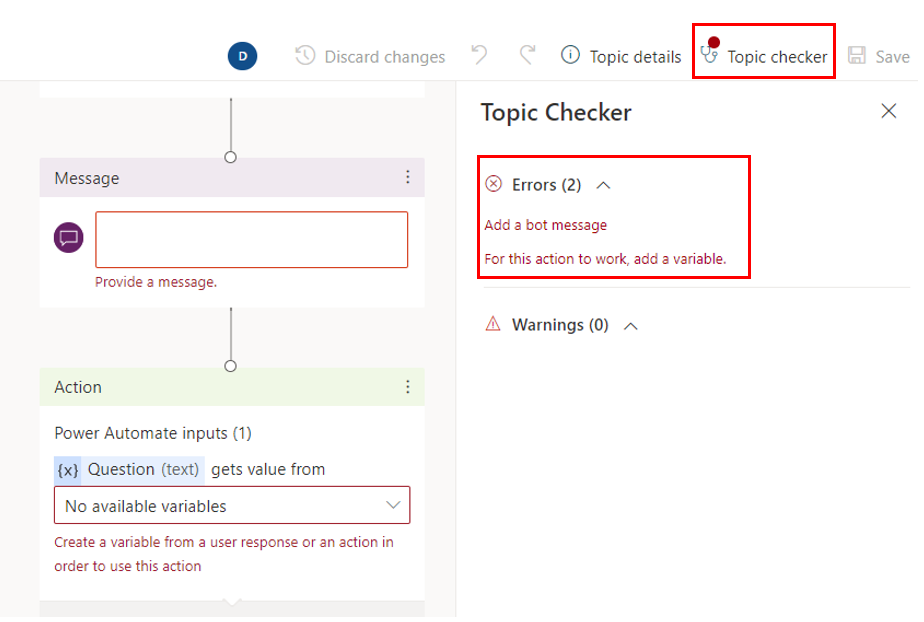

The best way to monitor the status and diagnose the error of your chatbot is at the topic level.

In **Topics** you see if its status is on or off, if it has any errors and if it's currently being edited by someone.

> [!div class="mx-imgBorder"]
> 

You hover your mouse over the displayed initial to find the full name of the person who is editing

> [!div class="mx-imgBorder"]
> 

To diagnose the cause of the error, click on the error in **Topics** and that will take you to the **Setup** page where you can see the error is from the authoring canvas.

> [!div class="mx-imgBorder"]
> 

Clicking on the status error number will take you in the canvas where you can see the two errors in the topic checker.

> [!div class="mx-imgBorder"]
> 
