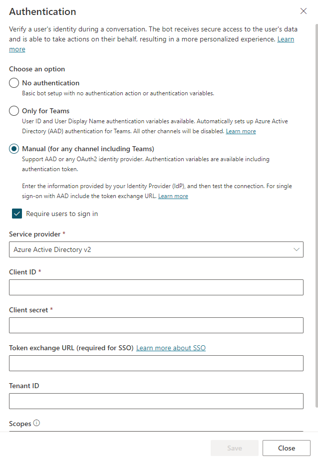
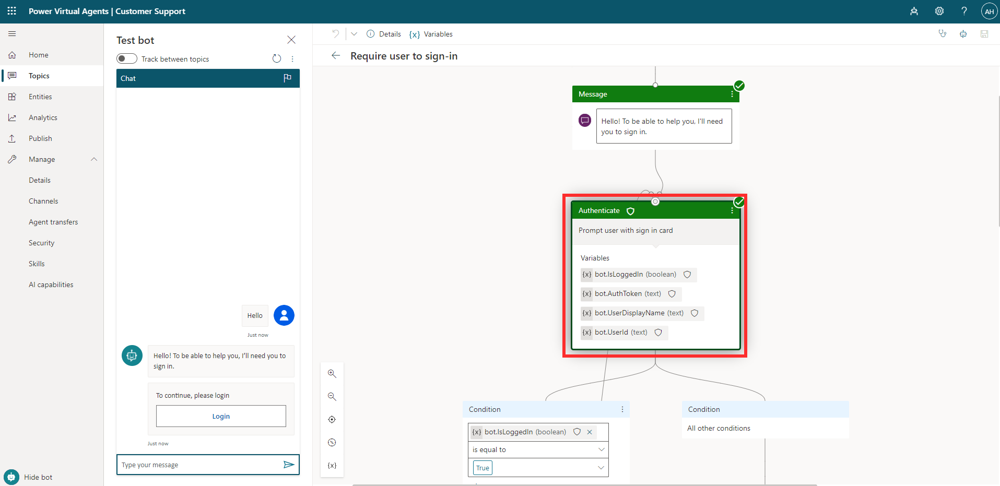
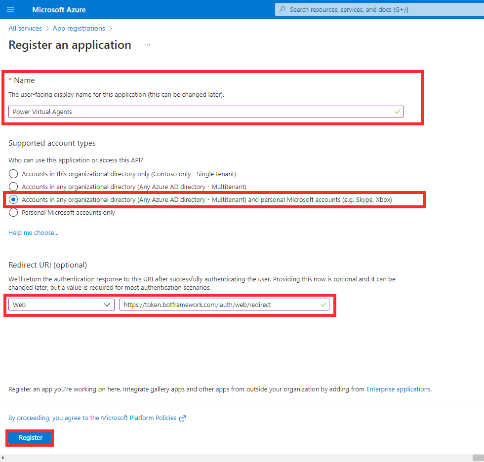
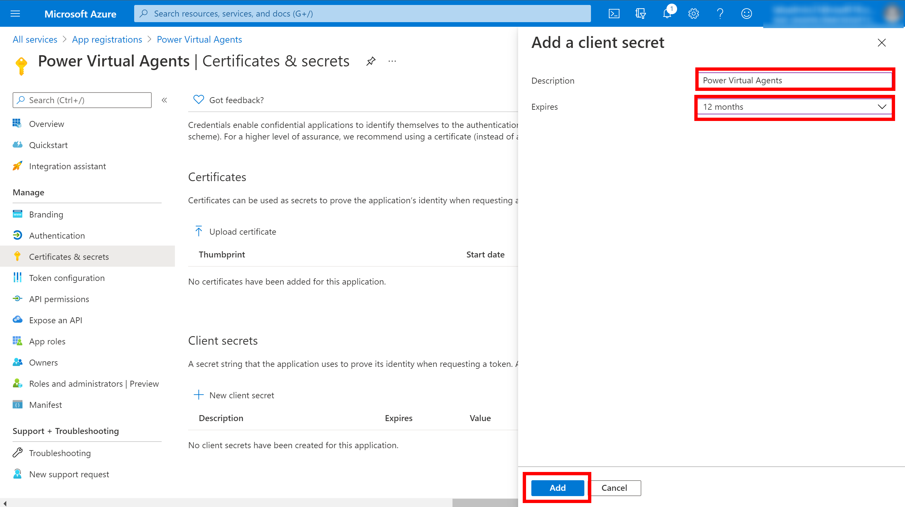
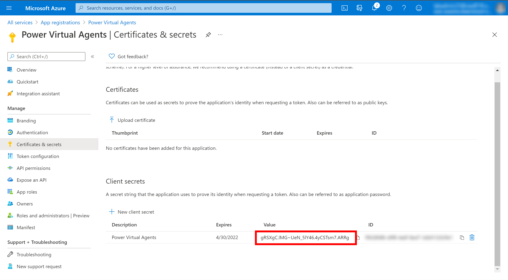
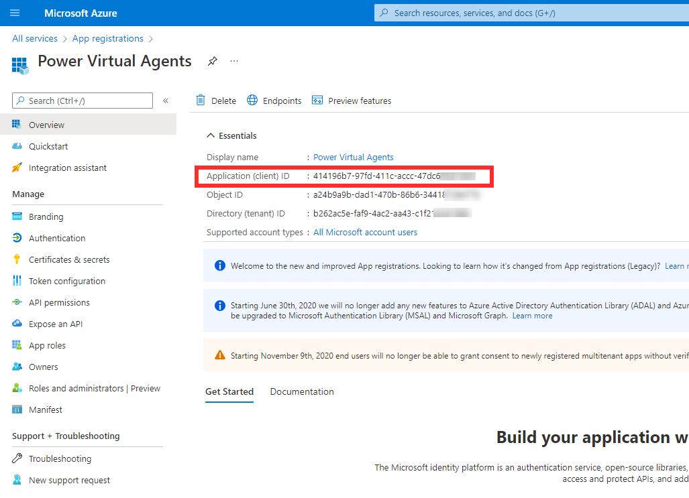
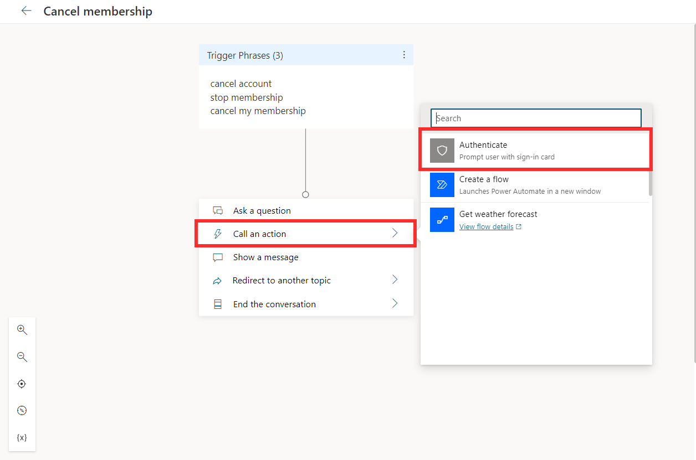
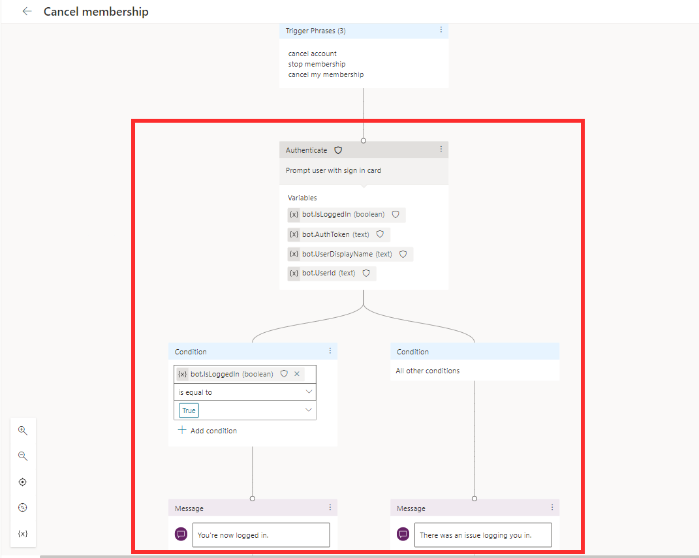

The authentication setting in Power Virtual Agents impacts how you can manage access to the bot. It allows you to verify a user's identity during a conversation, which enables

- Further personalization of the conversation
- The ability for the bot to execute actions on the user's behalf
- The ability to skip dialogs in the conversation by prefilling user data and going straight to the point
- Variables such as the user's ID and display name available to use within topics

It's a flexible experience. You can mark some parts of the conversation that require the user to sign in, while some other parts don't require the user to sign in.

Authentication settings are found in Power Virtual Agents by selecting **Manage** on the side navigation pane, then going to **Security** > **Authentication**. The options for authentication are:

- No authentication

- Only for Teams

- Manual (For any channel including Teams)

> [!div class="mx-imgBorder"]
> 

You need to publish your bot for changes in the authentication setting to occur.

## No authentication

If you select **no authentication**, anyone with access to the bot can chat with it without having to sign in. This includes any user with a link to the bot, or anyone who can find it, such as on your website. No authentication variables are available for use in topics.

## Only for Teams

This option sets up authentication only for Microsoft Teams, and turns off any other channels and disconnects the bot from them. Only users that you've shared the bot with can use it.

## Manual (For any channel including Teams)

Power Virtual Agents supports identity providers that are compliant with the [OAuth2 standard](/azure/active-directory/develop/v2-oauth2-auth-code-flow/?azure-portal=true) . This means that you can enable users to sign in with any OAuth2 identity provider. OAuth2 identity providers include:

- Azure Active Directory (Azure AD)
- Microsoft account
- Google
- Facebook
- Custom authentication service that you create for your company.

You can call on the Authenticate action during a conversation, which will prompt the user with a sign-in card. Alternatively, you can select the **Require users to sign in** option, which will create a system topic for Require user to sign in. This will prompt the user to sign in as soon as they begin the conversation with the bot. The screenshot below shows the Require user to sign in system topic, and the variables stored. The variables obtained are IsLoggedIn, AuthToken, UserDisplayName, and UserID.

> [!div class="mx-imgBorder"]
> 

## Configure manual authentication

To configure a manual authentication in Power Virtual Agents, register a new app with your identity provider and get a Client ID and Client Secret. The details below show you how you can do this from the [Azure portal](https://portal.azure.com/?azure-portal=true) for Azure Active Directory.

To register an application, you can go to **App registrations** from the Azure portal and create a new registration. You need to provide a name for the registration, such as the bot name, then specify which accounts can access the bot. For example, the option selected below allows users from any Azure AD directory or personal Microsoft account to sign in and talk to the bot. The **Redirect URI** should be `https://token.botframework.com/.auth/web/redirect` with **Web** as the platform.

> [!div class="mx-imgBorder"]
> 

Next, you need to add a new client secret. You can go to **Certificates & secrets** area of the app registration and select **+New client secret**. Here, you can provide a description and select an expiry period.

> [!div class="mx-imgBorder"]
> 

The **client secret value** as shown below should be noted as it will be used for the configuration.

> [!div class="mx-imgBorder"]
> 

You'll also need the **Application (client) ID**, which can be found in the Overview area of the app registration.

> [!div class="mx-imgBorder"]
> 

Now that Azure has been configured, the Power Virtual Agents Authentication settings can be populated. You can open your bot in Power Virtual Agents, and go to **Manage** > **Security** > **Authentication**.

**Authentication Option** should be **Manual**. If you select **Require users to sign in**, a system topic will be created which prompts users to sign in at the beginning of the conversation. Otherwise, if unselected, you can call on the authentication action at any point in the conversation.

**Service Provider** should be Azure Active Directory v2. The **Client ID** and **Client secret** fields are where you can enter in the Application ID and client secret value obtained earlier. **Token exchange URL** is an optional field used when [configuring single sign-on](/power-virtual-agents/configure-sso/?azure-portal=true). Scope refers to the access you want authenticated users to have once signed in. For more information, see [Scopes.](/azure/active-directory/develop/developer-glossary?azure-portal=true#scopes)

> [!div class="mx-imgBorder"]
> 

Once the authentication settings are saved and the bot is published, you can use **Call an action** > **Authenticate** in your topics. If multiple topics require authentication, the user will only be prompted to sign in once throughout the session.

> [!div class="mx-imgBorder"]
> 

This automatically sets up conditional branching, with messages and variables related to the authentication. There's a variable that stores the authentication token when the user logs in. It's a Boolean variable that stores whether the user has logged in, and variables for the user's ID and display name.

> [!div class="mx-imgBorder"]
> 
