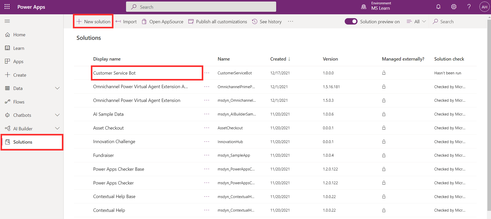
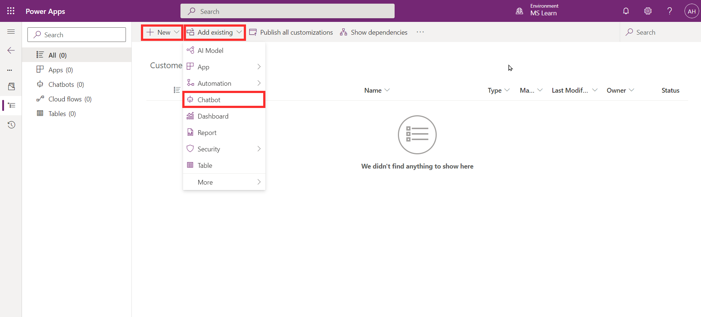
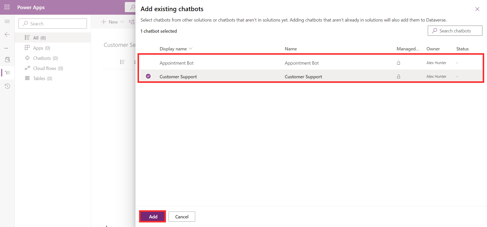
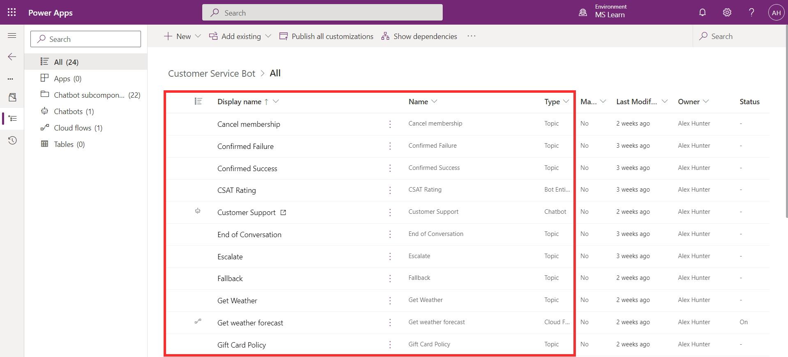
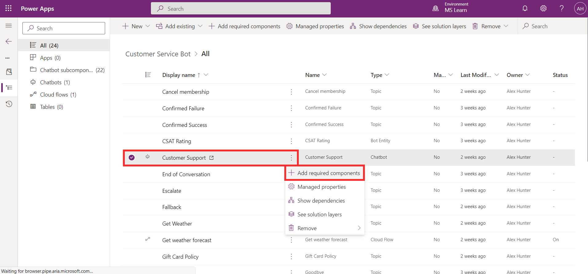
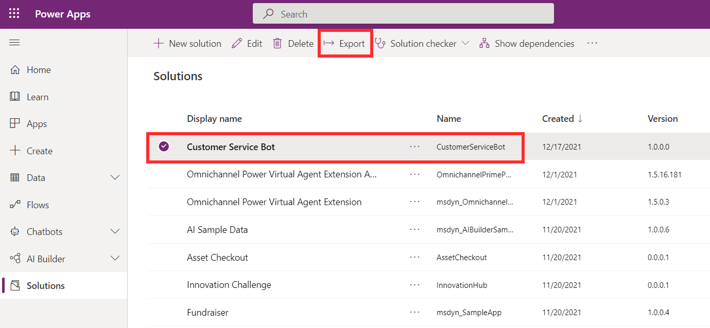
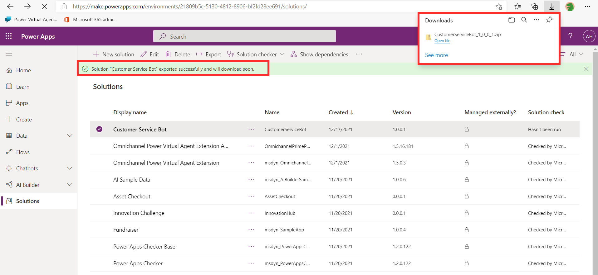
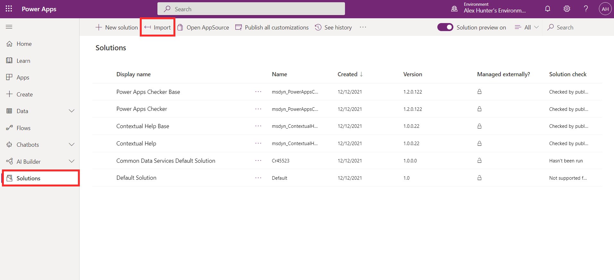
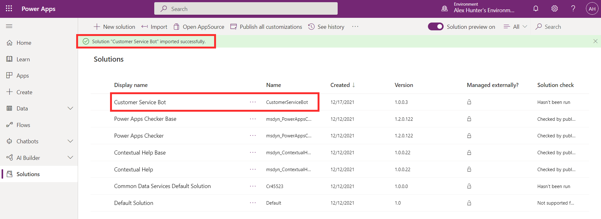
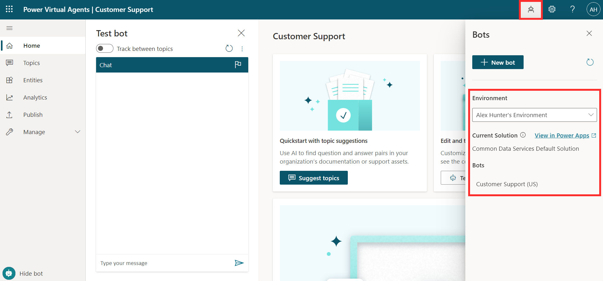

You can export and import bots using solutions to move your bots across multiple environments. For example, you may build your chatbot in a development environment, then move it to a different environment for testing purposes. Once the testing is complete, you can move it to a production environment for the chatbot to be deployed to end users.

Solutions are the mechanism for implementing application lifecycle management (ALM). The solution acts as a carrier for the bots. You use solutions to export the bot from one environment and import it into another. For more information, see [Solutions.](/powerapps/maker/data-platform/solutions-overview/?azure-portal=true)

## Export your bot

You can add a chatbot to an existing solution or create a new solution for your chatbot from Power Apps Solutions.

> [!div class="mx-imgBorder"]
> 

Within the solution, you can choose the bots in the environment you would like to export. You can do this by clicking **Add existing** > **Chatbot**. Multiple chatbots can be added to a single solution.

> [!Note]
> It is also possible to create a new chatbot from solutions.

> [!div class="mx-imgBorder"]
> 
>
> [!div class="mx-imgBorder"]
> 

Subcomponents of the bot will be added to the solution, such as topics, entities, and cloud flows. You shouldn't remove or change any of the bot subcomponents from Power Apps as this can cause the export to fail.

> [!div class="mx-imgBorder"]
> 

If you add more components to your bot, such as creating new topics, you can add these to the solution by selecting **Add required components** from the chatbot in the solution as shown below.

> [!div class="mx-imgBorder"]
> 

Once your solution is ready, you can export the package. This will download a .zip file of the solution, which will be used for importing the bot into another environment. If you're moving your bot to a test or production environment, you should export as a managed solution.

For more information, see [Export solutions](/powerapps/maker/data-platform/export-solutions/?azure-portal=true).

> [!div class="mx-imgBorder"]
> 

> [!div class="mx-imgBorder"]
> 

## Import your bot

You'll use the solution package downloaded at the export stage to import your bot into the desired environment. It's imported from Power Apps Solutions.

From Power Apps Solutions in the new environment, select **Import**, and select your solution .zip file. You can then proceed with the import steps.

For more information, see [Import solutions](/powerapps/maker/data-platform/import-update-export-solutions/?azure-portal=true).

> [!div class="mx-imgBorder"]
> 

Once the import is complete, you'll see it appear in your solutions list. You can access your imported bot from Power Virtual Agents as it will now appear in your list of bots in the new environment.

> [!div class="mx-imgBorder"]
> 

> [!div class="mx-imgBorder"]
> 
