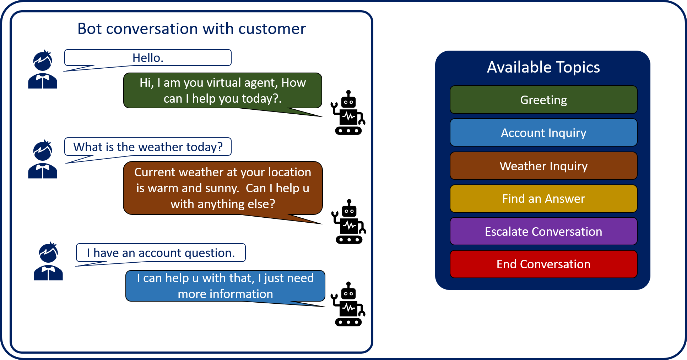

Assisting customers with AI virtual agents, often referred to as bots, is a major business trend today. Bots are being used to expand self-service support experiences for customers and to help ease agent workloads by handling specific types of support topics that are of the highest volume and easily automated. Bots help users accomplish specific tasks by using artificial intelligence to identify the customer's intent and present content or execute actions related to that intent. For example, if someone asks what the weather is where they live, a virtual agent bot could find out where they live and provide them with a detailed weather forecast for their area. Virtual agents could also be programmed to help the customer do things like check their account balance, book a hotel room, or hand them off to live agent that can assist them with things beyond the virtual agent's capability. The virtual agent just needs to know what information to present to the customer based on what they are asking for.

Think of a customer's interaction with a virtual agent just like a conversation you would have with a person. While each conversation is different, they all have their main parts:

- **Conversation beginning:** Each conversation is initiated by an event such as answering a phone, a face to face greeting, or through engagement in other formats.

- **Discussion points or topics:** These represent the specific topics that are being communicated during the conversation such as the weather, making or formulating plans, providing life updates, asking questions, etc.

- **Conversation ending:** The conversation is ended with an event such as hanging up the phone, shaking someone's hand, driving away, or some other action.

Conversations are driven by the topic the customer wants to discuss. For example, if they ask you about your new job, you are going to tell them about your job, not about a vacation you just took. Virtual agents need to be able to work the same way. They need to deliver the correct details and take appropriate action based what the customer is saying.

Microsoft Power Virtual Agent (PVA) bots do this through topics. Think of a topic as a small individual conversation on a specific subject. Multiple topics can be used together in a single bot to provide customer with an automated conversation that feels natural and flows appropriately.

For example, a single PVA bot might contain the following topics:

- Greeting

- Account Inquiry

- Weather Inquiry

- Find an Answer

- Escalate Conversation

- End Conversation

Each of the above topics would have trigger phrases that help the bot identify when to present that topic to a customer. If the customer asks, "What is the weather?", the weather topic will be launched. If they state, "I have an account question.", the account inquiry topic is launched. By defining multiple topics within a single bot, organizations can create flexible virtual agents that can be used to engage and interact with customers on a wide variety of individual topics.

> [!div class="mx-imgBorder"]
> 

Throughout this module, we will examine how to use topics to create and manage conversation paths in a bot.
