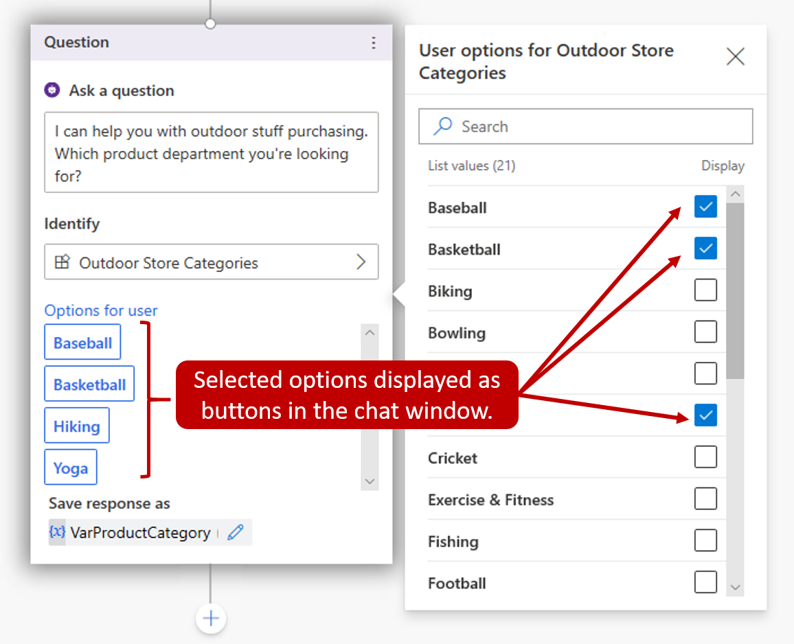
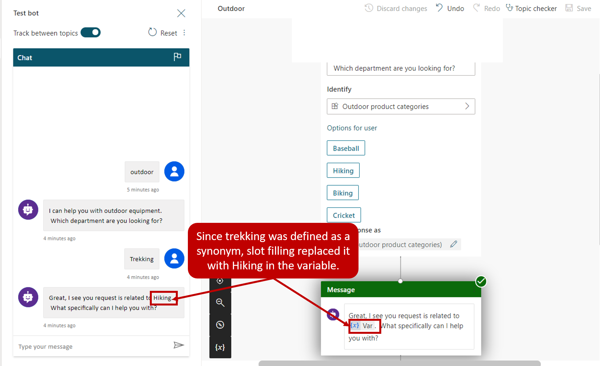
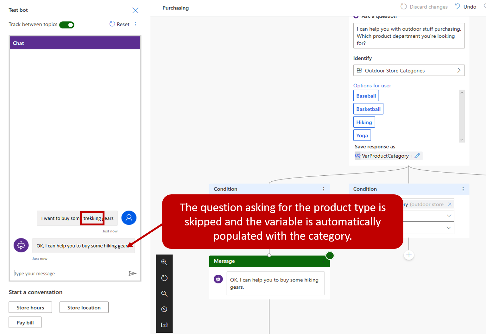

PVA conversations use natural language understanding to identify a user\'s intent based on what they input into the conversation window. For example, a user enters the text \"I tried to use my gift card, but it doesn\'t work\". Natural language understanding helps to identify and route the user to the topic related to gift cards not working, even if that exact phrase is not listed as a trigger phrase.

A key aspect of natural language understanding is to identify the entities being used in a user dialog. Think of an entity as an informational unit that represents a certain type of a real-world subject such as a phone number, postal code, city, or a person's name.

Power Virtual Agents comes with a set of prebuilt entities out of the box. These represent some of the most commonly used information in real-world dialogs such as age, colors, numbers, and names. The knowledge granted by entities allows the bot to recognize the relevant information from user input and save it for later use.

Let's use the pre-built entity for money that can be accessed from the entities tab. When you examine the entity, you can can see an explanation as well as the ways it can be used to look for information related to money or currency from a user's input.

> [!div class="mx-imgBorder"]
> 

For example, when a user inputs "It costs 1000 dollars", using this money entity the bot knows the "1000 dollars" represents the **money type** of information. When the bot extracts this entity and saves it to a variable, it will save "1000" as a number even though the surrounding information was text.

## Create custom entities

The prebuilt entities will cover many common information types. However, there will be occasions where language understanding will be needed for an organization specific scenario. For example, let's say you are building a bot for an outdoor store. The bot may need to acknowledge different types of outdoor products. A custom entity called "outdoor product" could be created. This will ensure that when someone types an outdoor product such as fishing, skiing, or boating the bot can direct them to the right spot.

Custom entities are created by navigating to the Entities tab on the side navigation pane and selecting new custom entity. Once you define the name, you will need to provide the items that you want to be included in the entity.

In the image below, we created a custom entity called Outdoor Store Categories, and then added a list of outdoor product category names.

> [!div class="mx-imgBorder"]
> 

### Work with smart match

Many times customers might mistype something, or enter a phrase that is slightly different from what is defined in the entity. For example, a customer might enter "softball" instead of "baseball". Both sports use the same type of equipment. In terms of product categories, "softball" should be considered the same as baseball. Smart matching lets the bot take in user input in a fuzzy way based on the list items given to the entity. This means that it does not have to find an exact match. When smart matching is on, the bot will automatically autocorrect misspellings and expand the matching logic semantically, such as automatically matching "softball" to "baseball".

### Work with synonyms

The synonym option is like smart matching. The primary difference is that while smart matching is automatic, with synonyms you manually expand the matching logic by defining synonyms. For example, the "hiking" product category could have "trekking" and "mountaineering" added as synonyms. For "Yoga", you can add "Pilates." Smart match and synonyms seamlessly work together to make your bot even smarter.

> [!div class="mx-imgBorder"]
> 

### Use entities in a conversation

Once your custom entity has been defined, they are available to be used when constructing bot conversations. Open the authoring canvas for a topic and add a Ask a question node.

You can also display category items as buttons to users. For example, if you would like some of the category items to display as buttons users can select as their input, choose select user options and then pick from the list. While in a conversation, a customer can either select the item button they want, or enter a different category manually as text.

> [!div class="mx-imgBorder"]
> 

### Work with slot filling

Slot filling is a natural language understanding concept that saves an extracted entity to an object. In simple terms, slot filling matches what is input by a customer and stores it appropriately in a variable. For example, when asked for a category type, the customer may select "Hiking", or they might type in something like \"trekking\" as shown in the image below. Since "trekking" was defined as a synonym it should still be considered as the user entered hiking. Slow filling ensures that even though something else was entered, it is associated with the correct category. The extracted entity "Hiking" will be used as the values for the Product Category variable.

> [!div class="mx-imgBorder"]
> 

Another concept is known as "proactive slot filling" where the user can specify multiple pieces of information that map to multiple entities. The bot understands what information belongs to which entity automatically.

In the example below, the user wrote "I want to buy some trekking gear." This includes the trigger phrase that the customer wants to buy gear, but it also provides a second piece of information the actual type of gear. In this case, the bot fills in both the entity for buying gear, and the type of gear. This in unlike the previous example where the bot needed to prompt the user for the type of equipment. The bot takes the user input and intelligently skips the question asking for the product category.

> [!div class="mx-imgBorder"]
> 

The bot is always actively listening to user input, remembering information upfront so it can skip unnecessary steps as appropriate.
