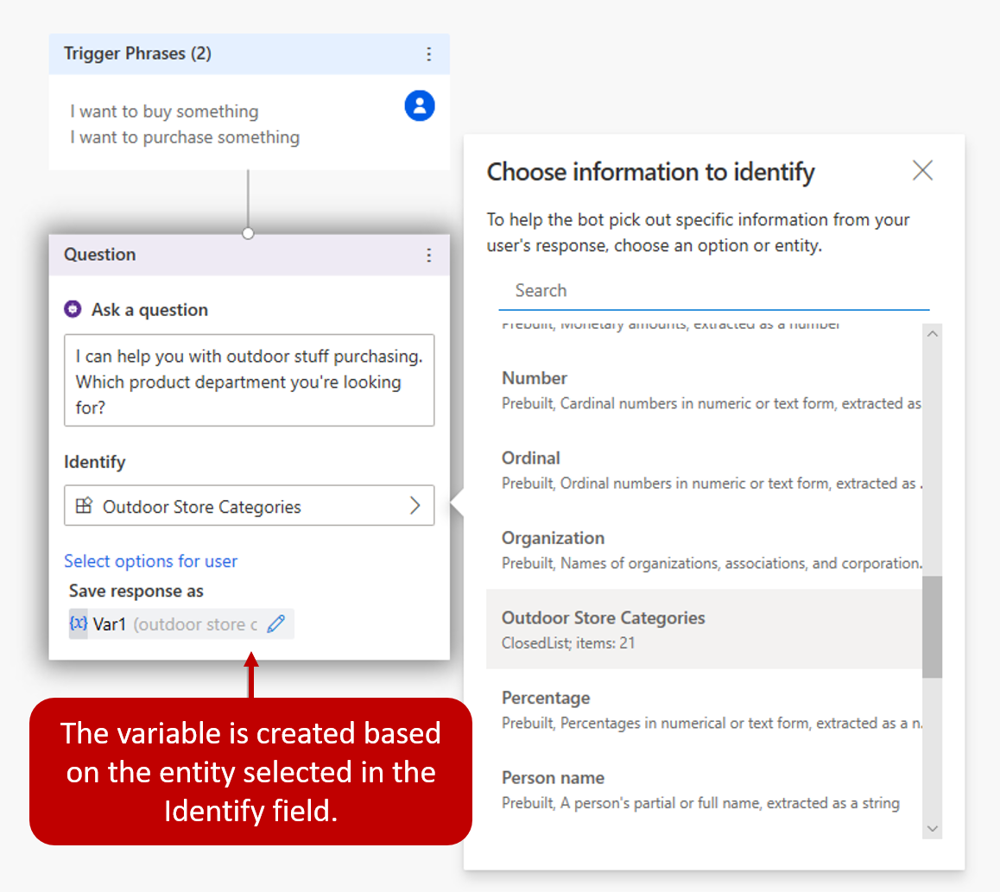
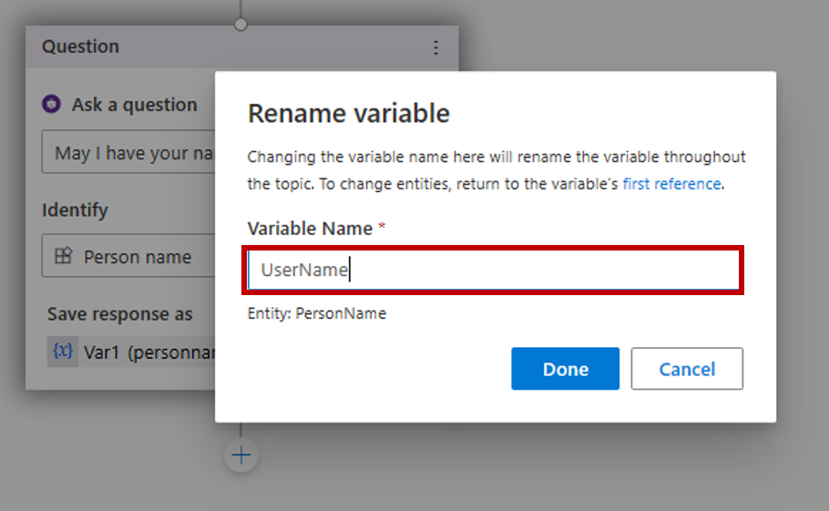
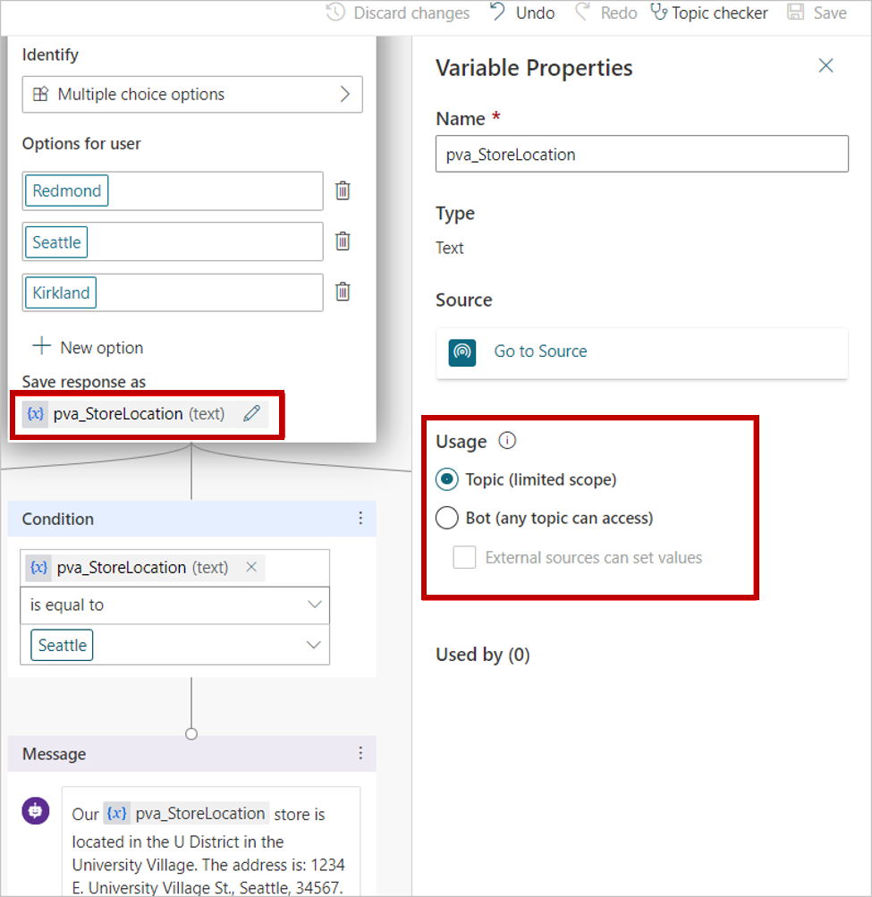

Power Virtual Agents allows you to store information important information entered by the customer for later use by using variables. For example, you can save a customer\'s name in a variable called UserName. This variable can be inserted into conversation nodes to create a more personal experience for the customer, such as inserting it into a message node, to allow the bot to address the customer by name as the conversation continues.

Variables can be used to dynamically route customers down different conversation paths. They can also be fed into [Power Automate](https://docs.microsoft.com/power-virtual-agents/advanced-flow/?azure-portal=true) Flows or [Bot Framework Skills](https://docs.microsoft.com/azure/bot-service/bot-builder-skills-overview?view=azure-bot-service-4.0/?azure-portal=true) as input parameters. For example, the city the customer lives in could be stored in a variable. When a Power Automate Flow is executed, the variable could be passed through as an input parameter to ensure the weather service is getting the correct forecast.

A complete list of variable types can be found here: [Entity and variable type](https://docs.microsoft.com/power-virtual-agents/authoring-variables#entity-and-variable-type/?azure-portal=true).

### Creating variables

Variables are created automatically when you add a question node to a topic. By default, when a question node is inserted, it will be created using Multiple choice options. However, any prebuilt or custom entity by can be used by selecting it under identify.

> [!div class="mx-imgBorder"]
> 

### Rename a variable

When a variable is automatically created, a default name will be given. If desired, you can rename a variable by selecting it and entering a new name.

> [!div class="mx-imgBorder"]
> 

### Use variables across topics

By default, a variable's value can only be used in the topic where this variable is created. However, there may be scenarios when you will want to use the same value across topics. Bots can remember the necessary variable context when a conversation spans multiple topics. For example, a "Welcome" topic, could ask for the customer's name and email. When the conversation goes to another topic, such as an "Appointment booking" topic, you might want the bot to remember customer's name and email address. In Power Virtual Agents, these variables are referred to as bot variables, because they apply across the entire bot.

Bot variables apply during the current chat session. They cannot be carried over from one customer chat session to another. You specify which variables should be treated as bot variables to distinguish them from topic-level variables.

### Set bot variables

After you set a bot variable, it will be available to all topics. When you select the {x} button in a message node or question node when you are composing a bot message, you will see that the bot variable is available. Variables are sorted in alphabetical order, so you will find that all bot variables are grouped together in the variable menu because they all begin with bot.

> [!div class="mx-imgBorder"]
> 

When you use a condition node, a flow action node, or a skill node, you will also see bot variables available there.

### Reuse a variable across topics by setting it as bot variable

To define a variable as a bot variable, you will need open it in the authoring canvas. This is done by opening the ask a question node that is storing the variable you want to work with. On the Variable properties pane, under Usage, select Bot (any topic can access). The variable name will be given a prefix string of bot. to differentiate it from the topic-level variables. For example, the variable UserName is now shown as bot.UserName. When you convert a variable to a bot variable, you need to ensure that the variable is unique across all topics. If a conflict is encountered, you will need to rename the variable before saving your change.

> [!div class="mx-imgBorder"]
> 

### Manage bot variables

After you have created a bot variable, you can see where it is first defined and what other topics are using it. This can be useful if you are working on a new bot, or if you have multiple variables and complex topic branching.

There are two primary items that are available from the Variable Properties pane.

- **Go to the source:** Goes to the node the variable was initially created.

- **Used by:** Displays all topics where the variable is used, so you can go straight to that topic and node.

For additional information on working with bot variables, see [Microsoft Docs](https://docs.microsoft.com/power-virtual-agents/authoring-variables-bot).
