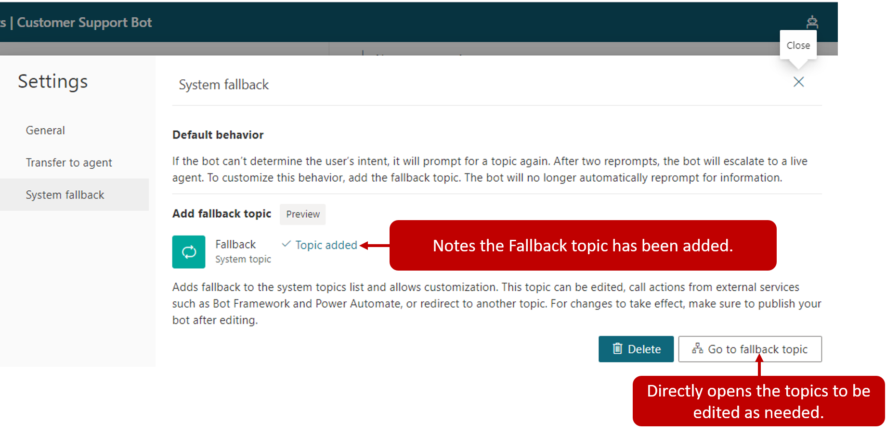

As a bot engages with customers, it triggers the most appropriate topic based on the user's input. From time to time the bot may not be able to determine the user's intent based on what they've typed. When this happens, it will prompt the user again. After two unsuccessful prompts, the bot will escalate the conversation to a live agent using the Escalate system topic.

Some organizations may not want to escalate all scenarios where a topic isn't triggered. For example, you can create a catchall topic to use whenever the bot is unable to recognize the intent. Once routed to this topic, it tries to better pinpoint what the customer is looking for by asking them questions, providing category options, or other types of interactions with the customer. When you want to defer to a topic rather than triggering an escalation, use a Fallback topic.

Fallback topics are added by selecting the settings icon from the top navigation pane and clicking System fallback. After you select the add button, a system fallback topic will be added to your bot. This will be the topic the bot goes to when it either cannot find an appropriate topic or does not understand the user's input.

> [!div class="mx-imgBorder"]
> 

### Customize the system fallback topic

Once the system fallback topic has been enabled, you will see a new Go to fallback topic item on the screen. Selecting Go to fallback takes you to the topic. The newly created fallback topic will also be available under System Topics in the topic list.

Unlike other topics, the fallback topic does not have a trigger phrase, the unrecognized user input is what triggers the topic.

The fallback topic contains two nodes:

- **Message**: Acknowledges the unrecognized input and rephrases it

- **Escalate**: Redirects to a live agent

> [!div class="mx-imgBorder"]
> 

As with any other system topic, the fall back topic can be customized to fit your needs. For example, you present the user with a question such as "what are you looking for assistance with?". The customer could be presented with options such as "Sales", "Service", or "General." Based on what they select they could be redirected to a topic that related to that selection, execute a Power Automate Flow, send an email, or if needed escalate them to an agent. The initial unrecognized text entered by the user is stored in a variable called *UnrecognizedTriggerPhrase* variable.

> [!div class="mx-imgBorder"]
> 

You can use the information stored here to further personalize the experience. For example, you can pass it as input to a [Power Automate flow](https://docs.microsoft.com/power-virtual-agents/advanced-flow/?azure-portal=true) or [Bot Framework Skill](https://docs.microsoft.com/power-virtual-agents/advanced-use-skills/?azure-portal=true).

### Delete a system fallback topic

If you find that the system fallback behavior is not what you are looking for, it can be reset to return it to its default behavior. Using Settings, navigate back to System Fallback and select Delete to remove the fallback topic.

> [!div class="mx-imgBorder"]
> 
