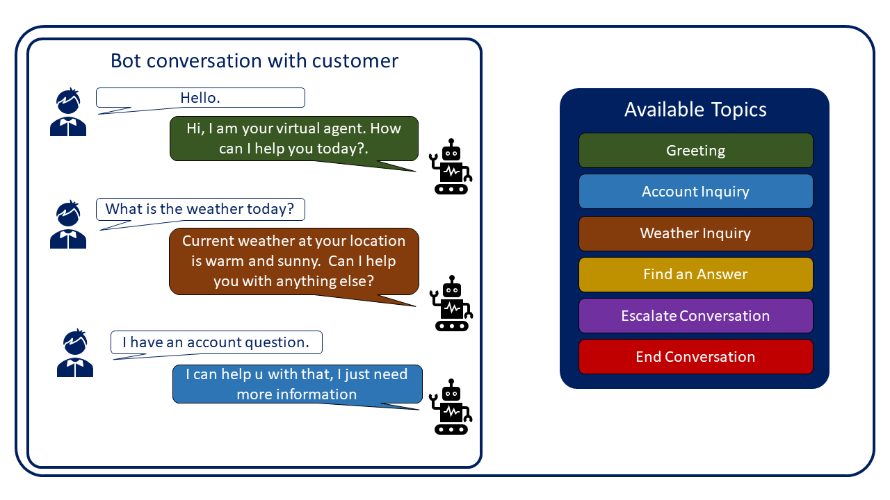

Assisting customers with AI virtual agents, often referred to as bots, is a major business trend today. Bots are being used to expand self-service support experiences for customers and to help ease agent workloads by handling specific types of support topics that are of the highest volume and easily automated. Bots help users accomplish specific tasks by using AI to identify the customer's intent and present content or implement actions that are related to that intent. For example, if someone asks about the weather conditions where they live, a virtual agent bot could find out where they live and provide them with a detailed weather forecast for their area. Virtual agents could also be programmed to help the customer check their account balance, reserve a hotel room, or send them to a live agent who can assist them with issues that are beyond the virtual agent's capability. The virtual agent needs to know what information to present to the customer based on what they are asking for.

Consider a customer's interaction with a virtual agent as a conversation that you would have with another person. While each conversation is different, they all have their main parts:

- **Conversation beginning** - Each conversation is initiated by an event such as answering a phone, a face-to-face greeting, or through engagement in other formats.

- **Discussion points or topics** - The specific topics that are being communicated during the conversation such as the weather, making plans, providing life updates, asking questions, and so on.

- **Conversation ending** - The conversation is ended with an event such as ending the phone call, shaking someone's hand, driving away, or some other action.

Conversations are driven by the topic that the customer wants to discuss. For example, if someone asks you about your new job, you would tell them about your job, not about a vacation that you just took. Virtual agents need to be able to work the same way. They need to deliver the correct details and take appropriate action based what the customer is saying.

Microsoft Power Virtual Agents bots accomplish these tasks through topics. Think of a topic as a small individual conversation on a specific subject. Multiple topics can be used together in a single bot to provide a customer with an automated conversation that feels natural and flows appropriately.

For example, a single Power Virtual Agents bot might contain the following topics:

- Greeting

- Account Inquiry

- Weather Inquiry

- Find an Answer

- Escalate Conversation

- End Conversation

Each of the preceding topics would have trigger phrases that help the bot identify when to present that topic to a customer. If the customer asks, "What is the weather?" the Weather Inquiry topic will be launched. If they state, "I have an account question," the Account Inquiry topic is launched. By defining multiple topics within a single bot, organizations can create flexible virtual agents that can be used to engage and interact with customers on a variety of individual topics.

> [!div class="mx-imgBorder"]
> 

This module will examine how to use topics to create and manage conversation paths in a bot.
