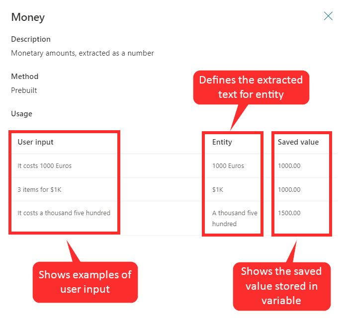
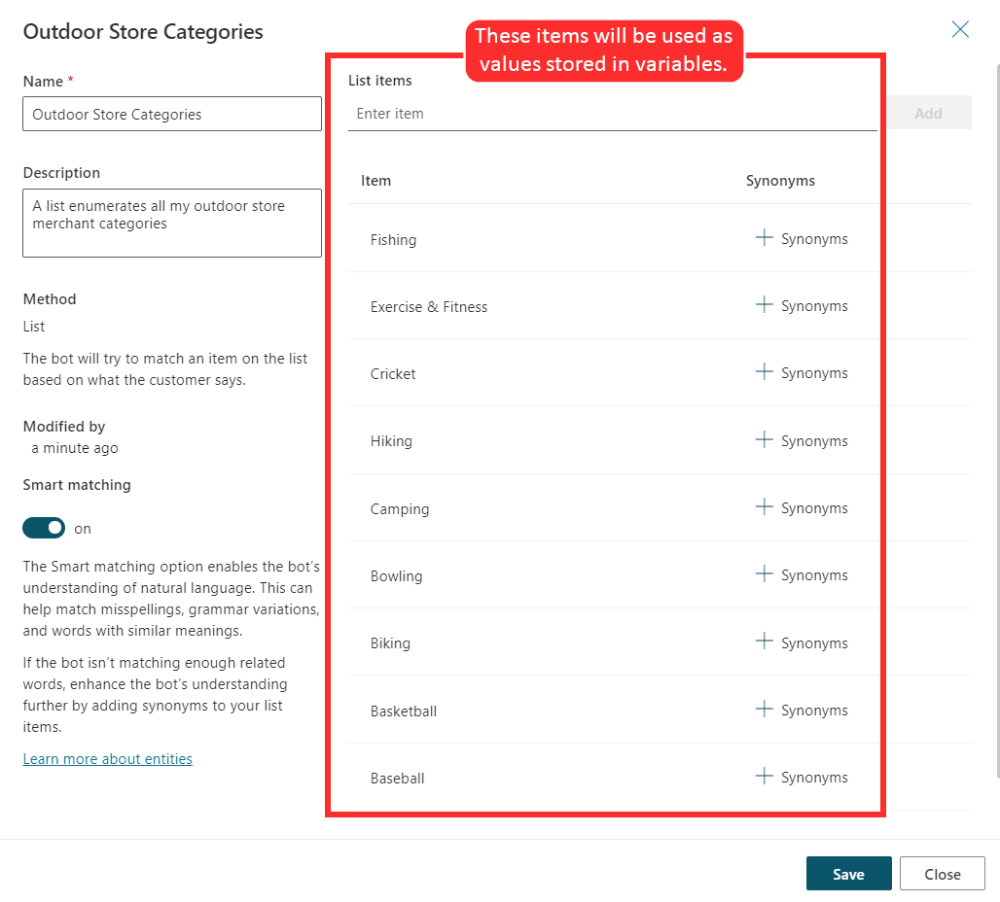
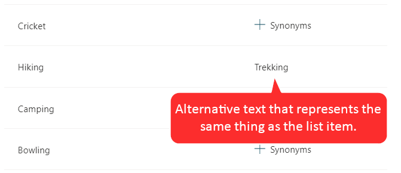
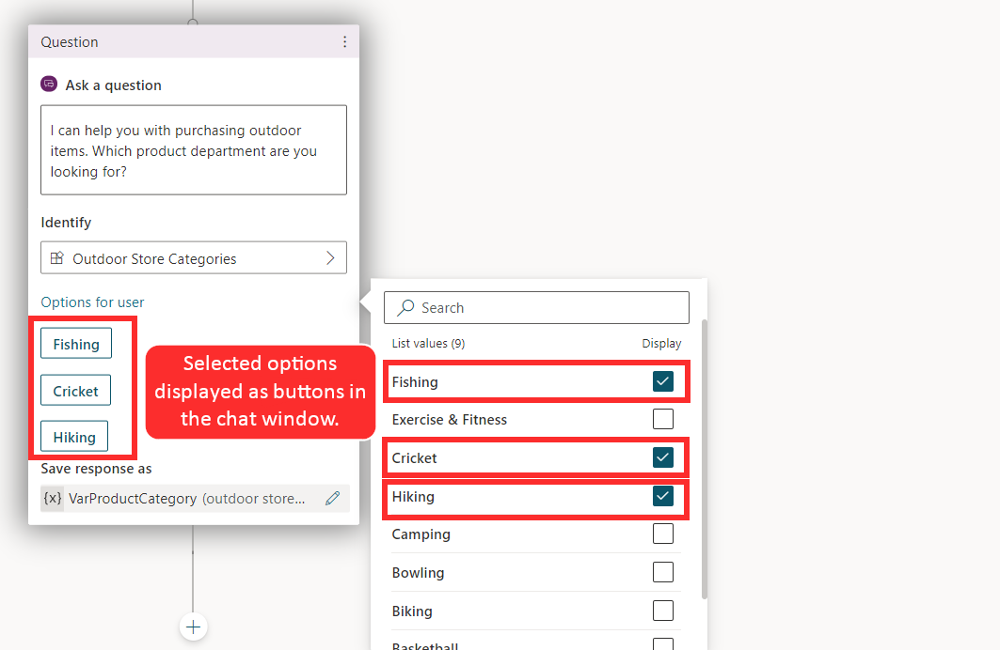
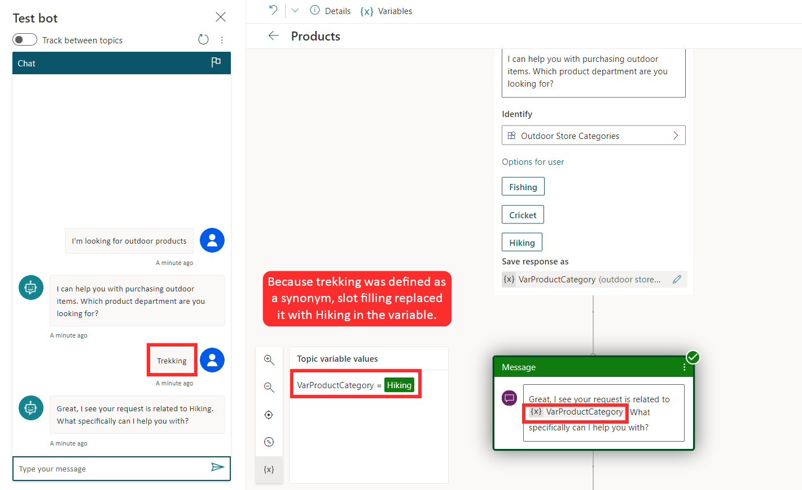
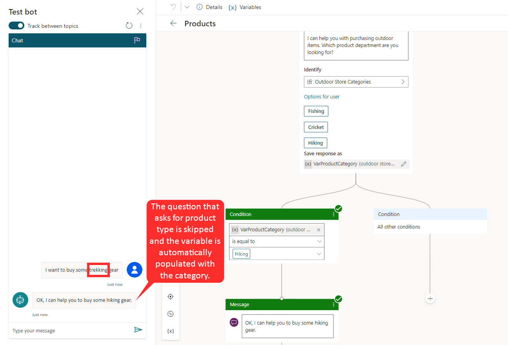

Power Virtual Agents conversations use natural language understanding to identify a user's intent based on what they entered into the conversation window. For example, when a user enters, "I tried to use my gift card, but it doesn't work," natural language understanding helps to identify and route the user to the topic that is related to gift cards not working, even if that exact phrase is not listed as a trigger phrase.

A key aspect of natural language understanding is to identify the entities that are being used in a user dialog. Think of an entity as an informational unit that represents a certain type of real-world subject such as a phone number, postal code, city, or a person's name.

Power Virtual Agents comes with a set of prebuilt entities out of the box. These entities represent some of the most commonly used information in real-world dialogs such as age, colors, numbers, and names. The knowledge that is granted by entities allows the bot to recognize the relevant information from user input and save it for later use.

For example, consider a scenario where you are using the **Money** prebuilt entity that you have accessed from the **Entities** tab. When you examine the entity, you notice an explanation and the ways that the entity can be used to look for information that is related to money or currency from a user's input.

> [!div class="mx-imgBorder"]
> 

For example, when a user enters, "It costs 1000 dollars," the bot will use this **Money** entity to determine that the "1000 dollars" entry represents the **money type** of information. When the bot extracts this entity and saves it to a variable, it will save "1000" as a number, even though the surrounding information was text.

## Create custom entities

Prebuilt entities will cover many common information types. However, situations will occur where language understanding will be needed for an organization-specific scenario. For example, if you are building a bot for an outdoor store, the bot might need to acknowledge different types of outdoor products. A custom entity called **Outdoor Products** could be created. This custom entity ensures that when someone enters a question about outdoor products related to fishing, skiing, or boating, the bot can direct them to the appropriate place.

You can create custom entities by going to the **Entities** tab on the side navigation pane and selecting **New custom entity**. After you have defined the name of the entity, provide the items that you want to be included in it.

The following image shows a created custom entity called **Outdoor Store Categories** with an added list of outdoor product category names.

> [!div class="mx-imgBorder"]
> 

### Work with smart match

Frequently, customers might mistype a word or enter a phrase that is slightly different from what is defined in the entity. For example, a customer might enter "softball" instead of "baseball." Because both sports use the same type of equipment, in terms of product categories, "softball" should be considered the same as "baseball." Smart matching lets the bot accept vague user input based on the list items that are given to the entity. In other words, the bot doesn't have to find an exact match. When smart matching is turned on, the bot will automatically autocorrect misspellings and expand the matching logic semantically, such as automatically matching "softball" to "baseball".

### Work with synonyms

The synonym option is similar to smart matching. The primary difference is that while smart matching is automatic, you can manually expand the matching logic by defining synonyms. For example, the "hiking" product category could have "trekking" and "mountaineering" added as synonyms. Similarly, for "yoga," you can add "Pilates" as a synonym. Smart match and synonyms seamlessly work together to make your bot smarter.

> [!div class="mx-imgBorder"]
> 

### Use entities in a conversation

After you have defined your custom entity, it will be available for use when you are constructing bot conversations. Select **Go to authoring canvas** for a topic and then add an **Ask a question** node.

You can also display category items as buttons. For example, if you want some of the category items to display as buttons that users can select as their input, select **User options** and then choose from the list. While in a conversation, a customer can select the item button that they want or manually enter a different category as text.

> [!div class="mx-imgBorder"]
> 

### Work with slot filling

Slot filling is a natural language understanding concept that saves an extracted entity to an object. In simple terms, slot filling matches what is entered by a customer and then stores it appropriately in a variable. For example, when asked for a category type, the customer might select the **Hiking** category button, or they might enter "trekking," as shown in the following image. Because "trekking" was defined as a synonym, it should still be considered as an entry for "hiking." Slow filling ensures that even though another word was entered, it is associated with the correct category. The extracted entity "hiking" will be used as the values for the Product Category variable.

> [!div class="mx-imgBorder"]
> 

Another concept is known as *proactive slot filling*, where the user can specify multiple pieces of information that map to multiple entities. The bot understands what information belongs to which entity automatically.

In the following example, the user entered, "I want to buy some trekking gear." This entry includes the trigger phrase that the customer wants to buy gear, but it also provides a second piece of information for the actual type of gear. In this case, the bot fills in the entity for buying gear and the entity for the type of gear. This situation is unlike the previous example, where the bot needed to prompt the user for the type of equipment. The bot accepts the user input and intelligently skips the question that asks for the product category.

> [!div class="mx-imgBorder"]
> 

The bot is always actively learning from user input, remembering information upfront so that it can skip unnecessary steps as appropriate.
