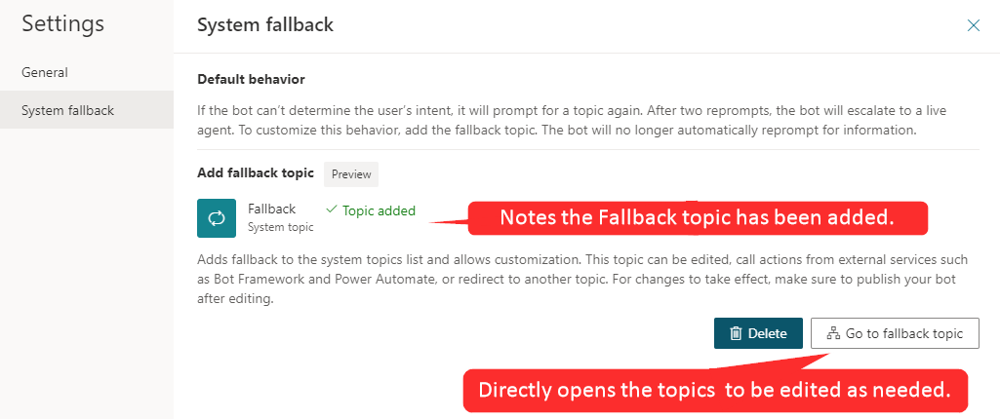
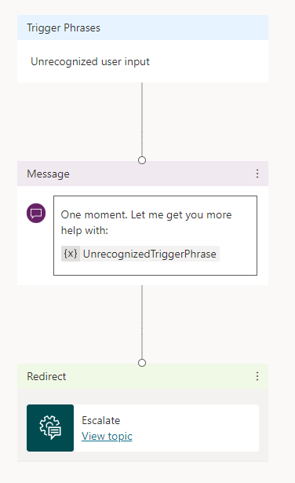
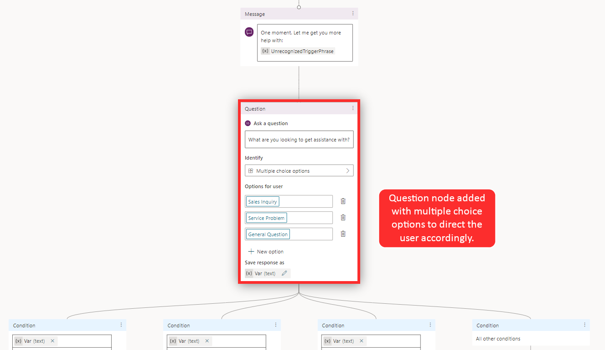
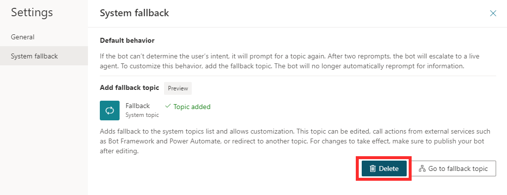

As a bot engages with customers, it triggers the most appropriate topic based on the user's input. Occasionally, the bot might not be able to determine the user's intent based on what they've typed. When this situation occurs, the bot will prompt the user again. After two unsuccessful prompts, the bot will escalate the conversation to a live agent by using the **Escalate system** topic.

Some organizations might not want to escalate all scenarios where a topic isn't triggered. For example, you can create a broad topic to use whenever the bot is unable to recognize the intent. After the bot is routed to this topic, it tries to better pinpoint what the customer is looking for by asking them questions, providing category options, or interacting with them in other ways. When you want to defer to a topic rather than trigger an escalation, use a fallback topic.

You can add fallback topics by selecting the **Settings** icon from the top navigation pane and then selecting **System fallback**. After you select the **Add** button, a system fallback topic will be added to your bot. This topic will be the one that the bot goes to when it can't find an appropriate topic or doesn't understand the user's input.

> [!div class="mx-imgBorder"]
> 

### Customize the system fallback topic

After the system fallback topic has been enabled, you will see a new **Go to fallback topic** option on the screen. Selecting **Go to fallback topic** will take you to the topic. The newly created fallback topic will also be available under **System Topics** in the topic list.

Unlike other topics, the fallback topic does not have a trigger phrase; the unrecognized user input is what triggers the topic.

The fallback topic contains two nodes:

- **Message** - Acknowledges the unrecognized input and rephrases it.

- **Escalate** - Redirects to a live agent.

> [!div class="mx-imgBorder"]
> 

As with any other system topic, the fallback topic can be customized to fit your needs. For example, you can present the user with a question such as, "What are you looking to get assistance with?" Then, the customer could be presented with options such as **Sales**, **Service**, or **General**. Based on what the user selects, the bot could redirect them to a topic that is related to that selection, implement a Power Automate flow, send an email, or (if needed) escalate the customer's issue to an agent. The initial unrecognized text that is entered by the user is stored in a variable called *UnrecognizedTriggerPhrase*.

> [!div class="mx-imgBorder"]
> 

You can use the information that is stored in the UnrecognizedTriggerPhrase variable to further personalize the experience. For example, you can pass the information as input to a [Power Automate flow](https://docs.microsoft.com/power-virtual-agents/advanced-flow/?azure-portal=true) or [Bot Framework Skill](https://docs.microsoft.com/power-virtual-agents/advanced-use-skills/?azure-portal=true).

### Delete a system fallback topic

If you find that the system fallback behavior is not what you are looking for, it can be reset to return it to its default behavior. By using **Settings**, return to **System Fallback** and select **Delete** to remove the fallback topic.

> [!div class="mx-imgBorder"]
> 
