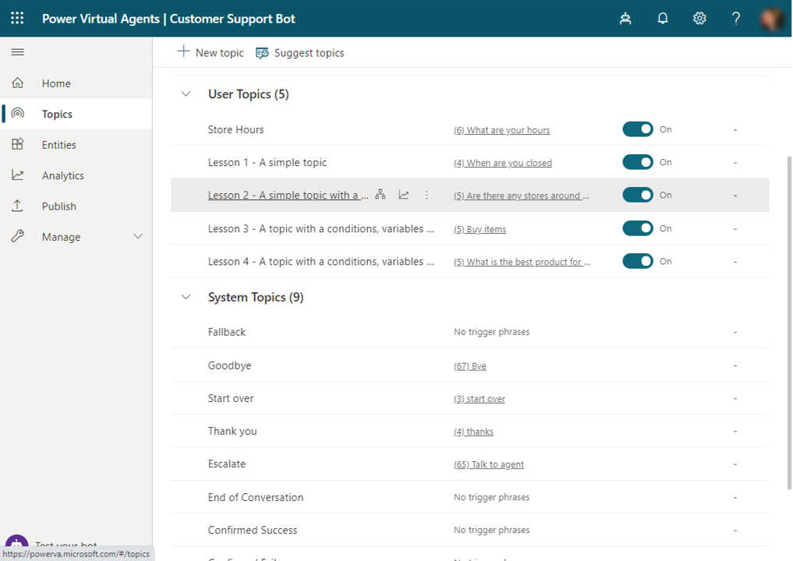
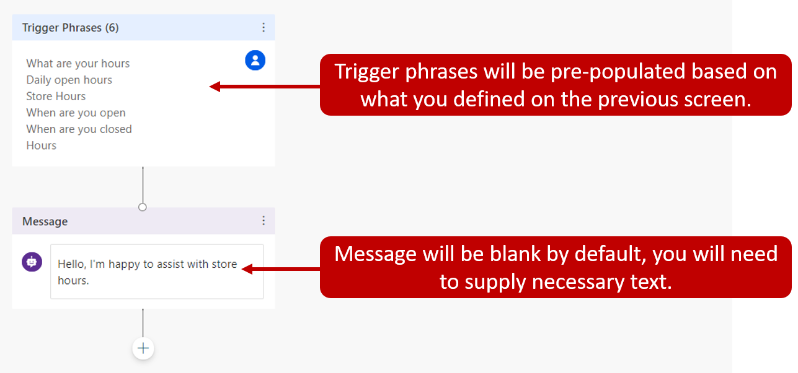
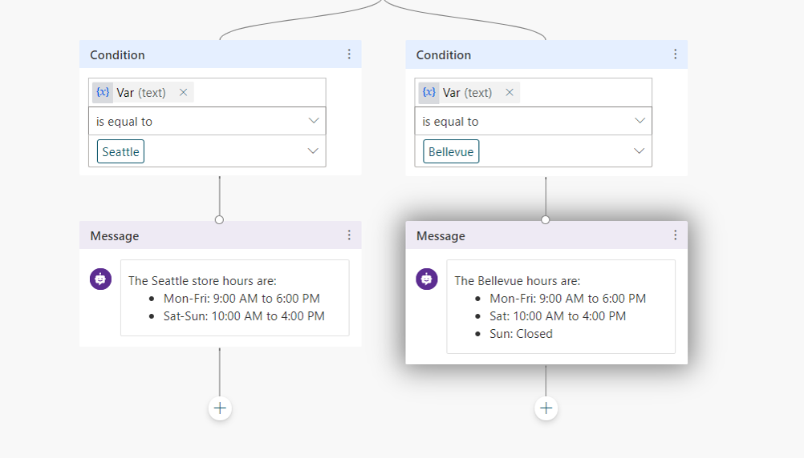

Now that the initial structure of the bot has been created, your next step is to begin writing topics. Topics define how the customers will interact with the bot, and they typically represent common issues, questions, or tasks that customers might need assistance with. For example, you might create a topic to provide customers with item return instructions. 

Each topic consists of two primary elements:

- **Trigger phrases** - Phrases, keywords, or questions that are entered by users and relate to a specific issue.

- **Conversation nodes** - Define how a bot should respond and what it should do.

You can design topics by [customizing provided templates](https://docs.microsoft.com/power-virtual-agents/authoring-template-topics/?azure-portal=true), creating a new one, or using a topic that has been suggested from existing sites. Your bot can have up to 1,000 topics.

## Get started with topics

Each created bot will include several predefined topics to help you get started. These predefined topics are separated into two types:

-   **Lesson** - Pre-created user topics that can help you understand simple and complex ways of using nodes to create bot conversations.

-   **System** - Prepopulated topics that represent common use cases that can occur during a bot conversation.

> [!div class="mx-imgBorder"]
> 

## Work with lesson topics

The intent of lesson topics is to provide examples of how to use topics to solve specific scenarios and to help you become more comfortable as you create bots. Lesson topics range from simple, such as providing a user with store hours, to more complex scenarios, where the bot assists online shoppers with items in their cart.

The following table describes the four included lesson topics.

|     Topic                                                                   |     Description                                                                                                                                                                                              |     Notes                                                                                                                                                                                                                                                                                                                                                                            |
|-----------------------------------------------------------------------------|--------------------------------------------------------------------------------------------------------------------------------------------------------------------------------------------------------------|--------------------------------------------------------------------------------------------------------------------------------------------------------------------------------------------------------------------------------------------------------------------------------------------------------------------------------------------------------------------------------------|
|     Lesson 1 – A simple topic                                              |     Goes through the creation of a simple topic with one conditional branch that displays store hours.                                                                                                        |                                                                                                                                                                                                                                                                                                                                                                                      |
|     Lesson 2 – Simple topic with condition and variable                   |     A simple topic that contains one conditional branch and a variable that displays store locations based on the customer's preferred store location.                                                  |     A variable is a name for an item that will be used later in the topic flow. In this example, pva_StoreLocation is the variable that is used to store the user's response when you ask for their preferred store location.                                                                                                                                                              |
|     Lesson 3 – Topic with conditions, variables, and a prebuilt entity    |     Goes through the creation of a topic that includes one conditional branch, a variable, and an entity. In this lesson, the bot uses the State entity and will recognize any US state that the user enters.    |     Topic entities help identify key information from what the user enters and will automatically fill in that information into your variables. For example, if you type "I want to buy a red car," the bot doesn't need to ask which color because the bot recognizes the Color entity in the content that you typed. The bot will then skip the question that asks for color.    |
|     Lesson 4 - Topic with conditions, variables, and a custom entity       |     Goes through the creation of a topic with a conditional branch, a variable, and a custom entity.                                                                                                        |     This lesson is similar to the previous example, except that you create a custom entity to capture information. For example, try testing this topic by typing, "I want a business laptop."                                                                                                                                                                                                              |

## System Topics

System Topics represent scenarios that customers are likely to encounter while interacting with your bot, such as initiating and ending a conversation or escalating a conversation to a live agent. System topics will have a basic structure already in place, based on what the scenario is. For example, the greeting topic will already have predefined triggers and a basic conversation path that you can begin to modify based on your needs.

> [!div class="mx-imgBorder"]
> 

## Create topics

You will define any additional topics by selecting **Topics** in the side navigation pane and then selecting **New topic** at the top of the page. Each topic that you define should include some trigger phrases. Trigger phrases are examples of text such as questions or utterances that teach the bot when to respond with this dialog. For example, the following image contains a topic called Store Hours, which will be used to provide customers with store location hours based on different scenarios.

> [!div class="mx-imgBorder"]
> 

Six trigger phrases have been added, such as *What are your hours?* and *When are you open?* These phrases will be used to determine when the Store Hours topic should be initiated. The more trigger phrases you add, the more likely it is that the topic will be appropriately used. Trigger phrases should be unique to each topic. If you have the same trigger in multiple topics, the bot will not be able to identify which topic to load. After you have added the initial triggers, select **Save topic** to add the topic to the **Topics** list. Additional triggers can be added later as needed.

After you have saved your topic, you can define how customers are guided through their conversational interaction with the topic. You can define the path by selecting **Go to authoring canvas**. The authoring canvas is a graphical dialog tree editor that allows you to define bot responses and the overall bot conversation. When the canvas loads, the conversation will consist of two nodes:

-   The trigger phrases that will initiate the topic.

-   The initial message that will be provided to the user.

The trigger phrases will be prepopulated with the items that are defined in the previous step. You will need to provide the initial message to the user such as "Hello, I'm happy to assist with store hours."

> [!div class="mx-imgBorder"]
> 

## Work with conversation nodes

Conversation nodes help define the path that the conversation will take. Conversation nodes can display messages, ask questions, or run actions. You can add these nodes by selecting the plus sign (**+**) below the node. For example, if you want to provide store hours based on where the customer lives, you would add an **Ask a question** node to identify which store location that they want the hours for.

The following image shows the **Ask a question** node being used to ask the customer which store location they want the hours for. In addition, the customers are provided with two multiple-choice options to choose from: Seattle and Bellevue.

> [!div class="mx-imgBorder"]
> 

Separate conversation paths are created based on the customer's response. In the forked conversation path, each node has automatically checked for **Seattle** in one path and **Bellevue** in the other path to take the appropriate next step. Additional nodes can be added for each path based on what you want it to do.

The following image shows that for each path, a **Message** node is added that provides the store hours for that specific location.

> [!div class="mx-imgBorder"]
> 

You now have a simple branching dialog tree and can begin to create more complex versions of this tree by incorporating [variables](https://docs.microsoft.com/power-virtual-agents/authoring-variables/?azure-portal=true), [entities](https://docs.microsoft.com/power-virtual-agents/advanced-entities-slot-filling/?azure-portal=true), and [Power Automate flows](https://docs.microsoft.com/power-virtual-agents/advanced-flow/?azure-portal=true).

