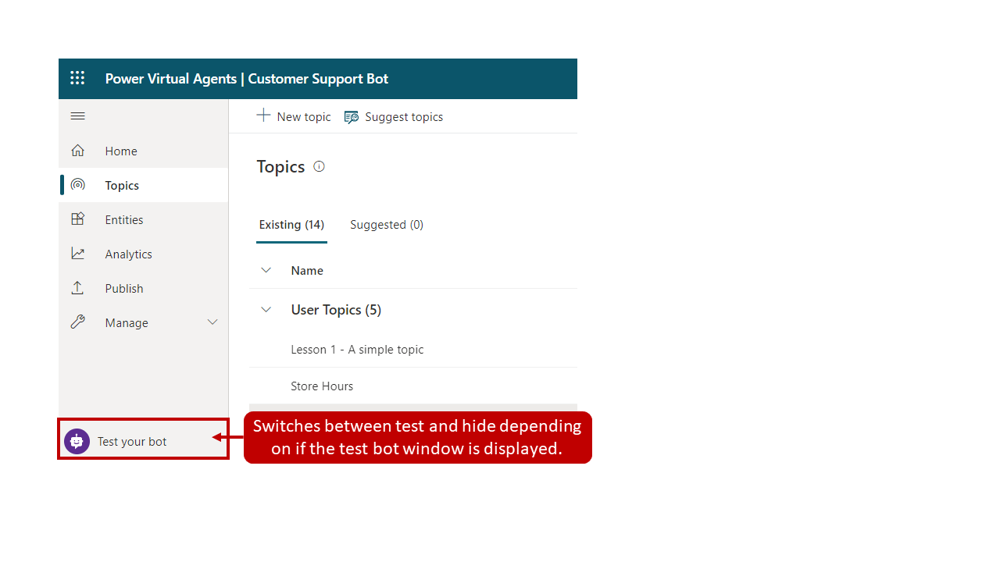
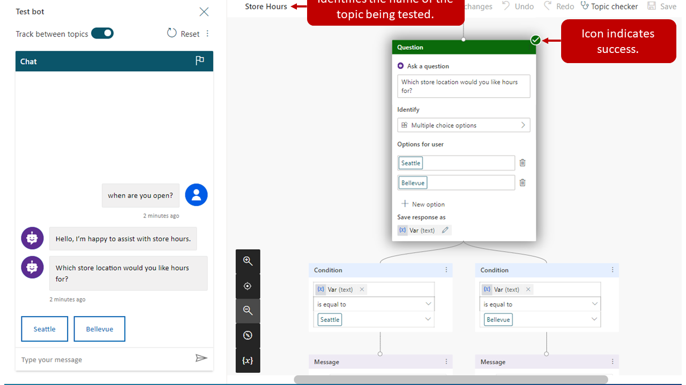

Because a bot is made up of multiple topics, it is important to ensure that each topic is working appropriately and can be interacted with as intended. For example, if you want to make sure that your Store Hours topic is triggered when someone enters text asking about store hours, you can test your bot to ensure that it responds appropriately.

You can test your bot in real time by using the test bot panel, which you can enable by selecting **Test your bot** at the bottom of the side navigation pane. When the panel displays, the button name changes to **Hide your bot** so that you can hide it if more space is needed during the design process.

> [!div class="mx-imgBorder"]
> 

The **Test bot** window interacts with your bot topics just as a user would. As you enter text into the test bot window, information will be presented as it would to a user. Your bot will likely contain multiple topics. As you engage with a specific topic, it might be handy to have the application take you to that topic. You can accomplish this task by turning on the **Track between topics** option at the top. This option follows along with the bot as it implements the different topics. For example, typing "hello" would trigger the Greeting topic, and then the application will open the Greeting topic and display its conversation path in the window. If you were to type "When are you open?" the application will switch to display the Store Hours topic. As each topic is displayed, you can observe how the path progresses, which will help you evaluate how your topics are doing.

> [!div class="mx-imgBorder"]
> 

The following image shows that the "When are you open?" message has been sent to the bot. Notice that you are automatically taken to the Store Hours topic. The conversation path is highlighted in green. The bot is now waiting for you to respond and has provided two suggestion buttons on how to respond. These suggestion buttons reflect the Seattle and Bellevue user options that were defined when the topic was previously created. In the test bot, you can select either of these suggestion buttons to continue.

> [!div class="mx-imgBorder"]
> 

As you select an option, you continue down the conversation path until you reach the end. The chat will stop when you reach the bottom of this branch.

By testing your bots often throughout the creation process, you can ensure that the conversation flows as anticipated. If the dialog does not reflect your intention, you can change the dialog and save it. The latest content will be pushed into the test bot, and you can try it out again.
