Welcome to the Contoso Retail Company! We specialize in all the world's retail needs, and with you as our newest Customer Support team member, we have no doubt that together we will reach higher levels of success and innovation!

Consumer sentiment is at an all-time high, but with increasing competition, it is more important than ever to minimize costs and focus on customer satisfaction so that we can maintain our competitive edge in having a robust customer base, while continuing to invest back into the customer experience and maximize our customer lifetime value.

Customer support costs have continued to rise as the customer base has grown, and the company can no longer continue to expand the Customer Support team. You have been tasked with finding a solution using Power Virtual Agent.

## Exercise 1: Build your first chatbot 

In this exercise, you will go through the steps of creating, deploying, and testing your first bot to handle a common customer request.

### Task 1: Sign in to create a bot 

1.  Go to [https://powerva.microsoft.com/](https://powerva.microsoft.com/?azure-portal=true) and select **Sign in**. Sign in with your own work or school account.

	> [!div class="mx-imgBorder"]
	> [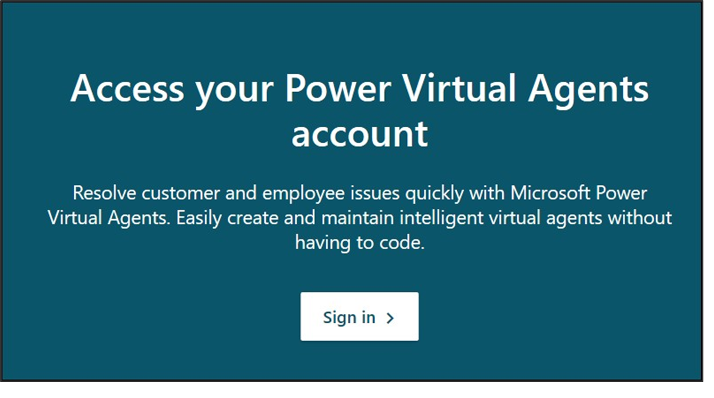](../media/lab-1.png#lightbox)

1.  Select the region/country and select Start free trial or Get Started.

	> [!div class="mx-imgBorder"]
	> [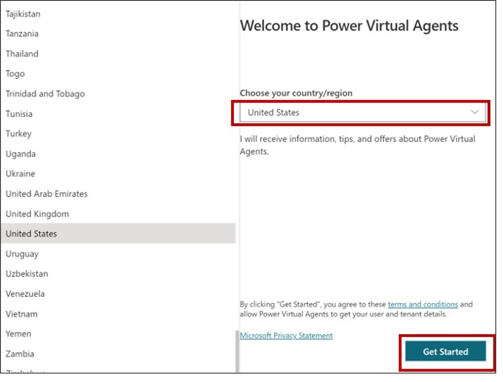](../media/lab-2.png#lightbox)

1.  Name your bot anything you like (such as "Contoso customer service"). Select the **Language**, an **Environment**, and then click **Create**. Note that from here you also have the option to create a new environment. A bot environment is where your organization will store, manage, and share the bot, business data, apps, and Power Automate flows.

	> [!div class="mx-imgBorder"]
	> [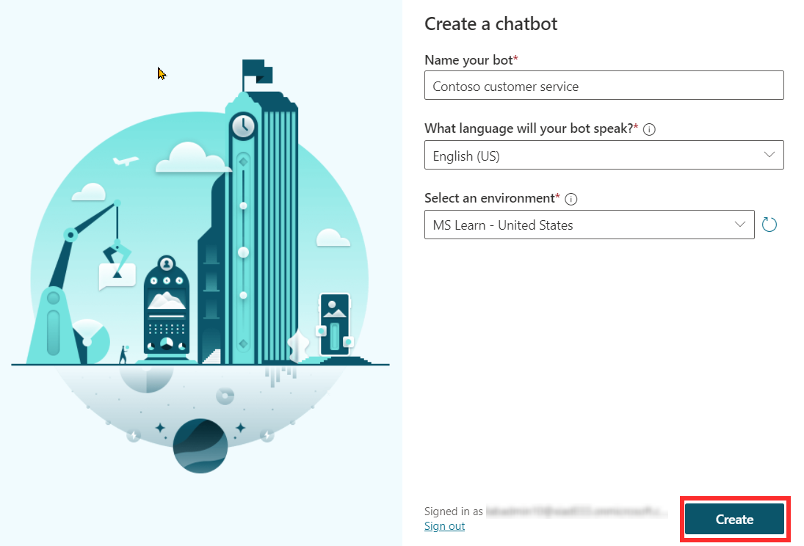](../media/lab-3.png#lightbox)

	> [!NOTE]
	> Once you select **Create**, the process of creating the first bot within a new environment can take up to 15 minutes. Subsequent bots will be created much faster.

	After you create your bot, it appears in the list under the robot icon on the navigation bar.

	> [!TIP]
	> If you've created a bot in this environment before, to create another bot select the robot icon on the navigation bar, and then select **New bot**.

### Task 2: Take a quick tour of the user interface 

Power Virtual Agents makes it easy to build your bot without ever writing a line of code. Let's take a quick tour of the six main pages:

> [!div class="mx-imgBorder"]
> [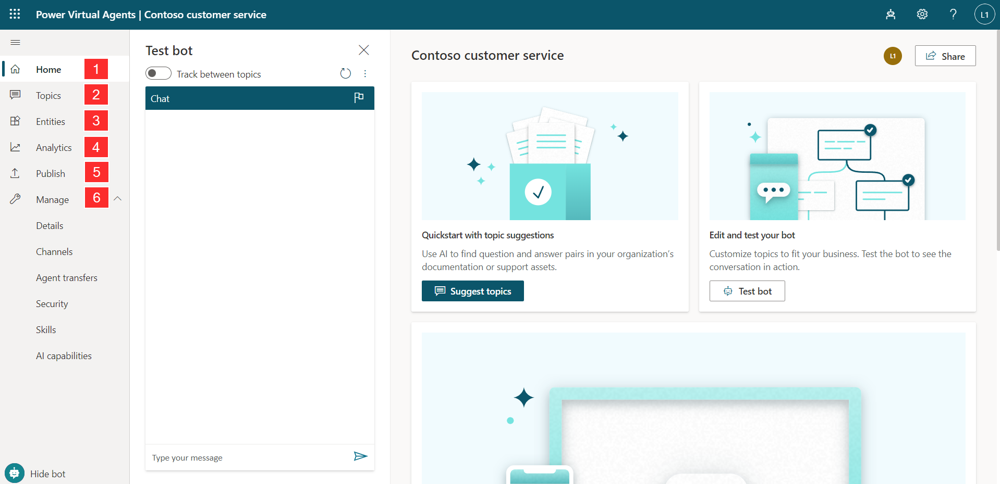](../media/lab-4.png#lightbox)

1.  **Home** page, which includes shortcuts to the Topics, Publish, and Analytics pages, as well as links to **Power Virtual Agents documentation**, **Support** **community** where you can ask questions, and **Idea forum** for sharing ideas and leaving product feedback.

1.  **Topics** page, where you view, delete, create, and edit conversation topics.

1.  **Entities** pages, where you view and create entities that Power Virtual Agents can recognize in customer conversations and load into variables.

1.  **Analytics** page, where you view metrics to monitor how well your bot is serving your customers and find ways improve it.

1.  **Publish** page, where you can publish the bot for team testing or to engage with your customers.

1.  **Manage** page, where you can select the **Channels** (such as your website or Facebook) you want customers to interact with your bot, configure **Authentication** to let your users sign in to their account with you when using the bot, and extend your bot's conversational capabilities with **Skills**.

## Exercise 2: Try out a conversation in the Test Bot pane (Hello!) 

Now let's try out the bot using one of the four pre-built lessons included when you create a new bot.

> [!div class="mx-imgBorder"]
> [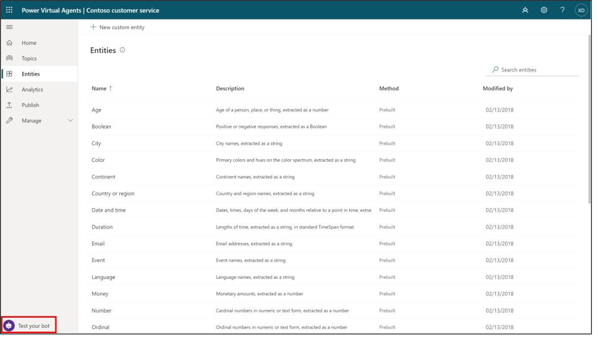](../media/lab-5.png#lightbox)

1. To show the Test bot, in the bottom-left corner of the screen, select Test your bot. (If the button says "Hide bot", then your Test bot is already showing.) At the top of the Test bot, turn on the **Track between topics** toggle.

1. At the **Type your message** prompt at the bottom of the Test bot, type: **Hello** and then select the **Send** button.

	> [!div class="mx-imgBorder"]
	> 

	The bot will offer a greeting in the Test bot pane.

	Additionally, the **Topics** page will open (no matter which page you were on before) and you can see the greeting topic open in the authoring canvas window, with green outline and a checkmark added for each part of the conversation design when it is used in the test chat. (This is what the **Track between topics** feature does; if you hadn't turned this on, you wouldn't see any changes to the page selection and you would see the green highlights in the greeting topic only if you had already opened it from the Topics page.)

	> [!div class="mx-imgBorder"]
	> [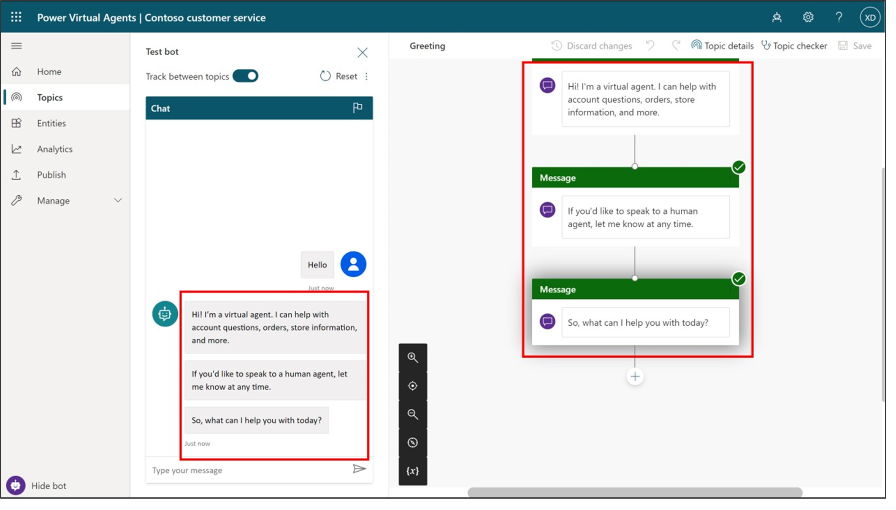](../media/lab-7.png#lightbox)

1. In the Test bot, enter the following message and press **Send**: **stores near me**.

	Notice that a new topic opens in the authoring canvas. You have triggered one of the pre-built topics (Lesson 2).
	
	Now, in the test chat, pick the store location you want.
	
	> [!div class="mx-imgBorder"]
	> [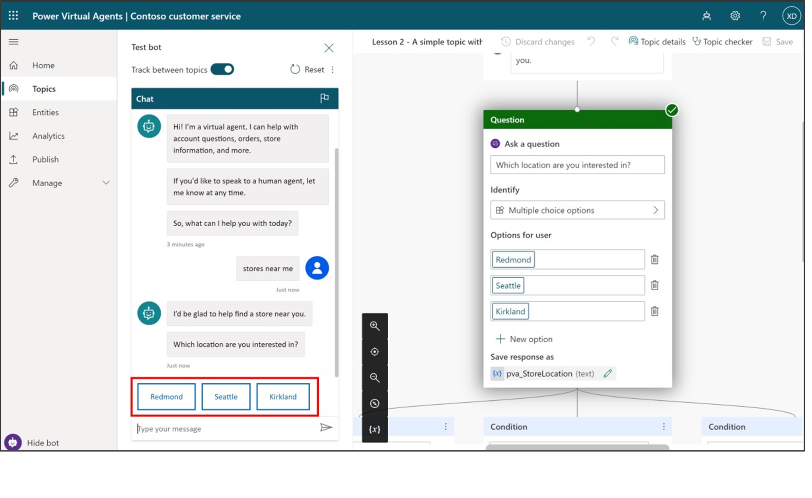](../media/lab-8.png#lightbox)

## Exercise 3: Edit your conversation 

Now, let's make a change to that conversation by adding another store location. We'll make a copy first so that later you can go back to the Lessons as they were written if you want to.

### Task 1: Make a copy of the topic 

1.  At the bottom left of the page, select **Hide bot** to put the Test bot out of your way for now.

1.  Toward the top left of the page, select the **Topics** tab to open the **Topics** list.

1.  Hover your mouse over the row for the prebuilt topic **Lesson 2 - A simple topic with a condition and variable**. Click the More actions icon, then **Make a copy**.
	
	> [!div class="mx-imgBorder"]
	> [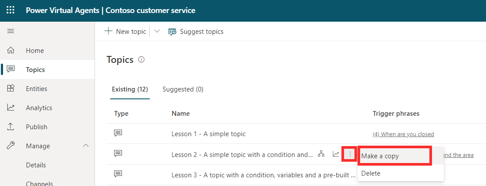](../media/lab-9.png#lightbox)
	
	A copy of the topic will appear at the top of the Topics list and its **Status** is set to Off. We will turn it on later when we're ready to test our changes.

### Task 2: Edit the copy of the topic 

1.  Select the name of the copied topic (the one at the top of the **Topics** list) to open the topic.

	You are now looking at the **Setup** page for the topic. This page is where you enter the topic **Name** (which will appear to your customers), **Description** (which doesn't appear to your customers but is for your own use), and **Trigger phrases** (we'll go into detail about trigger phrases later).

1.  Select the current text in the **Name** field, delete it, and type to rename the topic to **Get store locations**.

1.  Select **Save topic** in the upper right corner of the page.

	> [!div class="mx-imgBorder"]
	> [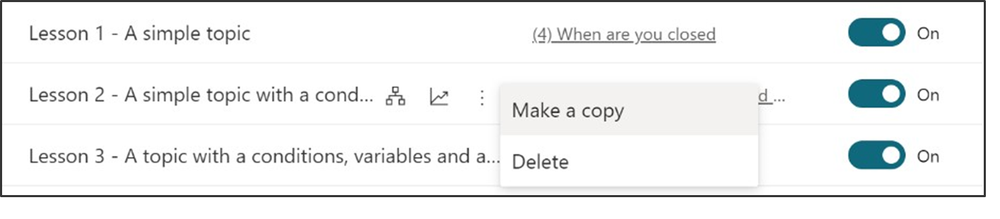](../media/lab-10.png#lightbox)

1.  Let's imagine you opened a new store in Bellevue. To add the store info to your bot, you need to edit the topic design in the authoring canvas. Select **Go to authoring canvas**.

	The authoring canvas contains all the text and logic for the conversation about store locations. At the top, you'll see a reminder of the trigger phrases, which are added and edited on the **Setup** page.

	> [!div class="mx-imgBorder"]
	> 

1.  Scroll down the page to see the conversation design.

	Each of the connected boxes you see is called a "node." You can see that the bot displays a message in a **Message** node that it's happy to help find a store location and then asks in a **Question** node which location the user is interested in. (You can reopen the test bot to see that this is the same as the conversation you had in Exercise 2. Then close the test bot again.)

1.  Scroll to the Question node that asks "Which location are you interested in?". We're going to add another option here.

1.  Under "Redmond" "Seattle" "Kirkland," select **+ New option**.

	> [!div class="mx-imgBorder"]
	> [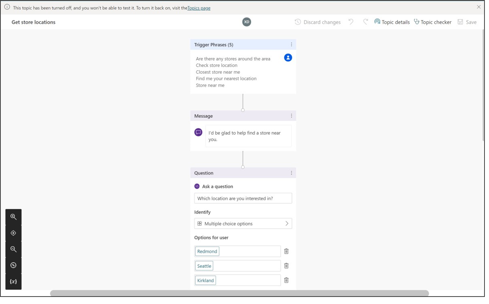](../media/lab-12.png#lightbox)

	A new **Condition** node is added under the Question node.

	> [!div class="mx-imgBorder"]
	> [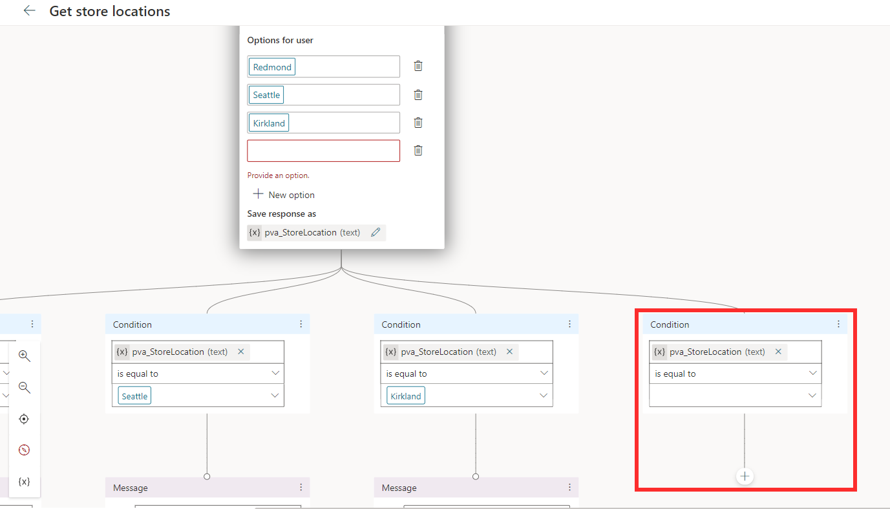](../media/lab-13.png#lightbox)

1. In the Question node (**NOT** in the Condition node), type **Bellevue** in the newly added empty box under **Options for user**.

	**Bellevue** is automatically added for you in the Condition node too.

	> [!div class="mx-imgBorder"]
	> [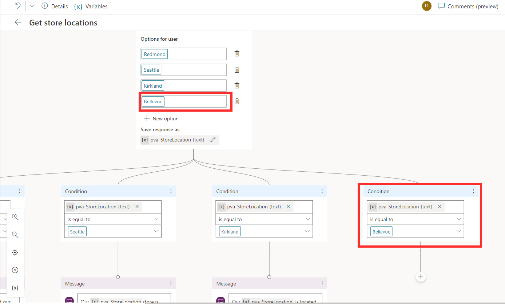](../media/lab-14.png#lightbox)

	> [!NOTE]
	> The **Options for user** section controls what buttons are visible to users in the chat window, and always need to be matched with a condition, or the button won't work. The Conditions, however, can handle the user typing something that is not shown in a button. So for instance if you were to delete the Bellevue **Options for user** button, it would not delete the Bellevue Condition node, which would be used if the user types "Bellevue" when asked for a location.

	Now, you'll tell the bot what message to display if the user selects **Bellevue**.

1. Click the + icon underneath the Bellevue condition node. From the options that appear, select **Show a message**.

	> [!div class="mx-imgBorder"]
	> [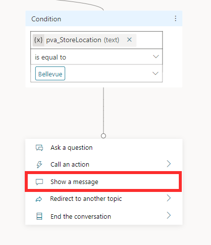](../media/lab-15.png#lightbox)

	This adds a new Message node connected to the Bellevue condition.

1. In the Message node, enter the store location info: **Our Bellevue store is in 1234 Bellevue Way, Bellevue, WA 98123.**

	> [!div class="mx-imgBorder"]
	> 

	> [!NOTE]
	> You can format the message text using the formatting buttons that appear while you're typing. You can even replace the name of the location with the value of the pva_StoreLocation variable by using the {*x*} control.
	
	You are now going to end the conversation. Since the conversation ends the same way no matter which location the user chose, we're going to link to a shared **End of conversation** node. This node starts the **End of conversation** system topic.

1. First, zoom out if necessary to see the **End of conversation** node on your screen. (**Zoom out** is in the utility bar on the left of the authoring canvas.)

	> [!div class="mx-imgBorder"]
	> 

1. Select the **Add node** button below the Bellevue location Message node. When the list of options appears, instead of selecting an option, hover your mouse over the connector dot at the top, which will turn pink. Then select the dot and drag the connector to the left until you connect with the top of the **End of conversation** node (which is already connected to the other three location messages).

	> [!div class="mx-imgBorder"]
	> [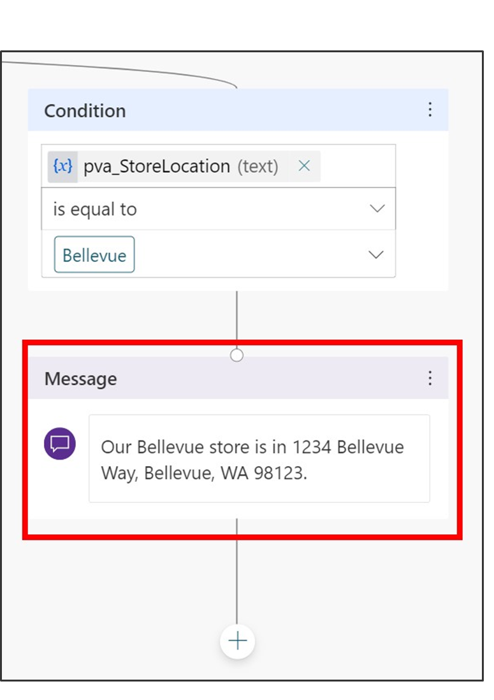](../media/lab-18.png#lightbox)

1. At the top right of the page, select **Save** to save the changes you made.

### Task 3: Turn on your topic and test your changes 

You may recall that when we made a copy of the Lesson 2 topic, the copy was created in an Off state. This means you can't trigger the topic in the test bot (and if you published your bot, your users couldn't trigger it either). We're ready to turn on the edited topic now.

1.  Select the **Topics** tab in the left navigation to return to the Topics list.

1.  Select the **Status** toggle from On to **Off** for **Lesson 2 - A simple topic with a condition and variable** and select the **Status** toggle from Off to **On** for **Get store locations.** Now, you can test the conversation you edited.

	> [!div class="mx-imgBorder"]
	> [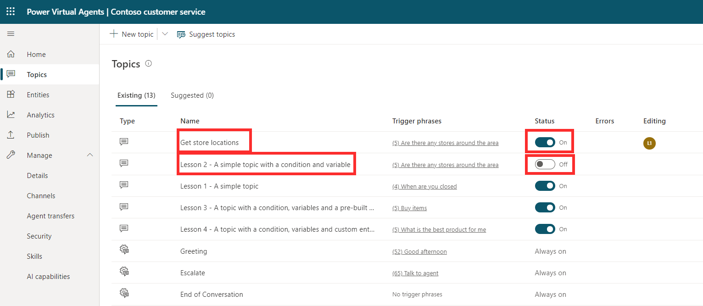](../media/lab-19.png#lightbox)

1.  In the bottom-left corner of the page, select **Test your bot**. Make sure the **Track between topics** toggle is set to the **On** position. In the test bot, enter **Is there a store near me?** and select the **Send** button.

	> [!div class="mx-imgBorder"]
	> [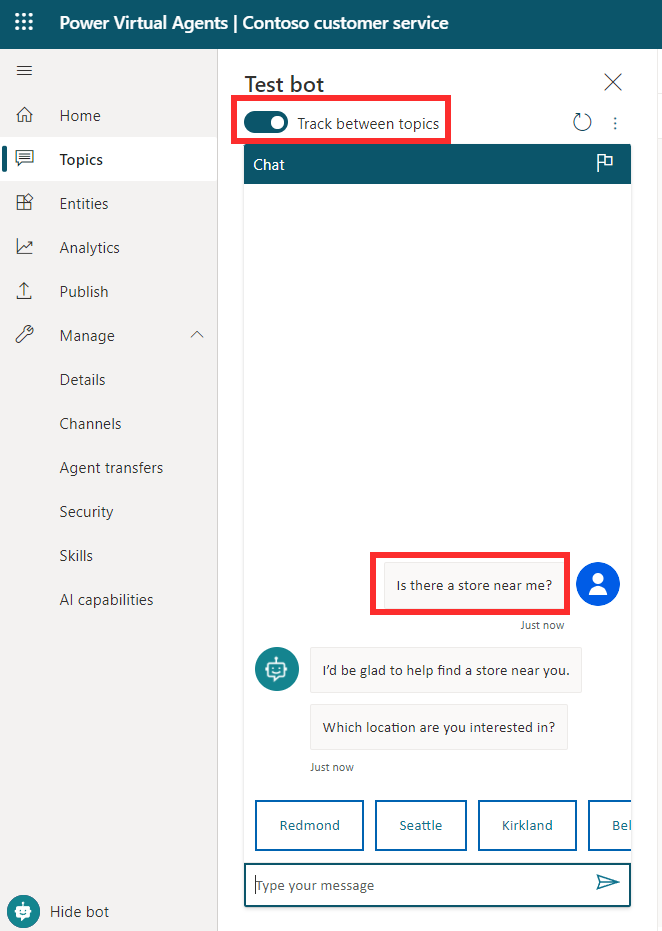](../media/lab-20.png#lightbox)

	Notice that even though it isn't exactly the same as the trigger phrases in the topic, "Is there a store near me?" works to trigger the topic because Power Virtual Agents understands that it means the same thing as the trigger phrases.

1.  When asked to select a location, select the **Bellevue** location in the test chat. (You might need to use the onscreen right arrow to see the Bellevue option. 

	> [!div class="mx-imgBorder"]
	> [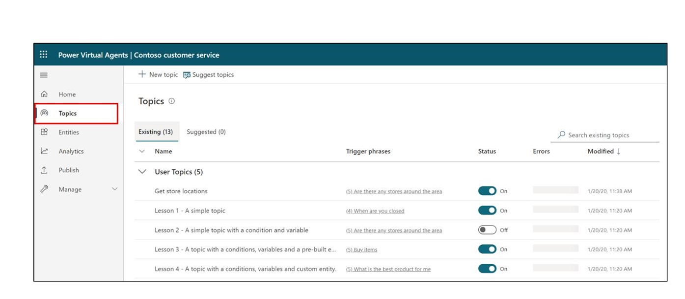](../media/lab-21.png#lightbox)
	
	The bot replies with location info for Bellevue store. Notice that the conversation continues in the **End of conversation** system topic. Feel free to keep chatting with the test bot.

## Exercise 4: Publish your bot to the demo site for testing 

Power Virtual Agents provides a demo website so that you can invite anyone to test your bot by sending them the URL. This demo website is useful to gather feedback to improve the bot content before you activate the bot for your real customers.

1.  Go to the **Publish** tab on the left navigation pane.

1.  Select **Publish** to push the latest bot topics to the demo website. You will need to do this before you use the demo site the first time and also after you make changes to the bot topics that you want people to test on the demo website. (When you've created your real chatbot, you will Publish each time you want to make updated topics available to your customers.)

	> [!div class="mx-imgBorder"]
	> [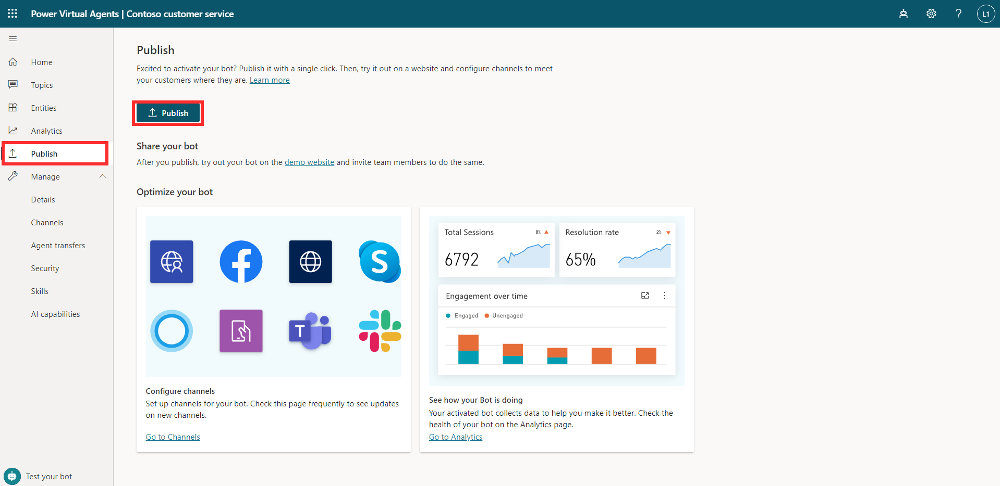](../media/lab-22.png#lightbox)

	The publishing process will check for errors in the bot topics whose Status is On. Publication should take only a few minutes.

	You will see a message at the top of the screen when publishing is complete.

1.  Select the link for the **demo website**.

	> [!div class="mx-imgBorder"]
	> [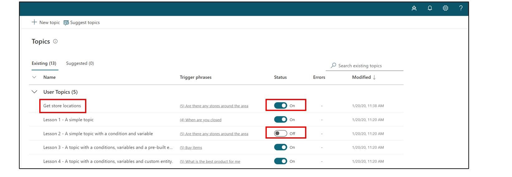](../media/lab-23.png#lightbox)

1.  When the demo site window opens, you can interact with the bot canvas by typing at the **Type your message** prompt or by selecting a starter phrase from the provided options.

	> [!div class="mx-imgBorder"]
	> [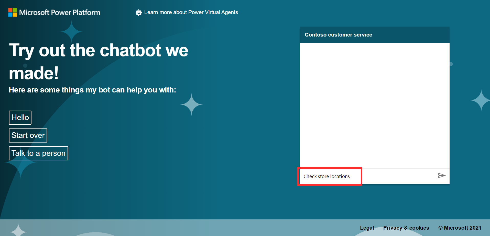](../media/lab-24.png#lightbox)

1.  You can share the URL of the **demo website** with your team.

Congratulations! You have built and published your first chatbot!
