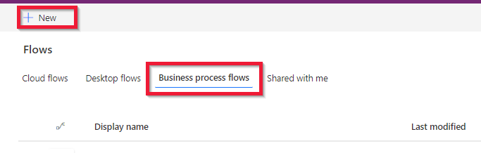
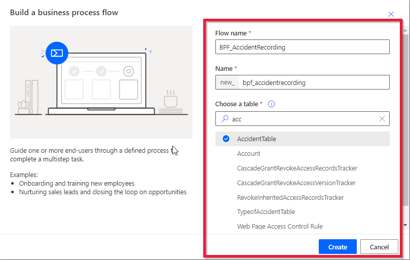
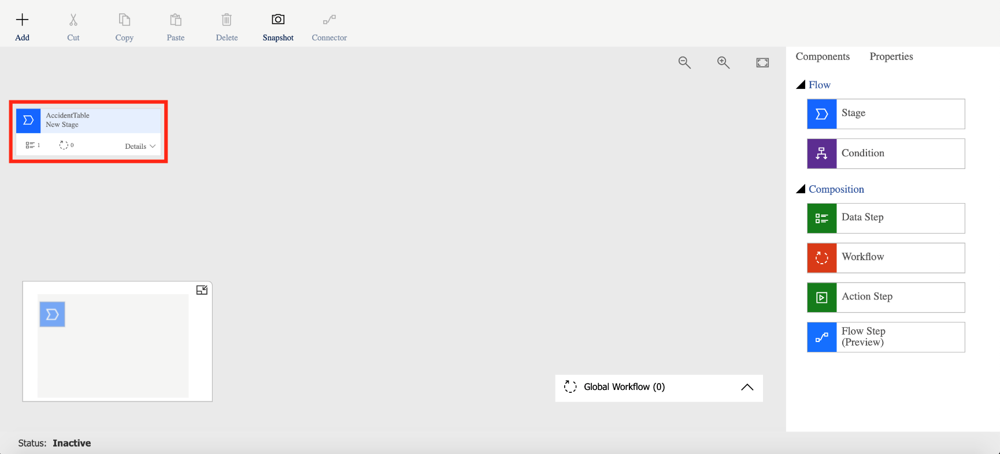
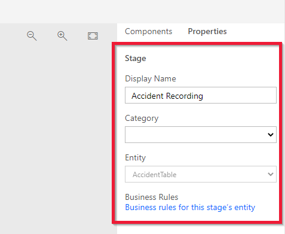
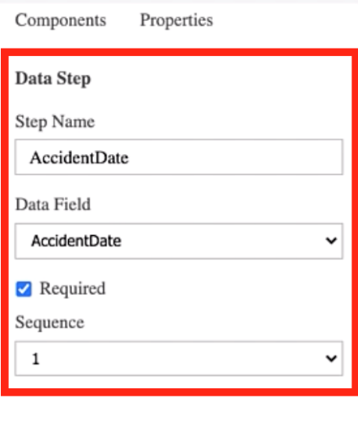
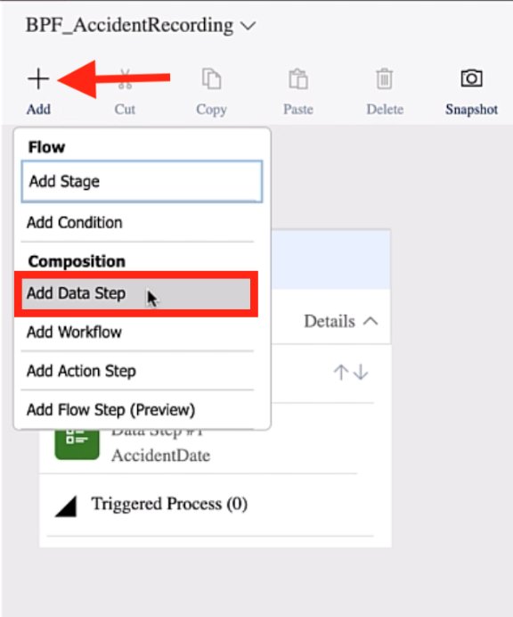
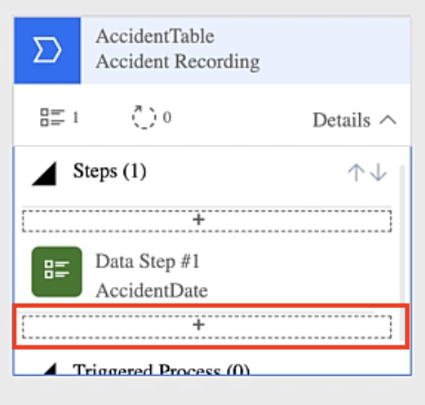
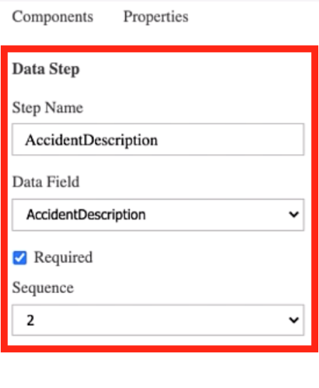
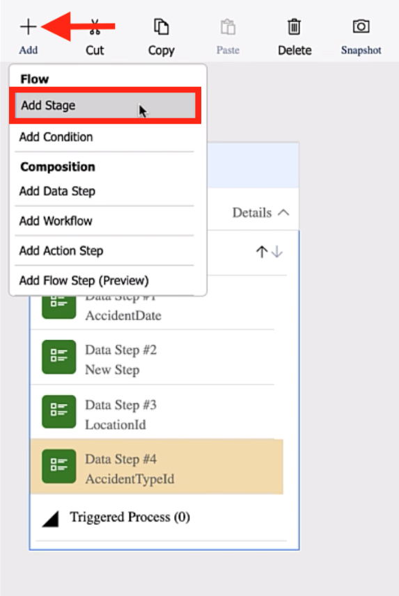
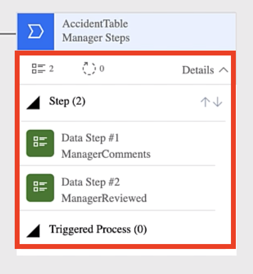

In this exercise, you will continue building the Accident Tracking application.

>[!NOTE]
> If you haven't completed the previous modules within this learning path, download the [packaging files](https://github.com/MicrosoftDocs/mslearn-developer-tools-power-platform/tree/master/power-apps/business-process-flow). These files contain the completed work on the Accident Tracking app thus far.

1. To get started, go to [Microsoft Power Apps](https://make.powerapps.com/?azure-portal=true) and sign in with your Microsoft credentials.

1. Select **Flows**.

1. Select **Business process flows** and then **+ New**.

	> [!div class="mx-imgBorder"]
	> 

1. Give your flow a meaningful name. For this exercise, name it **BPF\_AccidentRecording**.

1. Select the table that you want to attach the business process flow to. For this example, select the **AccidentTable** and then select **Create**.

	> [!div class="mx-imgBorder"]
	> 

1. In the business process flow designer, create the following components:

	-   A stage to direct an employee to log an accident
	
	-   Another stage for managers to enter their comments and approve the accident record

	> [!div class="mx-imgBorder"]
	> 

1. Give the stage a name by selecting it and then entering a **Display Name**. For this exercise, name this stage **Accident Recording**.

	> [!div class="mx-imgBorder"]
	> 

1. Select **Apply** to update the name.

1. Select the stage and then select **Details**, which will reveal the first step.

1. Select the step, and then in the **Data Field** dropdown menu, select **AccidentDate**.

1. The **Sequence** will be left as **1** because this field will be the first that a user will enter when recording a new accident. Select the **Required** checkbox because you want users to always enter a date.

	> [!div class="mx-imgBorder"]
	> 

1. Select **Apply** to save the changes.

1. To add more steps to the stage, select **+ Add** and then select **Add Data Step**.

	> [!div class="mx-imgBorder"]
	> 

1. Select the stage and then select the plus (**+**) sign at the bottom of the first step to add it.

	> [!div class="mx-imgBorder"]
	> 

1. Select the new step and then select the **Data Field** to associate to this step. For this example, select **AccidentDescription**.

1. Select the **Required** checkbox and then set the **Sequence** to **2**.

1. Select **Apply**.

	> [!div class="mx-imgBorder"]
	> 

1. Repeat the previous steps, and then add the following fields from your **AccidentTable**:

	-   **LocationId** - Users will select a location where the accident occurred.
	
	-   **AccidentTypeId** - Users will select the type of accident that occurred.

    Next, you will add another stage to store the steps that managers will complete.

1. Select **+ Add > Add Stage**.

	> [!div class="mx-imgBorder"]
	> 

1. Select where the stage should be added and then give it a name. For this example, you can call this stage **Manager Steps**.

1. Repeat steps 9 through 17 and then add the following steps to this stage:

	-   **ManagerComments**

	-   **ManagerReviewed**

	> [!div class="mx-imgBorder"]
	> 

1. When you are finished, select **Activate**.
