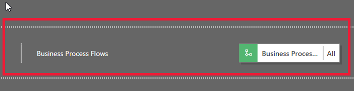
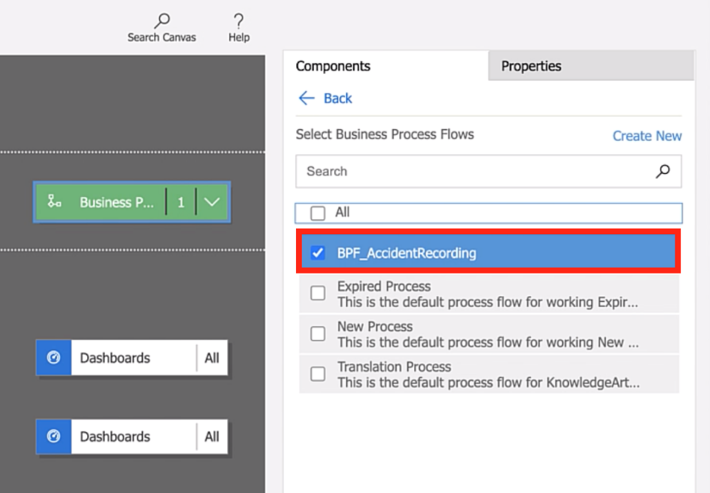
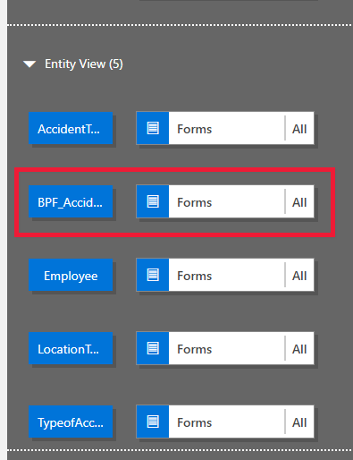
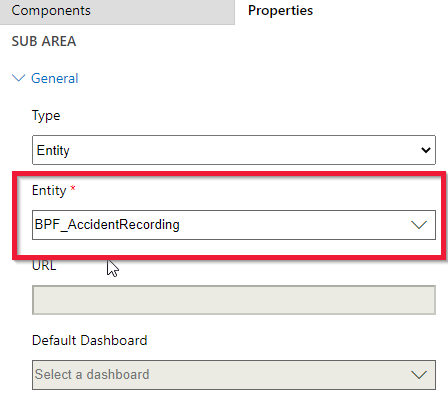
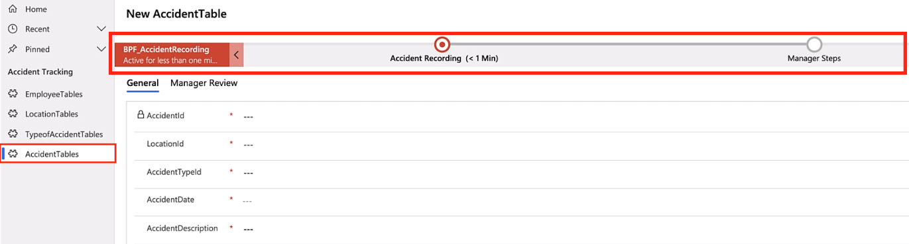
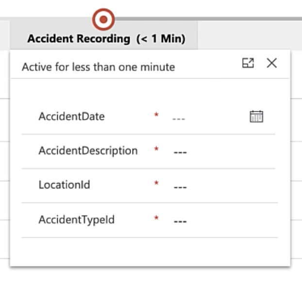
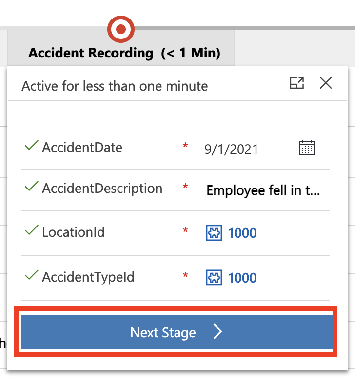
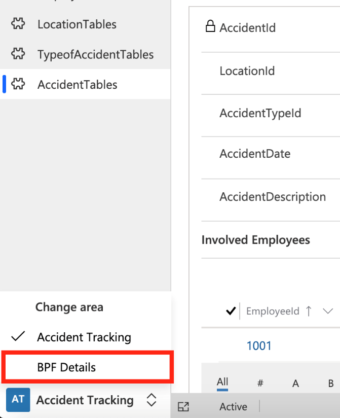
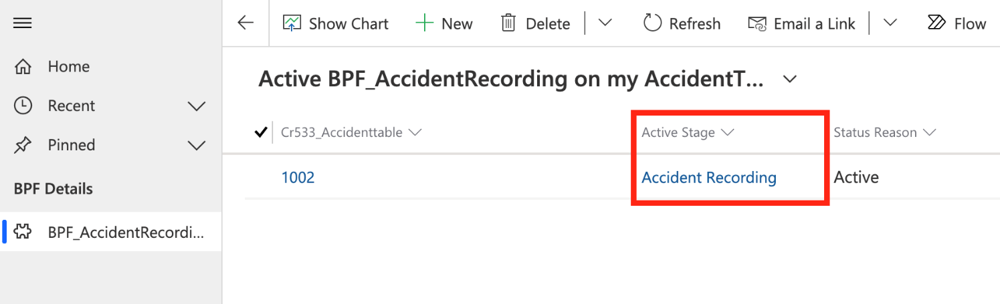

The best way to learn how to attach the business process flow that you created in the previous unit is to perform the following steps.

1. From Power Apps, select **Apps**.

1. To the right of the **Accident Tracking Application**, select the ellipsis (**...**) and then select **Edit**.

1. When the app designer opens, select **Business Process Flows**.

	> [!div class="mx-imgBorder"]
	> 

1. Select the business process flow that you created in the previous exercise: **BPF\_AccidentRecording**.

	> [!div class="mx-imgBorder"]
	> 

  A new entity (table) will show as added to the **Entity View**.

  > [!div class="mx-imgBorder"]
  > 

Your next steps will be to add a place inside your model-driven app to view the data from the business process flow entity. This location is where users can view the status and other data that are related to the **BPF\_AccidentRecording** business process flow.

1. Select **Save** to save your changes before performing the next steps.

1. In the site map, select **Edit** (pencil icon).

1. Select **+ Add** and then select **Area**.

1. Name this new area **BPF Details**.

1. Select the new area and then select **+ Add Group**.

1. Name this new group the same: **BPF Details**.

1. Select the new group and then select **+ Add Subarea**.

1. For **Type**, select **Entity**.

1. For the **Entity**, select **BPF\_AccidentRecording**, which is the business process flow that you created previously.

	> [!div class="mx-imgBorder"]
	> 

1. Select **Save and Close**.

1. Select **Publish** to save all changes.

1. Select **Play** to review the business process flow.

1. Select **AccidentTables** inside the model-driven app and then select **New** to create a new record.

   The **New AccidentTable** form will show your business process flow with the two stages added at the top.

	> [!div class="mx-imgBorder"]
	> 

1. Select the **Accident Recording** step, which will reveal the data steps that are needed to record a new accident.

	> [!div class="mx-imgBorder"]
	> 

1. Enter a new record inside the business process flow:

	-   **AccidentDate** - 9/1/2021
	
	-   **AccidentDescription** - Employee fell in the kitchen.
	
	-   **AccidentTypeId** - Select **Slip and Fall** (press the **Enter** key to reveal a list of accident type names)
	
	-   **LocationID** - Select **Contoso Main Factory** (press the **Enter** key to reveal a list of location names)

1. Select **Save**.

1. Add an employee to the accident record. For this example, add **Olive Yew**.

1. To finalize the new accident recording stage, select the **Accident Recording** stage and then select **Next Stage** to send it to the **Manger Review** stage.

	> [!div class="mx-imgBorder"]
	> 

	The next step is to review the records in the BPF\_AccidentRecording table to illustrate how the business process flow data is recorded in a table.

1. In the lower left, select the **BPF Details** area that you created previously.

	> [!div class="mx-imgBorder"]
	> 

1. This form shows the record that you entered and the current business process flow **Active Stage** set as **Accident Recording**.

	> [!div class="mx-imgBorder"]
	> 
