In this scenario, you will send an email automatically to the head of security compliance of Contoso when an accident has been reviewed by a manager. You will use Power Automate flows to accomplish this requirement. The next steps assume that you are familiar with Power Automate flows.

1. From Power Apps, select **Flows**.

1. Select **+ New Flow** and then select **Automated Cloud Flow**.

1. Give your flow a name. For this example, call it **Notify Head of Security**.

1. Search for **Data** and then select **When a row is added, modified, or deleted**.

	> [!div class="mx-imgBorder"]
	> [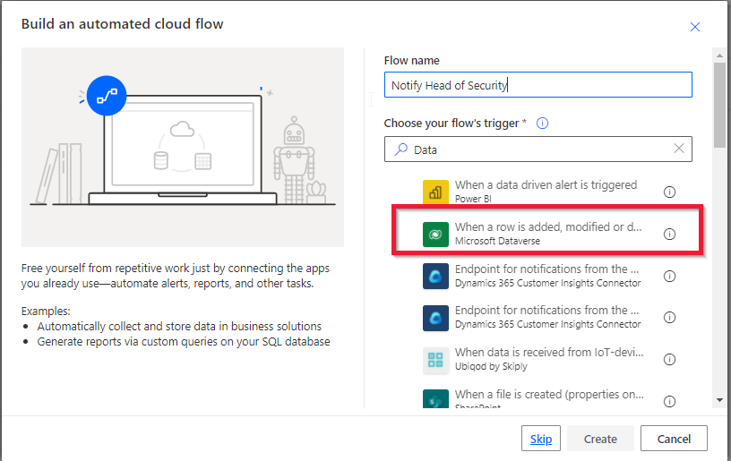](../media/row-added.png#lightbox)
	
1. Select **Create**.

1. On the **When a row is added, modified, or deleted** trigger, select the following settings:

	-   **Change type** - Modified
	
	-   **Table name** - BPF\_AccidentRecording (you will use the table that was created by the business process flow)
	
	-   **Scope** - Organization

	> [!div class="mx-imgBorder"]
	> [](../media/trigger-details.png#lightbox)

	The trigger will run the flow whenever a business process flow is changed, such as after a manager has completed the accident recording process. The trigger will return information about the business process flow in JSON format. You need to identify when the **Status Reason** of the business process flow is **Finished**. To accomplish this task, you will parse through the JSON output of your trigger.

	> [!div class="mx-imgBorder"]
	> [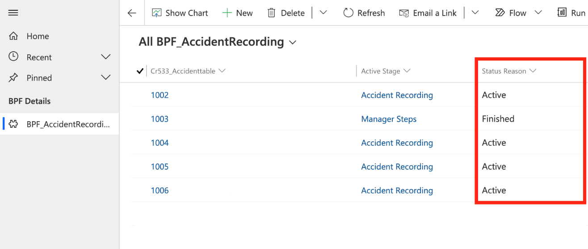](../media/status-reason.png#lightbox)

1. Select **+ New step**.

1. In the search connector box, type **json**, and under **Actions**, select the **Parse JSON** action.

1. For the **Content**, select in the empty box, and under **Dynamic content**, select **body**.

	> [!div class="mx-imgBorder"]
	> [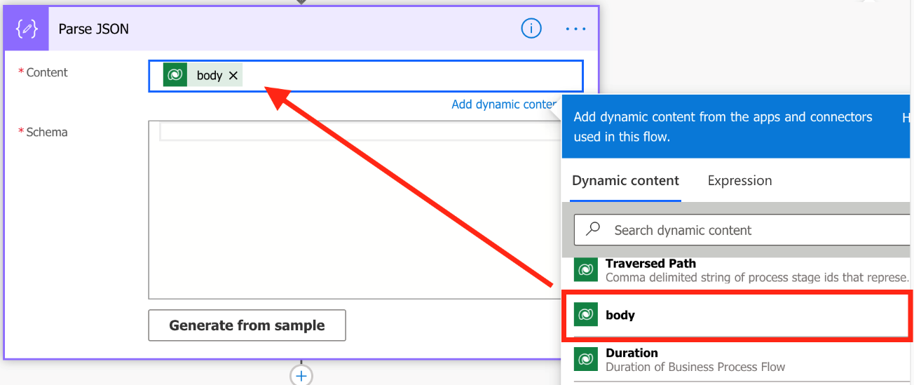](../media/body.png#lightbox)

1. For the **Schema**, paste the following code:

	```json
	{
	    "type": "object",
	    "properties": {
	        "_statuscode_label": {
	            "type": "string"
	        }
	    }
	}
	```

	> [!div class="mx-imgBorder"]
	> [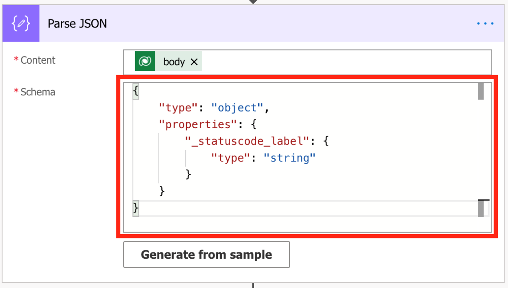](../media/code.png#lightbox)

1. Verify that the status shows as **Finished** by inserting a **Condition** action to check.

1. Select **+ New step** and then select **Condition**.

1. For the **Choose a value** box on the left, under **Dynamic content**, select **\_statuscode\_label** from the Parse JSON output as the condition to test.

1. Leave the default **is equal to** selected.

1. For the **Choose a value** box on the right, type **Finished**. This value is the one that you will want to check if the output is **equal to**. The following image shows what your **Condition** should look like. If it doesn't, take a moment to update it accordingly.

	> [!div class="mx-imgBorder"]
	> [](../media/condition.png#lightbox)

1. On the **If yes** branch, you will want to perform actions if the status is equal to **Finished**.

1. Select **Add an action**.

1. In the search box, type **Dataverse** and then select **Get a row by ID** under **Actions**.

1. For **Table name**, select **AccidentTables** from the dropdown menu.

1. For **Row ID**, select the ID from the trigger of the flow. For this example, the ID is the **Cr533\_Accidenttable (Value)** field.

	> [!div class="mx-imgBorder"]
	> [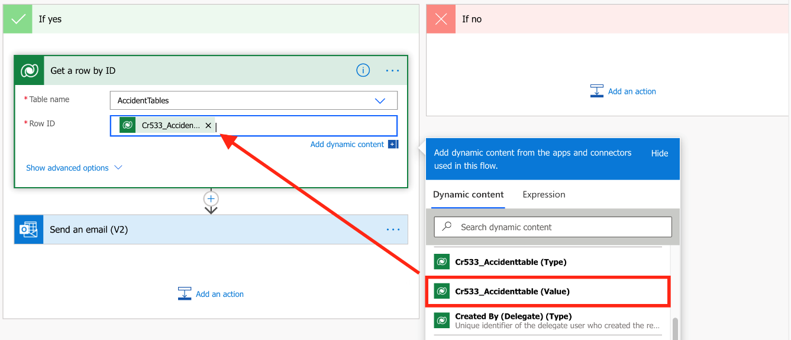](../media/row-id.png#lightbox)

1. Select **Add an action** to add another action.

1. In the search box, type **Outlook** and then select **Send an email (V2) - Office 365 Outlook**.

1. In the **To** field, enter your email address (you can change this address later to the head of security).

1. For the **Subject** of the email, enter **New Accident Recorded**.

1. For the **Body** of the email, enter a combination of text and dynamic content, including **AccidentDescription** and **ManagerComments**. When selecting the dynamic content, make sure that you select fields in the **Get a row by ID section**. The following screenshot shows the information to enter in the email body.

	> [!div class="mx-imgBorder"]
	> [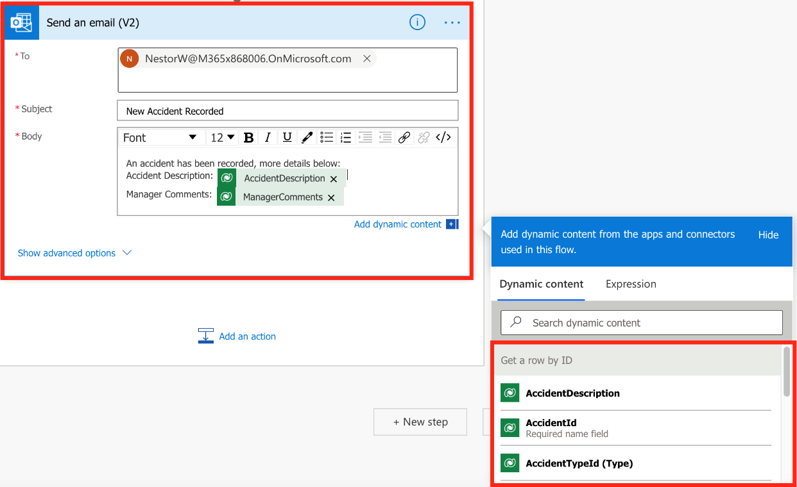](../media/email.png#lightbox)

1. When you are finished, select **Save**.

Your next steps are to test the new flow.

1.  Return to Power Apps and select **Accident Tracking Application**.

1.  When the app opens, start by creating a new accident. Enter whatever details that you want for this new accident. When you're finished, select **Save**.

	> [!div class="mx-imgBorder"]
	> [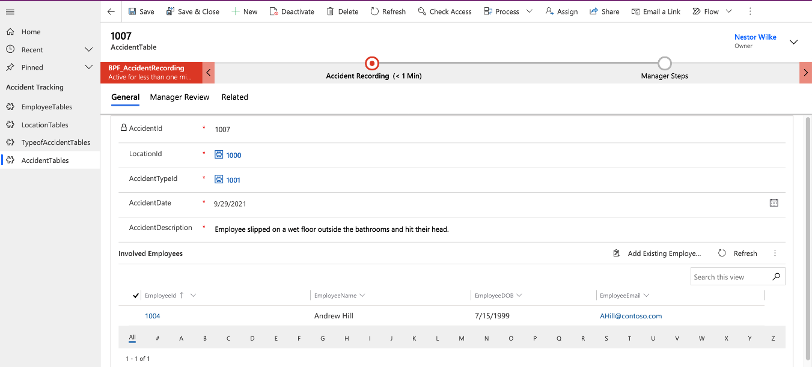](../media/new-accident.png#lightbox)

1.  Select the **Accident Recording** stage and then select **Next Stage**.

	> [!div class="mx-imgBorder"]
	> [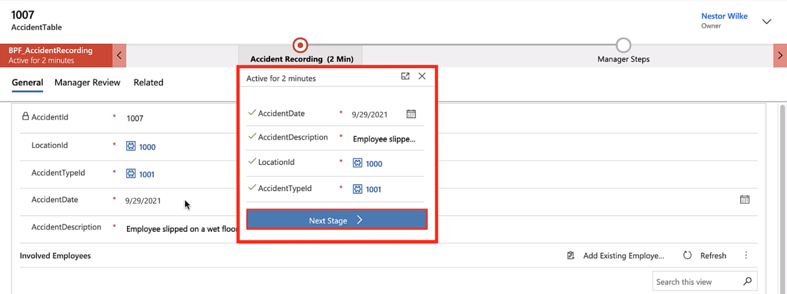](../media/accident-recording-next.png#lightbox)

1.  For the **Manager Steps** stage, enter content in **ManagerComments** and in **ManagerReviewed** and then select **Allowed**.

	> [!div class="mx-imgBorder"]
	> [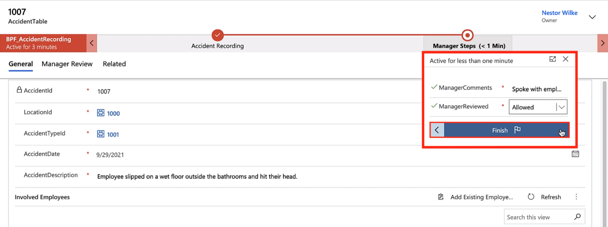](../media/finish.png#lightbox)

1.  Select **Finish** to complete your business flow and trigger the **Notify Head of Security** flow to start.

	> [!div class="mx-imgBorder"]
	> [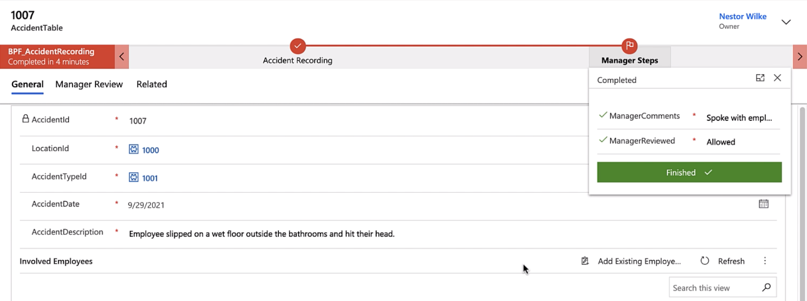](../media/flow-finished.png#lightbox)

1.  After a few moments, the person who was listed in the **To** field of the flow will receive an email notification with the details that you entered.

	> [!div class="mx-imgBorder"]
	> [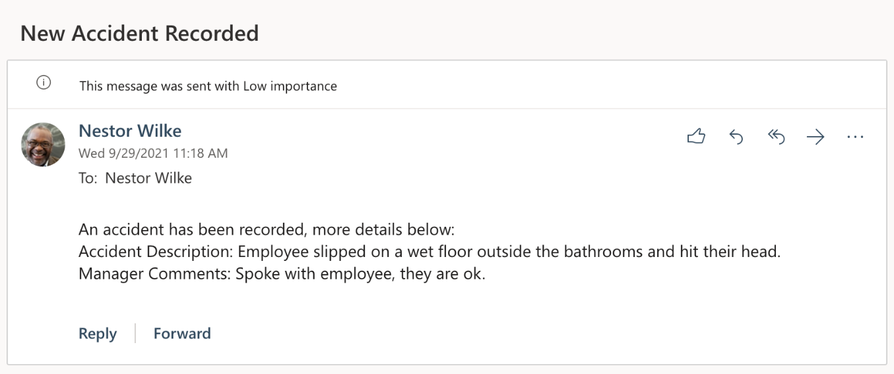](../media/new-accident-recorded.png#lightbox)
