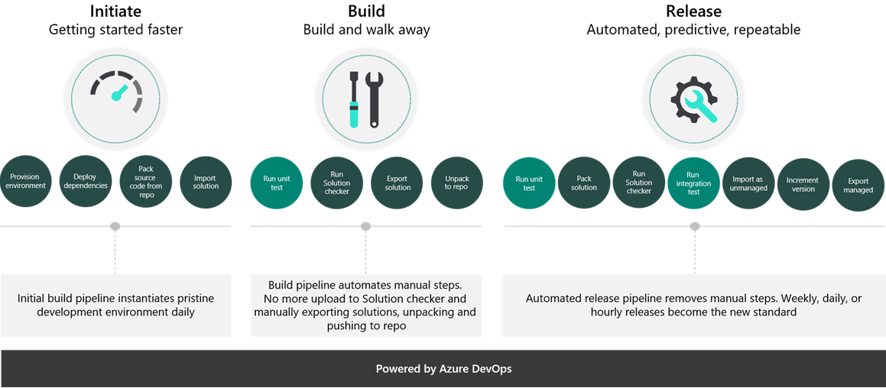
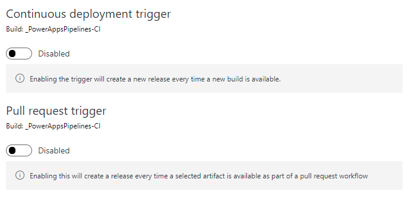

Solution architects lead the effort in defining the process for how changes will be promoted from development to production. This effort includes defining the number of stages, such as **dev > test > production**, and the processes to do the promotion, regardless of whether it's manual or automated.

Microsoft is building tools to support this process with Microsoft Azure DevOps by using continuous integration (CI) and continuous deployment (CD).

This section provides an overview of Azure DevOps and how DevOps can be used with Microsoft Power Platform to automate deployments.

## Azure DevOps

Azure DevOps provides developer services for support teams to plan work, collaborate on code development, and build and deploy applications.

Azure DevOps contains many features to help the development of applications:

- **Azure Boards** - Plan, track, and discuss work across your teams.
- **Azure Pipelines** - Use to automate continuous integration and continuous deployment (CI/CD) builds and releases.
- **Azure Repos** - Source control to store and track changes.
- **Azure Test Plans** - Plan, implement, and track scripted tests.
- **Azure Artifacts** - Publish solutions that are built by build pipelines.

## Pipelines

Power Apps builds tools to automate the common build and deployment tasks that are related to Power Apps by using Azure Pipelines.

Build pipelines can be used to:

- Create dev environments.
- Commit changes from dev to source control.
- Enable the Solution checker tool.
- Perform automated testing.
- Build output solutions from source control (for example, managed or unmanaged).

Release pipelines can be used to:

- Take solutions from build pipelines and deploy them to one or more test or production environments.
- Perform automated testing as part of the release process.
- Pause for approvals before progressing to the next environment.

Tasks in Microsoft Power Platform Build Tools can be used along with any other available Azure DevOps tasks to compose your build and release pipelines. Pipelines that teams will commonly establish include Initiate, Export from Dev, Build, and Release.

> 

## Deployment Methodologies

When deploying solutions through a release pipeline, a decision has to be made to push the release manually or automatically. Release pipeline runs can be started manually by an Azure DevOps user, run automatically on a schedule, or triggered by a Pull request. Continuous deployment can be enabled on a release pipeline to push the latest solution build to other environments as soon as the build becomes available. 

For immediate break/fixes to a solution, a manual trigger is likely the preferred method in order to make the newest build available in the upstream environments as quickly as possible, whereas a scheduled or pull request trigger makes more sense when updates to solutions are done regularly. 

> 

> 

Consider this example:

Contoso Bank has a team of developers working on a complex Power Platform solution that needs to be sent through various stages of testing before reaching production. The development team uses Agile methodologies for their development projects, and enforces a regular pattern of build and release cycles. For this reason, the Contoso Bank development team uses the scheduled release pipeline trigger, where the schedule is based around their pre-defined sprint cycles. This is an automated approach to pushing releases. 

However, if a major bug is discovered in a QAT environment, the developers may choose to patch the bug with a new build and trigger the release pipeline manually so that testing in the QAT environment can continue as quickly as possible. 

Perhaps Contoso Bank is running a smaller project without strict timelines for release cycles. In that case, using a manual trigger for the release pipeline might be preferred because there is no regular rhythm to when new builds are made available. 

For more information on Using DevOps to move from manual to automated ALM, and best practices around which deployment methodology is right for you, check out [Microsoft Docs.](/power-platform/alm/use-devops-automated-alm/?azure-portal=true)

## Alternative automation tools

Alternatives for automating deployments without using Azure DevOps are:

- Dataverse and admin APIs can be used to automate from any supported language.
- PowerShell can be used instead of build tasks for more control.
- Power Automate can be used with the platform admin connectors to automate deployments.
- GitHub actions are currently in preview.