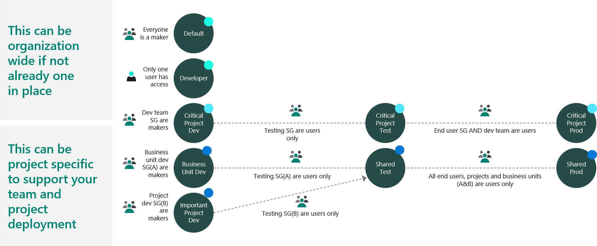
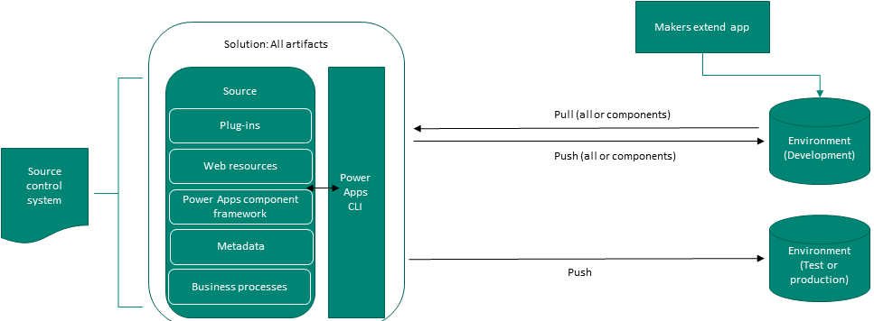
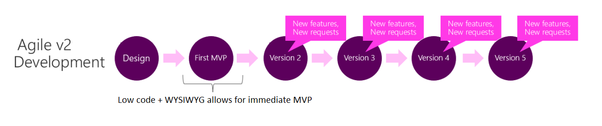

The solution architect needs to define the strategy for application lifecycle management on the project. This is part of the process of helping the organization put in place proper governance for the solution.

## Environment strategy

An environment is a container that stores, manages, and shares your business data, apps, flows, connections, and other assets, along with permissions to allow organization members to use the resources.

An environment serves as a container to separate apps that might have different roles, security requirements, or target audiences. How you choose to use environments depends on your organization and the apps you're trying to build. For example:

- You can choose to only build your apps in a single environment.
- You might create separate environments that group the test and production versions of your apps.
- You might create separate environments that correspond to specific teams or departments in your company, each containing the relevant data, and apps for each audience.
- You might also create separate environments for different global branches of your company.

Developing an environment strategy means configuring environments and other layers of data security in a way that supports productive development in your organization, while securing and organizing resources. A strategy to manage environment provisioning and access, and controlling resources within them, is important to:

- Secure data and access.
- Understand how to use the default environment correctly.
- Manage the correct number of environments to avoid sprawl and conserve capacity.
- Facilitate application lifecycle management (ALM).
- Organize resources in logical partitions.
- Support operations (and helpdesk) in identifying apps that are in production by having them in dedicated environments.
- Ensure data is being stored and transmitted in acceptable geographic regions (for performance and compliance reasons).
- Ensure isolation of applications being developed.

The following types of environment are available in the Power Platform.

- Sandbox: A sandbox environment is any non-production environment of Dataverse. Isolated from production, a sandbox environment is the place to safely develop and test application changes with low risk.
- Production: The environment where apps and other software are put into operation for their intended use.
- Community (Developer): The Power Apps Community Plan gives a user access to Power Apps premium functionality, Dataverse, and Power Automate for individual use only. This environment is primarily meant for learning purposes. A developer environment is a single-user environment, and cannot be used to run or share apps. A Community Plan environment can participate in the Azure DevOps pipeline.
- Default: A single default environment is automatically created for each tenant and shared by all users in that tenant. The Default environment is used by Microsoft 365 services.
- Trial: Trial environments are for trying new features or to perform proof of concepts. Trial environments are automatically deleted after 30 days.

> [!IMPORTANT]
> The solution architect needs to define how many environments are required, what is their purpose, and what are the dependencies between environments. At a minimum, a healthy ALM practice should include using a test environment prior to deploying anything to the production environment. This ensures that you have a place to test your app, but also ensures that the deployment itself can be tested.

For more information, see [environments](https://docs.microsoft.com/power-platform/admin/environments-overview) and [environment strategy](https://docs.microsoft.com/power-platform/guidance/adoption/environment-strategy).

## Handling solutions and other non-solution aware code and components

Power Platform projects consist of components that can be packaged inside solutions in environments and components that cannot be added to solutions such as components deployed in Azure, configuration data, and Power BI reports. The ALM plan must consider how to handle these non-solution aware components.

The solution architect needs to decide if application lifecycle management will be managed by using solutions or by using source code control. Traditionally, Power Platform projects have been more environment centric, but many are now moving towards source control centric.

If you use an environment centric approach, then:

- The Dev environment is the master copy of all changes.
- Changes are promoted directly from Dev -> Test -> Prod.

If you use a source control centric approach, then:

- Source control is the master.
- The Dev environment is re-created from source control (this can be automated and repeatable).
- Changes from Dev are checked into source control.

A Source control centric approach encourages having a definitive master and the ability to re-create development environments for any version tracked. Microsoft is encouraging and building tooling to support source control-centric ALM.

> [!NOTE]
> Ideally all environments other than production should be "throw away" i.e., the dev and test environments can be deleted and recreated without any loss.

Using a source control-centric approach will enable a DevOps approach with Build and Release Pipelines. Using an environment-centric approach means that you need to define the workflow for app makers and developers. The solution architect will need to define how, and who, will promote the app through the environments from Dev to Prod.

The solution architect will also need to define how to configure each environment and look for ways to make this easier.

## Team working

Compared to traditional app development, Power Apps projects are different in two key areas:

- How various members of the project team work together to create the solution.
- Development methodology.

Power Apps is a platform that benefits both pro developers and citizen developers. In a traditional development environment, only pro developers could be involved with the actual making of an app. With Power Apps, everyone has the power to build the apps they need by using advanced functionality that was previously available only to professional developers. Power Apps democratizes the custom business app building experience by enabling users to build feature-rich, custom business apps without writing code.

With Power Apps, you can quickly create a usable version of your app, because Power Apps provides a WYSIWYG (what you see is what you get) development experience. Users experience the actual working app very early in the development process, and if new requirements arise, new features can be added to the next version.

There are a number of issues with customizing and developing components within the Power Platform:

- The Power Platform does not support versioning of components (except for Canvas apps).
- Users cannot work on the same Power Platform component at the same time.
- With Model-driven apps, there are multiple components each with their own editors allowing work to be divided between makers. With Canvas apps, there is only one editor and only one person can work on an app at any one time. By using Canvas components, you can allow multiple makers to work on the same app.

The solution architect should establish the workflow for how app builders will make changes and promote them. Proactive communication and work assignment should be managed to minimize conflicts between makers.

You can minimize clashes between makers by creating an individual environment for each maker. Individual maker environments offer isolation and tracking but require extra effort to merge work and resolve conflicts. A shared maker environment can be less complex but does not offer isolation between app builders and lack detail tracking of changes.

## Source control

Even if you are using an environment-centric approach you will still need to decide where the master copy of the solutions and code live.

Solution aware developer code assets (such as plug-ins, PCF code components, and Form Scripts (transpiled from TypeScript) should be "built" on a build environment and not the developer's desktop. After being built the assets should be deployed to an environment that the master solution will be exported from, or built into a solution that will be installed.

## Tools

There are several tools and apps that Microsoft provides that can be used with Power Platform ALM:

- Power Platform admin center: The Power Platform admin center provides a unified portal for administrators to create and manage environments.
- Power Apps build tools: The Power Apps build tools automate common build and deployment tasks related to Power Apps using Azure DevOps.
- GitHub: Popular example of a version control system.
- Configuration Migration Tool: The Configuration Migration Tool enables you to move configuration and/or reference data across environments.
- Package Deployer: The Package Deployer lets you deploy packages of assets to Dataverse instances. Packages can consist of not only solution files, but also flat files, custom code, HTML files, and data.
- Solution Packager: Solution Packager is a tool that can unpack a compressed solution file into multiple XML files and other files, so they can be easily managed by a source control system.
- Power Apps CLI: Microsoft Power Apps CLI is a simple command-line interface that empowers developers to create code components.
- Package deployment PowerShell module: The Package deployment PowerShell module is used to deploy packages to Dataverse environment.
- Power Apps checker PowerShell module: The Power Apps checker PowerShell module interacts with the Power Apps checker service so you can run static analysis jobs and download the results.

> [!NOTE]
> GitHub actions for the Power Platform are currently in preview.
