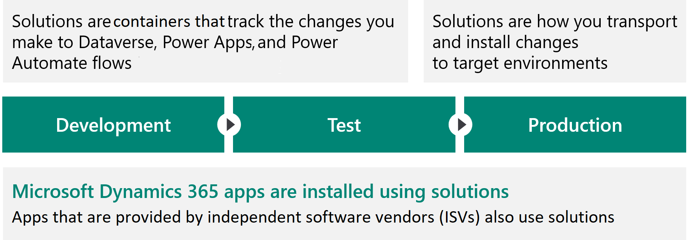
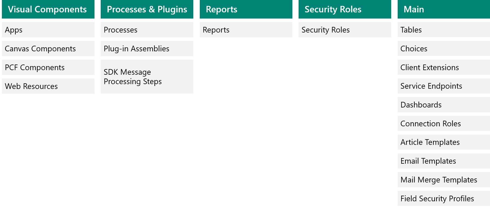
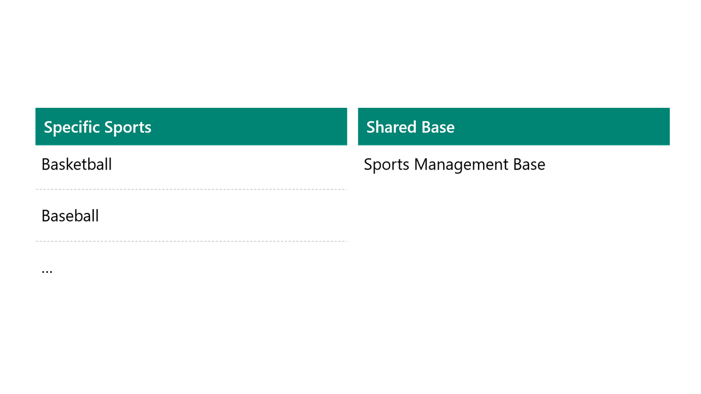

Solutions are containers that track and manage customizations in a Dataverse environment. Solutions are used to transport apps and components from one environment to another, or to apply a set of customizations to existing apps.

When you have multiple environments, each environment has their own set of solutions.

> [!NOTE]
> When you have a Dynamics 365 first-party app like Sales, the app is installed using the same solution framework. Third-party ISVs also ship their products using solutions.

Solutions have the following features:

- Solutions include metadata and certain entities with configuration data. Solutions do not contain any business data.
- Solutions can contain many different Power Platform components, such as model-driven apps, canvas apps, site maps, flows, tables, table metadata, columns, forms, views, business rules, process definitions, custom connectors, web resources, choices, charts, and components created by developers like scripts or compiled code.
- Solutions are packaged as a unit to be exported and imported to other environments, or deconstructed and checked into source control as source code for assets.
- Solutions are used to apply changes to existing solutions.

## Types of Solution

There are two types of solution:

- Unmanaged: Used during development and to transport to other development environments.
- Managed: Used to distribute to non-development environments.

Unmanaged Solutions are to be used in development environments while you are making configuration changes to your application. Solutions are exported as unmanaged and checked into your source control system. Unmanaged solutions should be considered your source.

Managed solutions are used to deploy to any environment that is not a development environment. This includes test, user acceptance testing (UAT), system integration testing (SIT), and production environments.

Managed solutions can be serviced (upgrade, patch, and delete) independently from other managed solutions. As an ALM best practice, managed solutions should be generated by a build server and considered a build artifact.

## Solution layering

Solution layers describe the dependency chain of component from the root solution introducing it, through each solution that extends or changes the component’s behavior. Layers are created through extension of an existing component (taking a dependency on it) or through creation of a new component or version of a solution.

Solution layering is implemented at a component level. Managed and unmanaged solutions exist at different layers within a Microsoft Dataverse environment. In Dataverse, there are two distinct layers:

- Unmanaged layer: All imported unmanaged solutions and ad-hoc customizations exist at this layer. All unmanaged solutions share a single unmanaged layer.
- Managed layers: All imported, managed solutions and the system solution exist at this level. When multiple managed solutions are installed, the last one installed is above the managed solution installed previously. This means that the second solution installed can customize the one installed before it. When two managed solutions have conflicting definitions, the runtime behavior is either "Last one wins" or a merge logic is implemented. If you uninstall a managed solution, the managed solution below it takes effect. If you uninstall all managed solutions, the default behavior defined within the system solution is applied. At the base of the managed layers level is the system layer. The system layer contains the entities and components that are required for the platform to function.

The solution architect needs to decide on the number of solutions that will be used for their business solution. While you could work with a single solution, this leads to dependencies on releases, and large solutions can take a long time to export and import. Most projects use multiple solutions. Solution architects should understand the merge behavior when a solution is updated or when multiple solutions are installed that affect the same component.

In the following example, four solutions have been used: The CDM Healthcare accelerator, a Common Contoso solution, and two solutions containing apps. These solutions are layered. For example, the contact form is customized in the CDM Healthcare Extension. The same form elements are modified in the Contoso Common solution. The end users will see the changes from the Contoso Common solution.

## Solution structure

The following are some strategies for creating solutions listed in order from simplest to most complex:

- Single solution
- Multiple solutions
- Multiple solutions with shared components

By creating a single solution, you establish a working set of customizations. This makes it easier to find items that you have customized. This approach is recommended when you only want to create a single managed solution. If you think you may have to split up the solution in the future, consider using multiple solutions.

If you have two unrelated solutions that don’t share components, the most direct approach is to create two unmanaged solutions.

You may have multiple solutions that share components. You may have a certain set of common functionality within multiple solutions and that common functionality is compatible with any of the other functionalities unique to each solution. Some components can be included in more than one solution as long as any changes that were made to them are compatible with all other solutions that use them. It is important that all the solutions share the same solution publisher. If the solution publisher is not identical, you will not be able to install more than one of your solutions.

There are some rules you should follow with solutions:

- Create a Solution Publisher and use for all solutions.
- Don’t use the default publisher, the Default solution, or the Common Data Service Default Solution.
- Keep the solution structure as simple as possible.
- Avoid using include all components unless adding in an unmanaged table.
- Include table metadata only when you are changing table properties.
- Add the subcomponents of a table (columns, forms, views etc.) only when you are changing them.

Adding only what is required to a solution is known as segmenting a solution.

When deciding how to segment into one or more solutions consider the following:

- Use multiple solutions only for a tangible purpose, multiple solutions add complexity.
- Multiple solutions that share components should be avoided.
- Multiple solutions each require their own environments to ensure they remain independent.
- Care must be taken to manage dependencies.
- Makers must know what solution to put new components in.
- Common patterns for multiple solution splitting are horizontal and vertical partitioning.

## Horizontal solution splitting

Horizontal splitting refers to creating solutions that only contain components of the same type.

## Vertical solution layering

Vertical layering groups components into functional areas. Often you will have a shared base/common solution with separate solutions for each key business area.

You can combine vertical and horizontal partitioning, for instance the base containing all tables and processes with separate solutions for each app.
