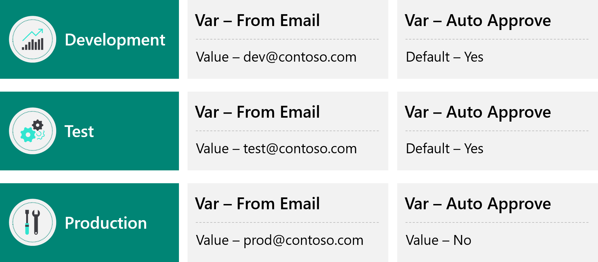

As you transport solutions through environments those components may have configuration settings or refer to data that also need to be transported through the release process.

## Environment variables

Solution Environment variables are used for app configuration data that is environment-specific. Applications often require different configuration settings or input parameters when deployed to different environments. Environment variables store the parameter keys and values, which then serve as input to various other application objects. Separating the parameters from the consuming objects allows you to change the values within the same environment or when you migrate solutions to other environments.

The alternative is leaving hard-coded parameter values within the components that use them. This is often problematic; especially when the values need to be changed during application lifecycle management (ALM) operations.

Because environment variables are solution components, you can transport the references (keys) and change the values when solutions are migrated to other environments.

Environment variables can be of type Decimal number, Text, JSON, Two options, or Data source. Each environment variable can have a default value and a current environment value.

The following diagram illustrates how environment variables can be used to tailor values for each environment.

> [!NOTE]
> You can provide a default value that is used if a current value is not specified in a particular environment.

Power Apps, Power Automate and developer code can retrieve and modify the values of environment variables.

## Connection references

Connection references are used for connections that are environment-specific. A connection reference contains information about a connector. Both Canvas app and operations within a Power Automate flow bind to a connection reference.

Because connection references are solution components, you can transport the references and change the connection when solutions are migrated to other environments. Connection references enable you to change a connection associated with a canvas app or flow without editing the app or flow.

## Configuration Migration Tool

Solutions do not contain data. Often, your application will rely on reference, or configuration data. This data also needs to be transports from one environment to another.

The Configuration Migration Tool can help move data between environments. Importantly, the Configuration Migration Tool can maintain the same primary record identifier (GUID) for the rows in this data. This prevents issues with components that refer to specific data from having to be updated each time it is imported.
