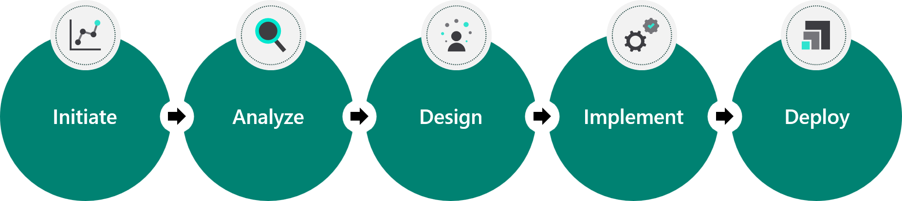
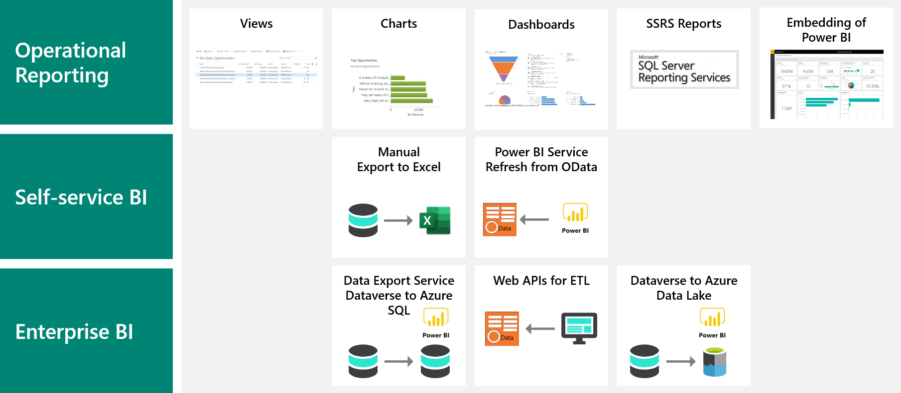

Analytics play a major role in solutions that are developed for Microsoft Power Platform. Analytics and insights can be delivered with Microsoft Power Platform in several different ways. The solution architect will need to evaluate the ways for implementing reporting and analytics in the solution.

AI is becoming more important in enhancing the apps and data in business solutions. Accordingly, the solution architect will need to evaluate the options for using AI within Microsoft Power Platform solutions.

## Reporting and insights

The solution architect needs to consider reporting and analytics in all stages of the project.

For example:

- A solution architect will often be involved in sales and presales and will use reporting to impress the customer.
- During the Analyze phase, the solution architect must clarify the actual goals for reporting and analytics.
- In the Design phase, the solution architect must ensure that data modeling incorporates the required data and data relationships to support the reporting and analytic requirements.
- Training and setting up for self-service are required at the Deploy stage.

## Solution architect role in reporting

Microsoft Power Platform offers a multitude of options for reporting, which will be covered in this module. Solution architects must evaluate the needs from the requirements and then identify the best approach to take.

> [!NOTE]
> Different approaches might be required for different needs. The solution architect should select the most appropriate method for each requirement and scenario.

Because reporting is left until the end of a project, a key task that is often overlooked is ensuring that the data model supports the requirements for reporting and analytics. The data model must also support the required relationships for analytics. Solution architects should ensure that the data model supports application processing and required reporting.

The solution architect should look for opportunities to use proactive insights and AI instead of reactive reviewing of reports and analytics.

## Types of reporting and analytics

When looking at reporting, the solution architect needs to consider different categories of reporting and analytics:

- **Operational reporting** - Data comes from Microsoft Dataverse directly and is viewed and interacted with in the context of an app in Microsoft Power Apps.
- **Self-service BI** - Data is exported from Dataverse or could be refreshed on a schedule.
- **Enterprise BI** - Data is extracted for use in broader enterprise reporting tools, which could be done to allow integration of data from other sources.

Solution architects need to be aware of the prebuilt insights that are available with Microsoft Dynamics 365 apps, such as:

- Dynamics 365 Sales Insights
- Dynamics 365 Customer Service Insights
- Dynamics 365 Customer Insights
- Dynamics 365 Fraud Protection

Extensive insight capabilities are available within these apps, which could be used in the solution instead of building reports. Additionally, Microsoft Power BI template apps are available for Dynamics 365 apps and could be deployed to meet reporting requirements.

Questions that solution architects should consider when evaluating requirements for reporting and visualizations:

- What data is required?
- Is data required that is external to the solution?
- Does the requirement fit with one of the prebuilt insights?
- Who consumes the report/visualization and are they users already?
- How fresh does the data have to be, or does it need to be at a point in time?
- Does something need to be built, or can an existing view or report satisfy the requirement?
- What is the expected action that users will take from reviewing the report?
- Is the action something that can be predicted, or can it be automated instead?
