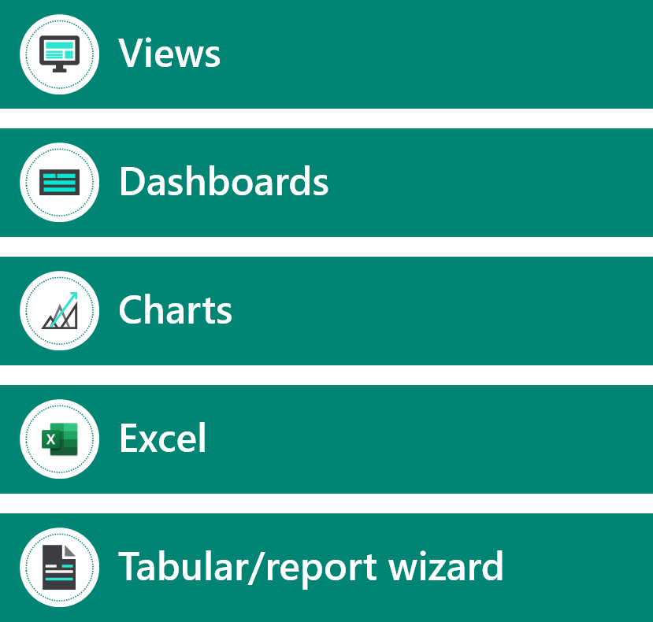
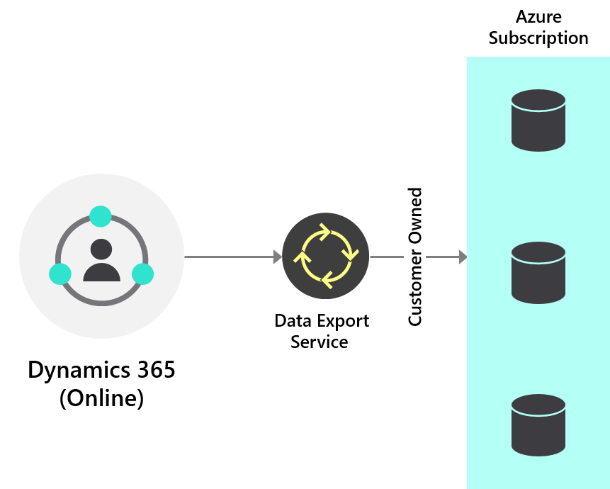
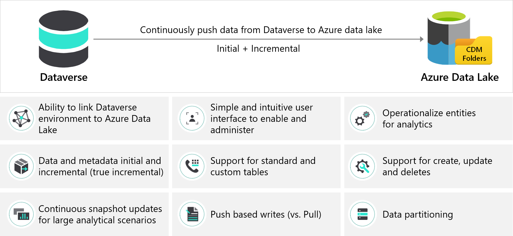

The reporting options that are provided in Microsoft Power Platform meet many operational reporting requirements.

## Model-driven apps

Dataverse provides many reporting options for model-driven apps:

- **Views** - Views are stored queries on the tables in Dataverse with selected columns and filters. Many reporting requirements are simple lists of data, and views can often meet many of those requirements.
- **Charts** - Charts are visualizations of Dataverse data in a view.
- **Dashboards** - A dashboard is a collection of views and charts. Power BI visualizations can also be added to dashboards. Standard dashboards are for viewing of data only. Interactive dashboards allow users to filter data and take action.

The advantages of these options are:

- Simple access from within apps.
- Data is always current.
- Security model is enforced.
- They are included in solution packages.
- No special skills are required.
- Users can create their own personal views, charts, and dashboards.

The disadvantages of these options are:

- Only simple visualizations are available.
- Data is limited to a single table and tables in many-to-1 relationships.
- Data is always current and cannot look back at a point in time.
- Trends cannot be analyzed.
- Users must have a license and be an app user.
- Charts and dashboards are limited to 50,000 rows.
- Views will only show the first 5,000 rows.

## Export to Excel

Dataverse provides the ability to export to Microsoft Excel. Users can export as static data or as a dynamic query. Exporting of data is from a view with columns and filters.

You can provide static data to users who are not app users. Static data is for when you need to get a snapshot of the data at the current date and time or if you want to share the data with others.

Use dynamic query to get the most up-to-date information. Additionally, you can use dynamic query to refresh your information in Excel and match what you see in your app at any time. A user must have a license to access an Excel worksheet with a dynamic query. Dynamic queries support exporting the data as either rows or a PivotTable.

The **Export to Excel** feature can only include data from Dataverse.

Data can also be edited in Excel Online and then saved back into Dataverse to give an immersive editing user experience.

A limit has been established for exporting to Excel of 100,000 rows by default. You can increase this limit to 1,000,000 rows with the **MaxRecordsForExportToExcel** setting.

## Word and Excel templates

You can use Microsoft Word and Excel templates for reporting. Word templates are for a single row and all its related rows. Excel templates are for a view, or list, of rows. Excel templates can include visualizations and other analysis that are provided by Excel.

You can control access to individual templates through security.

> [!IMPORTANT]
> Word and Excel templates can't be included in a solution package. Document templates that are downloaded from one environment can only be used within that environment. Environment-to-environment migration for Word or Excel templates isn't currently supported.

## Report wizard

The report wizard is a user-reporting generation tool for model-driven apps. The report wizard can create a SQL Server Reporting Services report from data that is held in Dataverse. The report can be tabular or contain a simple chart.

The reports that the wizard generates have a simple layout, as shown in the following screenshot.

You can download and edit these reports to change their layout. Reports that are created by the report wizard can be included in a solution package.

## SQL Server Reporting Services

A data analyst can create reports by using SQL Server Reporting Services and Visual Studio. SQL Server Reporting Services reports can retrieve multiple datasets from different parts of the data model, which allows for more complex reports than can be created with the options that were previously described.

> [!NOTE]
> Reports and queries can run for up to five minutes. When the maximum period has been reached, the report will time out and a message will be returned to the user. Within the five-minute duration, reports and queries are allowed to span large datasets that are beyond 50,000 rows.

Tips for creating reports:

- Design reports to query smaller datasets over shorter periods of time by adding a time-based filter in the report, such as the current month or quarter, to limit the results.
- Limit the number of tables that are needed to return the result. This approach helps reduce the time that is required to run the query and return the result set.
- Reduce the number of rows that are shown in detailed reports. Suitable filtering can be used to reduce the number of rows that are returned by the query to reduce time-outs.
- For aggregated or summarized reports, queries must be used to push the aggregation to the database and not fetch detailed rows and perform aggregation in the SQL Server Reporting Services report.

> [!IMPORTANT]
> Running large reports can affect performance for all users. The solution architect should consider offloading the reports by exporting the Dataverse data to enable more complex and deeper reporting.

## Export to Azure SQL

Data Export Service replicates Dataverse data to your own SQL database. You can use Microsoft Azure SQL or a SQL Server on an Azure VM. Data Export Service is available as an add-on from Microsoft AppSource.

> [!IMPORTANT]
> Data Export Service is only available for Microsoft Dynamics 365 Customer Engagement apps.

Data Export Service intelligently synchronizes the entire data initially; thereafter, it synchronizes on a continuous basis as changes occur (delta changes) in the system. This feature helps enable several analytics and reporting scenarios on top of data with Azure data and analytics services. The data in the Azure SQL database is almost real-time. Data analysts can run SQL queries natively on the Azure SQL database. Error handling and monitoring are provided.

> [!NOTE]
> Data Export Service uses the change tracking features of Dataverse. A table must be enabled for change tracking to be exported by Data Export Service.

An alternative export option is to use Microsoft Azure Data Lake.

## Export to Azure Data Lake

The Export to Azure Data Lake service enables continuous replication of Dataverse table data to Azure Data Lake Storage Gen 2, which can then be used to run analytics such as Power BI reporting, Microsoft Azure Machine Learning, Data Warehousing, and other integration scenarios.

Export to Data Lake simplifies the technical and administrative complexity of export tables for analytics. With a few simple selections, customers can link their Dataverse environment to a data lake in their Azure subscription and then select tables and export them to Azure Data Lake Storage. All data and metadata changes (initial and incremental delta) in Dataverse are automatically pushed to Azure Data Lake Gen 2 without additional actions.

Data is stored in Common Data Model format, which can be consumed by Power BI and other Azure analytics services.

## Alternative options

Advanced Find is one of the most useful tools that functional consultants, business analysts, administrators, and even end users should master. Advanced Find allows users to create their own queries and save them as personal views. Advanced Find queries are the basis for many other functions in model-driven apps, including Export to Excel, Excel templates, bulk delete, duplicate detection, and dashboards.

Creating a report is not always needed:

- For impromptu reporting, consider using a combination of Advanced Find and Excel.
- For users, consider using out-of-the-box dashboards and charts.
- For reporting that must be printed or exported, consider creating Word templates and Excel templates.

The solution architect will need to consider reporting tools from other sources that the customer is using.

Power BI should always be considered for reporting and analytics.
