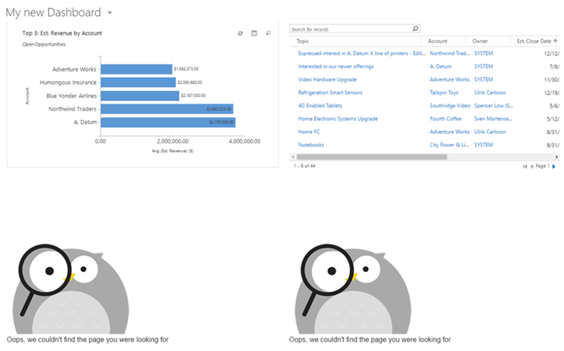
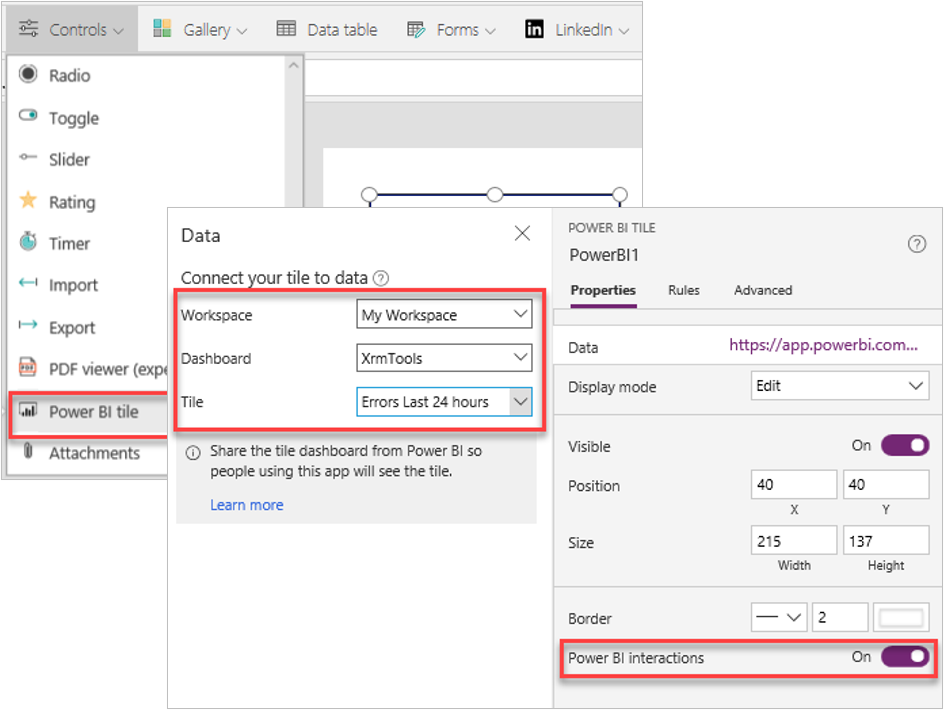
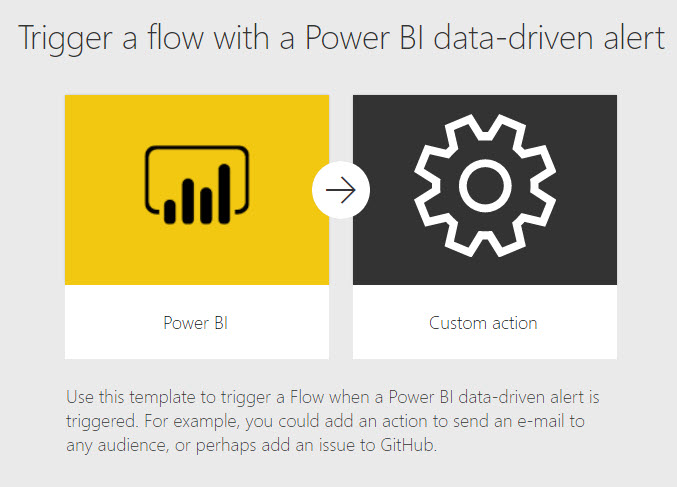

Power BI can be used with the other components of the Power Platform.

Power BI content can be:
- Consumed in PowerBI.com
- Consumed from the Power BI mobile
- Consumed from Power BI Data Alerts
- Embedded in Power Apps
- Embedded in Microsoft Teams

To embed Power BI in a model-driven app, an administrator must first enable Power BI visualization embedding for the environment. You can either add an entire Power BI dashboard to a model driven app, or add a tile from a Power BI dashboard to a Dataverse dashboard. To add a Power BI dashboard or tile, the maker selects the workspace, the dashboard, and tile.

The Power BI dashboard used must be shared with the users of the model-driven app. If the Power BI dashboard is not shared, the user will see errors as shown in the following screenshot

> [!NOTE]
> Power BI dashboards and tiles can now be added to system dashboards as well as user dashboards.

To embed Power BI tile in a canvas app, the maker adds the Power BI control to the screen and selects the workspace, the dashboard, and tile as shown in the following screenshot.

The Power BI dashboard that the tile is from must be shared with the users of the canvas app. If the Power BI dashboard is not shared, users will see an error.

It is not recommended to have more than 3 Power BI tiles loaded at the same time within an app. The LoadPowerBIContent property controls the loading of Power BI content. When this property is set to true, the Power BI content is loaded and shown. When set to false, the Power BI content is unloaded, which releases memory and optimizes performance.

It is possible to pass a parameter of type string to the Power BI tile from the canvas app by modifying the TileURL property and appending &$filter=<TableName>/<ColumnName> eq '<Value>'. This allows the tile to be filtered by a value in the canvas app.

A canvas app can be embedded within a Power BI report. The canvas app can interact with the other visuals in the report. There is a Power Apps visual that is added to the report. The canvas app uses the PowerBIIntegration object to integrate the canvas app with Power BI.

## Alerts and Power Automate

Power BI alerts can trigger Power Automate cloud flows. Power BI alerts are rules that trigger an alert when a value exceeds a threshold value. The Power BI alert must be created first and a Power Automate cloud flow linked to the Power BI alert.

## Power Automate visual

There is a new visual, Power Automate, in preview. This new visual allows a report author to add a button to a Power BI report that can trigger a Power Automate cloud flow.
