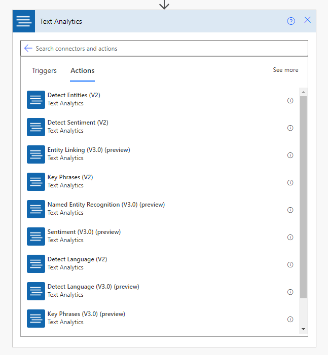
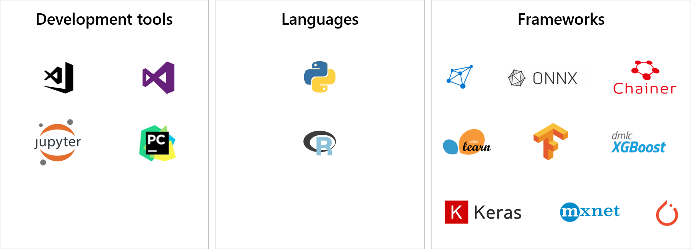
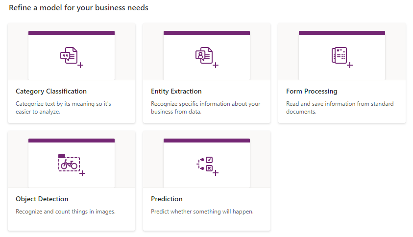
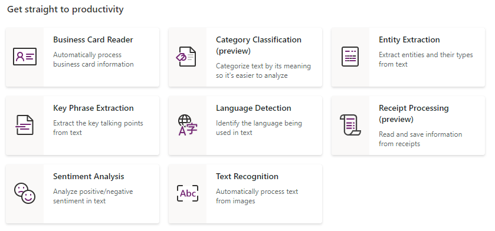

AI refers to computers thinking and acting in a way that simulates a human. AI is a technology that takes information from its environment and responds based on what it learns. The goal of AI is to create a machine that can mimic human behavior.

AI is more than learning; it is knowledge representation, reasoning, and abstract thinking. Machine learning is the subset of AI that takes the approach of teaching computers to learn for themselves rather than teaching computers all that they need to know. Machine learning is the foundation for modern AI and focuses on identifying and making sense of the patterns and structures in data.

Microsoft provides a number of machine learning services to enhance data.

## Dynamics 365 AI apps

Solution architects need to be aware of the prebuilt insights that are available with Dynamics 365 apps, including:

- Dynamics 365 Sales Insights
- Dynamics 365 Customer Service Insights
- Dynamics 365 Customer Insights
- Dynamics 365 Fraud Protection

## Azure Cognitive Services

Cognitive Services is a suite of prebuilt AI services that developers can use to build AI solutions. Cognitive Services meets common AI requirements and allows you to add AI to your apps quickly without expertise in machine learning. 

Cognitive Services APIs cover:

- Computer vision
- Natural language processing
- Speech
- Decision
- Web search

Cognitive Services is available as a set of REST APIs that can be consumed by applications. Essentially, Cognitive Services includes off-the-shelf services that help you develop an AI-based solution quickly and with less specialist expertise.

Microsoft has created connectors for Azure Cognitive Services for Power Apps and Power Automate:

- Content Moderator
- Computer Vision
- Custom Vision
- Face
- LUIS (Language Understanding)
- Text Analytics (including Sentiment, Named Entity Recognition, Key Phrase Extraction)
- Translator

> [!NOTE]
> Cognitive Services connectors are premium connectors.

These connectors can be used to enhance data and application functionality.

## Azure Machine Learning

Azure provides many different services to help you create your own machine learning models when Cognitive Services doesn't meet your needs. You can build machine learning models by using many different tools, languages, and frameworks.

Machine learning is beyond the scope of this course. However, solution architects should be aware that Azure Machine Learning can allow developers to implement enterprise grade machine learning for scenarios that are not met by AI Builder or Cognitive Services.

## AI Builder

AI Builder is a component of Microsoft Power Platform solution that allows you to add AI to predict outcomes to help improve business performance without writing code. You do not need to understand machine learning or learn Python to use AI Builder. Microsoft helps make it easier for you to create AI models and then consume those models in Microsoft Power Platform.

AI Builder takes the concept of Cognitive Services further, enabling anyone to use AI in their apps and flows and to build their own machine learning models without needing expertise in machine learning or having to write code.

With AI Builder, you can:

- Use one of the prebuilt AI models that are supplied with AI Builder.
- Build and train your own AI model by using your own data.

AI Builder has five model types for prediction, vision, and language:

- **Category Classification** - Performs natural language processing on text data and classifies into separate categories.
- **Entity Extraction** - Recognizes specific data in text data. Entity extraction transforms unstructured text into structured data that can be used in apps and flows.
- **Form Processing** - Reads and extracts information from documents such as invoices and purchase orders.
- **Object Detection** - Finds objects within images.
- **Prediction** - Analyzes patterns in historical data to predict the outcome of new data.

AI Builder has the following pretrained models:

- **Category Classification** - Classifies text into categories that are associated with customer feedback, such as compliments, issues, and pricing.
- **Entity Extraction** - Recognizes and extracts standard business objects in data.
- **Key Phrase Extraction** - Identifies the main talking points from a piece of text.
- **Language Detection** - Identifies the language that is used in a piece of text.
- **Sentiment Analysis** - Detects whether the message in a piece of text has a positive or negative emotion.
- **Text Translation** - Translates text from one language into another language.
- **Business Card Reader** - Extracts information from an image of a business card.
- **Text Recognition** - Extracts words from documents and images.
- **Receipt Processing** - Extracts details from pictures of printed and handwritten receipts.

Canvas apps can use prebuilt models and custom models to enhance data. You could use an AI Builder model to analyze text that a user has entered. You can take a picture with a canvas app and then use an AI Builder model to extract the text from the image or to detect objects in the image.

You can use AI Builder models in two ways with a canvas app:

- By adding AI Builder model controls to a screen
- By using AI Builder models through the formula bar

Power Automate can use all prebuilt models and any custom models in AI Builder to enhance data. You can trigger a Power Automate flow when a record is created or when an image is stored. An AI Builder connector is available that you can add to a flow to access the models. For example, Power Automate can categorize a new record or predict what will happen to a newly created record.
