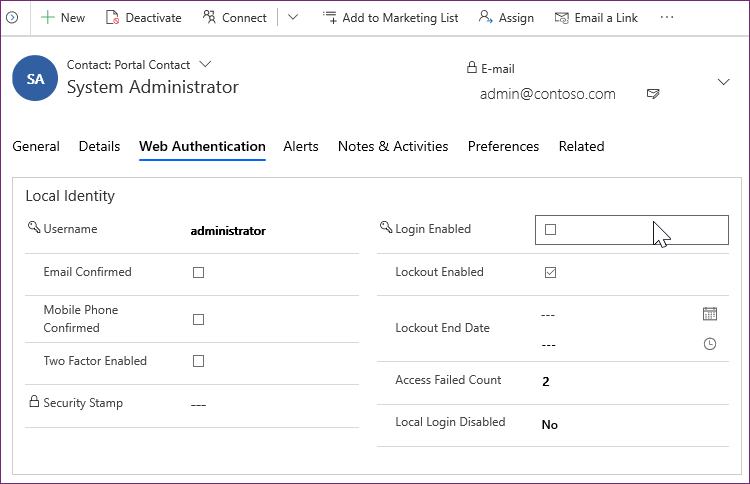
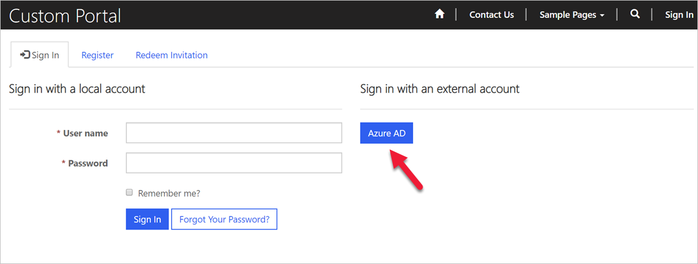
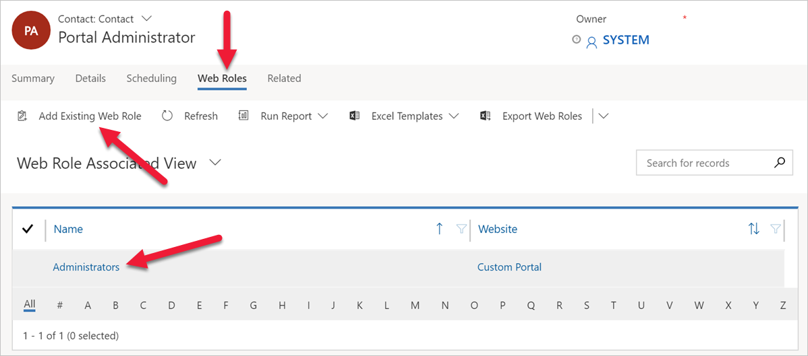

Power Apps portals extend Power Apps model-driven solutions to internal and external audiences such as communities, customers, partners, and employees. As part of this process, portal visitors can access portals as either anonymous or authenticated users.

When authenticated users access and use the portal, there are two parts to the process:

* **Authentication**. This is the process of validating the user's identity. In other words, it's a verification of "they are who they say they are".
* **Authorization**. This is the process of verifying that a user has access to something, for example, a specific portal page, or a Common Data Service record. It's determining if "User A can do X".

Let's discuss authentication in more detail.

## Tracking users as contacts

Authenticated users are *always* tracked in Common Data Service as contacts. This is regardless of the portal template used to provision the portal, it's the same whether the user is a third-party or an employee. Neither depends on the authentication method used.

Portal users can authenticate using the following methods:

* **Local authentication.** Common forms-based authentication with usernames and password hashes stored in the Common Data Service contact record.
* **External authentication.** Credentials and password management are handled by third-party identity providers, such as Azure AD B2C, Microsoft, Twitter, etc.

Portal administrators may choose to enable or disable any combination of authentication options through the portal site settings.

All interactions and actions that a portal user takes (for example, leaving comment on a page) are tied to their contact record in Common Data Service.

## Contact extensions

To support authentication, Power Apps portals extend the **Contact** entity and add **External Identity** entity. There are number of attributes and specific Portal Contact forms added to the contact record.

These extensions allow:

* Control parts of authentication process, for example if login is enabled for the contact.
* Access portal-specific contact information.
* Provide registration and profile management forms for the portal.
* Support password-based local authentication.
* Enforce password and lock out policies.
* Manage user's identities when external providers are used.

> [!div class="mx-imgBorder"]
> 

## Administrator as portal user

There are no portal users defined when Power Apps portal is provisioned. You, the person who provisioned the portal, already have access to the Common Data Service instance as a system administrator. It's common practice to ensure that you can access the portal as an *external* user as well.

* Sign in to the portal using Azure AD authentication. If Open Registration is enabled (and it is by default), this will create a contact record as required.

   > [!div class="mx-imgBorder"]
   > 

* If it's the first time Azure AD authentication has been used, you may be prompted to provide a consent for portal web app to access user information. You can consent on behalf of the organization so that individual users won't be prompted.

* Locate and open the contact record created. The contact record will have the same email address as the signed in Azure AD user.
* Navigate to **Related > Web Roles**. Associate **Administrators** web role with the contact.

> [!div class="mx-imgBorder"]
> 

These steps will ensure that this Azure AD user has full administrative permissions when accessing the portal as an *external* user.

> [!VIDEO https://www.microsoft.com/videoplayer/embed/]
