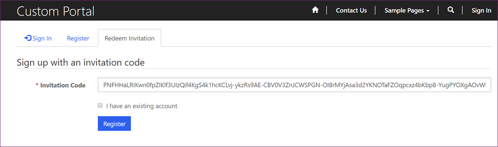
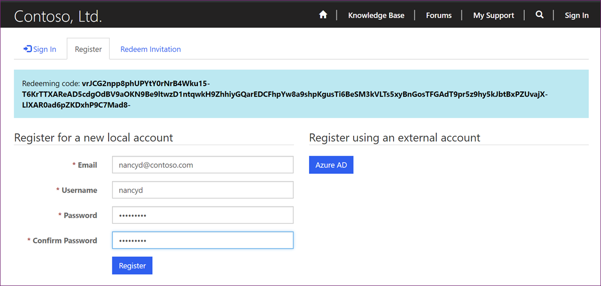

Before portal visitors can sign-in to Power Apps portal, they need to be registered as portal users. All portal users are tracked as contacts, and there are two ways to register them.

* **Open registration** allows visitors to register directly on the portal.
* **Invitation-based registration** requires users  to provide an invitation code.

The decision which option is more appropriate depends on the target audience of your portal, and whether the members of the audience are known in advance.

Regardless of the registration configuration, both local and external accounts participate equally in the registration workflow. That is, users have the option to choose which type of account they want to register.

Registration is enabled by default. The site setting `Authentication/Registration/Enabled` controls overall registration process and adding this setting with the value `False` disables all forms of user registration. Any other registration setting is ignored until the registration is enabled. You can use [Enable or disable user registration](https://docs.microsoft.com/powerapps/maker/portals/configure/set-authentication-identity#enable-or-disable-user-registration/?azure-portal=true) settings to control individual registration options.

## Open registration

Open registration allows visitor to register directly on the portal using **Register** tab on the portal **Sign In** page. It is the least restrictive sign-up configuration where the portal allows a user account to be registered by simply providing a user identity. When open registration is enabled, any user completing the registration form, is immediately registered and authenticated.

As users are not validated prior to sign up, this option works well in more open environments like community portals, where site visitors are not known in advance. Organizations run these portals for the communities where the users might have some common interests, for example, the area where they live, their hobbies, industries they work in. In other words, when it is not easy to discover and validate the users in advance.

## Invitation-based registration

Invitation-based registration is the process where an existing contact is validated by an invitation code.

This registration is useful in the scenarios when contacts are known in advance. It is commonly used to register customers, partners, or employees. It works in the situations where users can be "pre-validated," for example, you may have collected contact information from the visitors of your exhibition booth.

Invitations contain a number of [Invitation attributes](https://docs.microsoft.com/powerapps/maker/portals/configure/invite-contacts#invitation-attributes/?azure-portal=true) that allow you to do the following:

* Send Single or Group Invitations. Group invitations use the same invitation code for all invitees and work well with the restriction on the number of invitations to redeem. For example, an promotional email can be sent by a software company inviting all their users to participate in a beta program but intake is limited to the first 100 registrations.
* Specify an expiry date if desired.
* Specify a portal contact as the inviter. You can use this information to customize invitation emails and in the post-registration workflows.
* Automatically assign the invited contact(s) to an account upon invite redemption. This option is useful in partner portal scenarios where all invitees are from the same company.
* Automatically execute a workflow upon invite redemption. For example, you may want to send a "Thank you" email to the contacts who accepted the invitation.
* Automatically assign the invited contact(s) to Web Roles upon redemption. You can use this feature to grant users accepting the invitation special access rights in your portal.

> [!IMPORTANT]
>Email integration must be enabled in your Common Data Service instance for the email invitations to work.

Let's take a look in details at the steps in the process of sending and redeeming the invitations.

### Configure automation

The workflow process sending the invitation email is a generic process and needs to be customized prior to the use. When customizing the invitation email, make sure the link to the **Invite Redemption Page** page includes the invitation code. The default link should look like the following: `https://yourportalurl/register/?returnurl=%2f&invitation={Encoded Invitation Code(Encode Invitation Code)}`.

Once the invitation code is generated, it can be distributed via other channels. For example, if you have SMS messaging solution in place, you may want to replace the steps creating and sending the invitation email with the custom step sending SMS message instead.

> [!IMPORTANT]
> Power Automate has significant advantages over the classic workflow model. You should consider using Power Automate to automate your Send Invitation process instead of classic workflow.

### Create Invitation

A unique invitation code that is generated when an Invitation record is created. Invitations record can be created manually by using **New**  command on Invitations view or using **Create Invitation** command on a contact record. See [Create invitations from Portal Management app](https://docs.microsoft.com/powerapps/maker/portals/configure/invite-contacts#create-invitations-from-portal-management-app/?azure-portal=true) for detailed instructions how to create and send invitations.

### Redeem Invitation

When the contact receives the email invitation and follows the URL, they are directed to the Redeem Invitation tab of the Sign In page.

On this page they can select the option **I have an existing account**. This opens up some automation opportunities where the existing portal users can be sent an invitation code. Once the code is accepted, and an existing account is used, you can run a workflow that could, for example, grant user access to some protected content.

> [!div class="mx-imgBorder"]
> 

### Register User

If user does not select **I have an existing account** option they are presented with the registration page. Similar to Open Registrations, users have the option to register using any provider enabled on the portal.  The selected registration will be associated with the invited contact, marking the invitation as redeemed.

> [!div class="mx-imgBorder"]
> 

After the registration process is complete, depending on the invitation options, portal user can be associated with the predefined account, or additional workflow can be executed.

[Invite contacts to your portals](https://docs.microsoft.com/powerapps/maker/portals/configure/invite-contacts#invitation-attributes/?azure-portal=true) documentation contains addition details about the invitation process.
