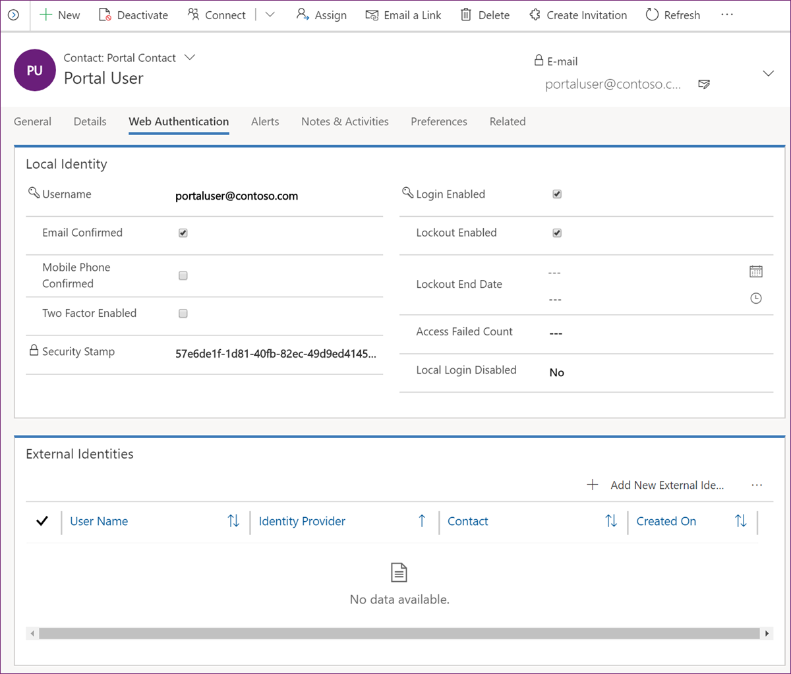
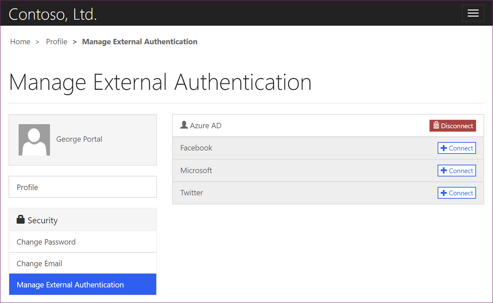

Power Apps portals administrators have several options for controlling authentication behavior for the portal user. These options are accessed via the **Web Authentication** tab on the **Portal Contact** form.

> [!div class="mx-imgBorder"]
> 

Let's walk through some of these options.

| Field                  | Description                                                  |
| ---------------------- | ------------------------------------------------------------ |
| Username               | The username is used for local authentication. Password can be reset by running **Change password for portal contact** task flow: [Change password for a contact in Power Apps portal app](https://docs.microsoft.com/powerapps/maker/portals/configure/configure-contacts#change-password-for-a-contact-in-dynamics-365-portal-app/?azure-portal=true). |
| Email Confirmed        | This flag indicates if email has been confirmed, that is, validation code has been emailed to and confirmed by the user. Unless email is confirmed, it cannot be used for password resets or two-factor authentication. If required, it can be set manually by the administrator. |
| Mobile Phone Confirmed | Similar to **Email Confirmed** but SMS messaging is used for confirmation and other operations. There are no messaging providers included out of the box but if organization has one then the authentication flows can be extended to include SMS as a valid confirmation channel. |
| Two Factor Enabled     | Defines if two-factor authentication has been enabled for the contact. A confirmed email address is required for two-factor authentication to be used. |
| Login Enabled          | Clearing this checkbox (or setting the field value in a workflow) will disable all forms of authentication for the contact, including external providers |
| Lockout Enabled        | Defines if contact can be locked after a preconfigured number of failed attempts |
| Lockout End Date       | When contact is locked out, this field defines when it's going to be unlocked automatically. Traditional use of this value is to lock out contact for a number of minutes (controlled in site settings) after preconfigured number of failed sign-in attempts. |
| Local Login Disabled   | Defines if local authentication option is available for this user. Site settings may disable local authentication for all users, in which case this flag will have no effect. |

[Set authentication identity for a portal](https://docs.microsoft.com/powerapps/maker/portals/configure/set-authentication-identity/?azure-portal=true) includes description of the site settings that may overwrite some of these options for all portal users.

## External identities

**External Identities** lists includes all external providers registered for this user. Multiple external identities permit user sign-in with any of the registered providers. Entries in this list should not be edited manually. They are added / removed when the user connects / disconnects the providers using **Manage External Authentication** link on their **Profile** page.

> [!div class="mx-imgBorder"]
> 
