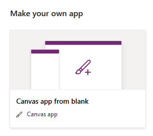
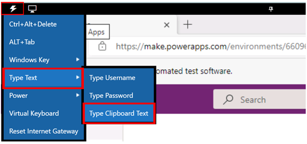
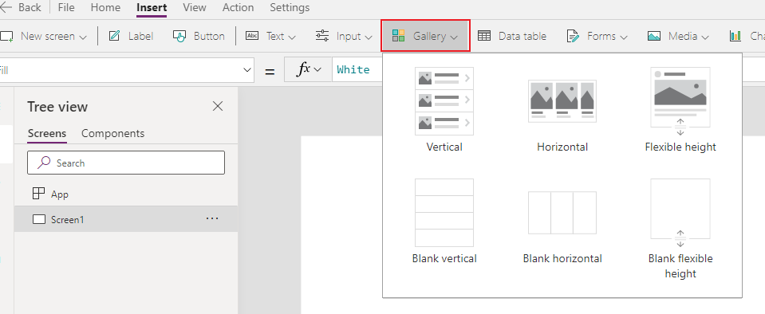
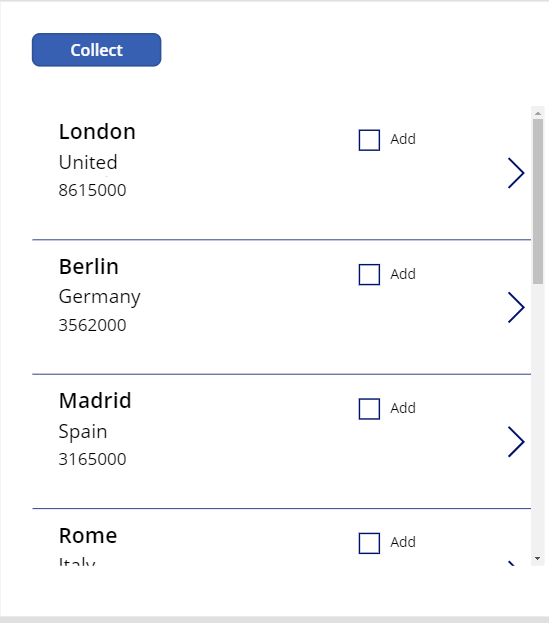
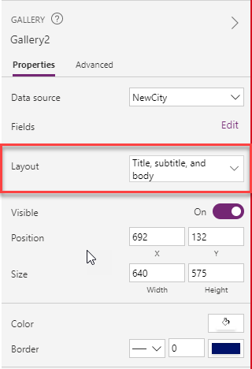

This hands-on lab shows you how to use the ForAll function in a gallery. 

1.  Sign in to [Power Apps](https://make.powerapps.com/?azure-portal=true). If you are using the virtual environment, skip to step 2.
  
1.  On the Home screen, select **Canvas app from blank**.

	> [!div class="mx-imgBorder"]
	> [](../media/exercise-1.png#lightbox)

1.	Name your app **New App** , format **Tablet** and click **Create**.
	
	> [!div class="mx-imgBorder"]
	> [](../media/exercise-2.png#lightbox)

1. Select the **Insert** tab and add a button, and set its **OnSelect** property to this formula:

	```powerappsfl
	ClearCollect(CityPopulations, {City:"London", Country:"United
	Kingdom", Population:8615000}, {City:"Berlin",
	Country:"Germany", Population:3562000}, {City:"Madrid",
	Country:"Spain", Population:3165000}, {City:"Rome",
	Country:"Italy", Population:2874000}, {City:"Paris",
	Country:"France", Population:2273000}, {City:"Hamburg",
	Country:"Germany", Population:1760000}, {City:"Barcelona",
	Country:"Spain", Population:1602000}, {City:"Munich",
	Country:"Germany", Population:1494000}, {City:"Milan",
	Country:"Italy", Population:1344000})
	```

    To copy and paste the text in the virtual environment, select the Commands button on the top left corner of the screen, select Type text, then select Type clipboard text. Paste the copied text in the window.

    > [!div class="mx-imgBorder"]
	> [](../media/copy-instructions.png#lightbox)

1.  Select the **Button** control, and set its **Text** property to "Collect." Hold the **Alt Key** and press the **Button** control.
(This will create your collection and store all the information).

1.  Select the **Gallery** dropdown at the top and choose **Blank vertical** gallery and choose **CityPopulations** from the data source pop-up.
    
    > [!div class="mx-imgBorder"]
	> [](../media/gallery.png#lightbox)

1.  With the gallery selected, in the right pane, change the layout from blank to **Title, subtitle, and body**.

1.  Select the last or third Label in the first item of the gallery, and change the **Text** property to
    **ThisItem.Population**.

1. Select the **Insert** tab, select **Input** button and add a checkbox, and set its **Text** property to "Add".

	> [!div class="mx-imgBorder"]
	> [](../media/4a-exercise-forall-collection-checkbox.png#lightbox)

1. Select the **Insert** tab add a button, set its **Text** property to "ForAll Collect" and set its **OnSelect** property to this formula:

	```powerappsfl
	Clear(NewCity);
	ForAll(Gallery1.AllItems, If(Checkbox1.Value = true, Collect(NewCity, {City: City, Country: Country, Population: Population})))
	```			

1. Select the **Insert** tab add a **Blank Vertical Gallery**, and choose NewCity from the data source pop-up.

1. On the left Navigation Pane change the layout from blank to Title, subtitle, and body.

	> [!div class="mx-imgBorder"]
	> [](../media/4a-exercise-forall-collection-change-gallery-type.png#lightbox)

1. Select the **Play** button, check the checkbox, and then select the **ForAll Collect** button.

You have now used the For All command to add all checked items to a new gallery.