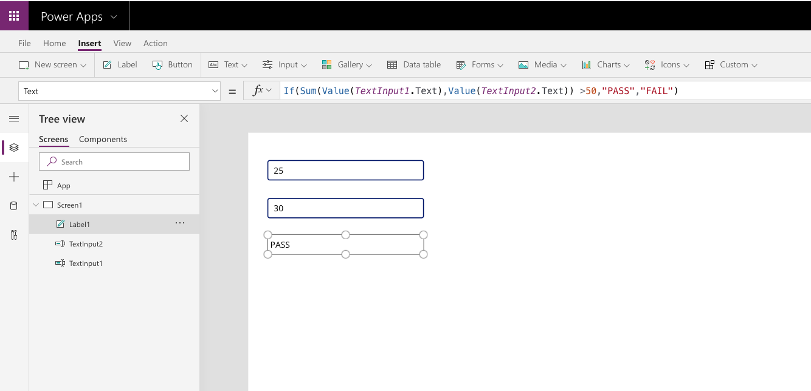

Combining functions
-------------------

As you begin building your app, when possible, combine multiple
functions and elements in a single formula. Creating dynamic formulas is
more efficient and effective, not only for the app developer but also
for the user experience. More single function formulas may mean more
work to maintain, track, and update each formula. By creating
multi-function formulas, updating and maintaining formulas is much
simpler. Also, depending on the size of your app and the number of
single-function formulas, you might encounter performance problems. If possible,
it is more efficient to create
multi-function formulas. The following example combines
multiple functions into a single formula.



The two **Text Input** controls (TextInput1_1 and TextInput1_2) have no
formulas or modifications. The **Text** property of the selected
**Label** control (Label1) is a multi-function formula.

```
If(Sum(Value(TextInput1.Text),Value(TextInput2.Text)) >50,"PASS","FAIL")
```

The output of this formula is displayed in **Label1**. The function
converts the text stored in the TextInput1 and TextInput2 controls into
values using the **Value** function. Then those values are added together
using the **Sum** function. In this example, 25 + 30 = 55. The **If**
function then evaluates if the sum of the values (55) is greater than
50. For this example, it evaluates to true (55 is greater than 50), so
the text **PASS** shows in the Label. If the sum had been less than 50,
then the **Label** control would have displayed **FAIL**.

Similarly, when implementing controls, the same combined formula logic should apply. There is
nothing to stop you from creating a button for every action that you would
like the user to take, but it's far more efficient and effective to
combine them when you can. To combine more than one action in a formula,
use the semicolon (;). 
> [!NOTE]
> Do not use a semicolon if your locale is fr-FR or similar. 

Continuing with the previous example, add an **UpdateContext** function to
the formula.

```powerappsfl
UpdateContext( { x: 1 } ); Navigate(Screen2,ScreenTransition.Cover)
```

> [!NOTE]
> The actions are performed in the order in which they appear
> in the formula. The next function won't start until the previous
> function has completed. If an error occurs, subsequent functions will
> not process. 
