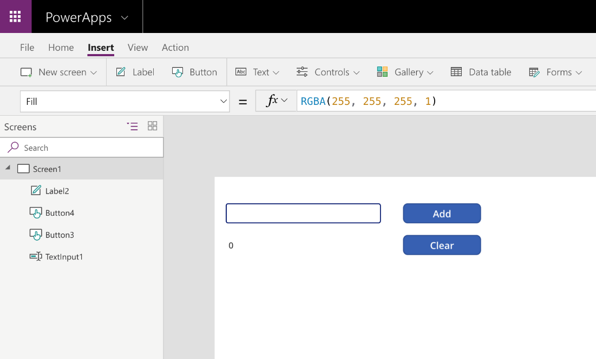

The following example uses the **Button** control and the
**UpdateContext** function to create a dynamic formula for changing the
**DisplayMode** of a button.

1. Navigate to [Power Apps](https://make.powerapps.com).

1. Select **+ New App** and **Canvas**.

1. At the bottom, under **Blank app**, select **Tablet layout**.

1. Select the **Insert** tab and add a **button**.

1. Change the **Text** property of the button to *Add*.

1. Add another **Button** control and change the **Text** to *Clear*.

1. Add one **Label** and one **Text input** to the canvas.

   > Use the following screenshot for positioning and formatting.

   > 

1. Select **Add** button (Button1), and set the **OnSelect** property to

   > **UpdateContext( { RunningTotal: RunningTotal + TextInput1 } )**.

1. Select the **Clear** button (Button2), and set the **OnSelect**
   property to

   > **UpdateContext( { RunningTotal: 0 } )**.

1. Set the **DisplayMode** property for the same button to
   
   > **If(RunningTotal \> 0, DisplayMode.Edit, DisplayMode.Disabled)**.

   > Notice that after you've updated the **DisplayMode** property, it appears greyed out.

1. Select the **Label** (Label1), set the **Text** property to
   **RunningTotal**.

1. Test it by putting the app in Preview mode. In the text input, enter a
   value and select the **Add** button.

As soon as you select the **Add** button, the **Clear** button is selectable again.

For this example, an **If** function is used to evaluate whether the
**Context Variable** (RunningTotal) is greater than 0. If the
**Context Variable** is greater than 0, set the **DisplayMode**
property for the **Clear** button to **Edit**. If the **Context
Variable** has no value or is 0, set the **DisplayMode** property to
**Disabled**.

Do you have to use a **Context Variable** to achieve this type of
functionality in a control? No, there are several
different ways you could have configured the **DisplayMode** property
for the **Button** control and achieved the same results. For
instance, by applying the same logic as the example, but this time
instead of evaluating a **Context Variable** you decided to use the
**Label** (Label2). The **DisplayMode** property for your **Clear**
button would now look like the following.

```powerappsfl
If(Value(Label2.Text) > 0, DisplayMode.Edit, DisplayMode.Disabled) 
```

Because the **Label** (Label2) is storing information as text, don't
forget to use the **Value** function. The **Value** function
is used to convert a string of text into a value. If you attempted to
evaluate the **Label** (Label2.Text) against a value, it would result
in an error in the formula. As you continue to learn, develop, and
deploy more apps, you will see there are usually at least a few ways
to create the same functionality by utilizing different controls,
functions, and properties.
