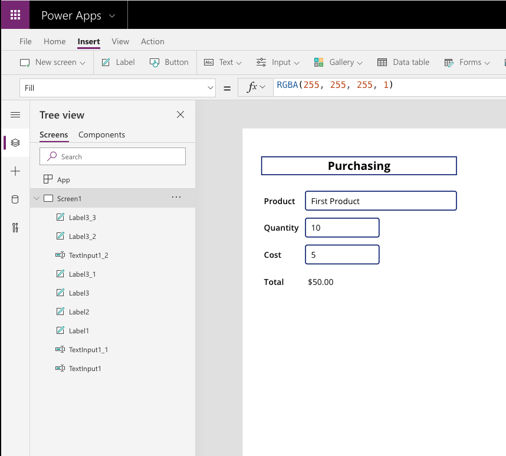

In Power Apps, like Excel, you can create formulas to calculate and
return values. The following are a few common functions that you can use when working with
numbers and calculating values:

-   **Average** - Calculates the average, or arithmetic mean, of its
    arguments.

-   **Max** - Finds the maximum value.

-   **Min** - Finds the minimum value.

-   **Sum** - Calculates the sum of its arguments.

-   **StdevP** - Calculates the standard deviation of its arguments.

-   **VarP** - Calculates the variance of its arguments.

You can incorporate controls into your calculations by referencing
the function name.

the following example shows how to calculate the sum of goods and services.

1.  Add 6 **Labels** and 3 **Text Inputs** to your canvas app,
    as shown in the following screenshot.

	

2.  Select the **Label** to the right of "Total".

3.  Change the **Text** property to the following.

    ```powerappsfl
    Sum(TextInput1_1 * TextInput1_2)
    ```

>(In this example, TextInput1_1 is the Quantity purchased and TextInput1_2 is the Cost per item.)

4.  Now preview the app by selecting the **Play** button in the
    upper-right corner. Test the formula.

5.  Next, format the formula to display the value as a Currency. Update
    the formula as follows.
    ```powerappsfl
    Text(Sum(TextInput1_1 * TextInput1_2),"$#,###0.00")
    ```

For more information, see [Power Apps Aggregate Functions](https://docs.microsoft.com/powerapps/maker/canvas-apps/functions/function-aggregates).
