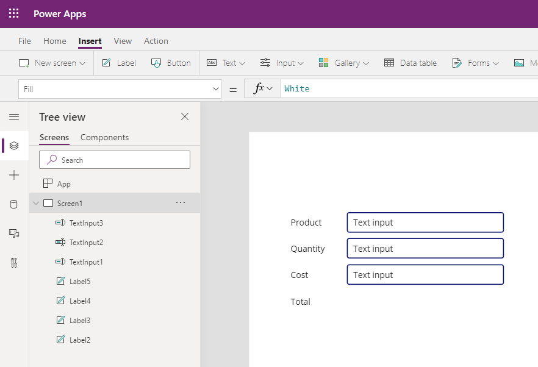
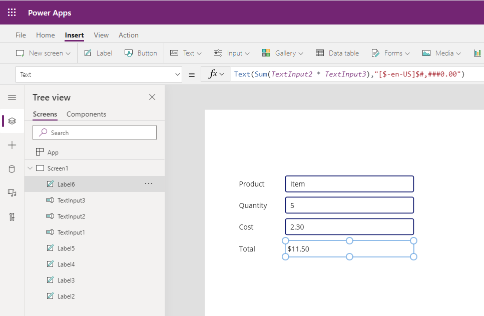

In Power Apps like Excel, you can create formulas to calculate and
return values. The following are a few common functions that you can use when working with
numbers and calculating values:

-   **Average** - Calculates the average, or arithmetic mean, of its
    arguments.

-   **Max** - Finds the maximum value.

-   **Min** - Finds the minimum value.

-   **Sum** - Calculates the sum of its arguments.

-   **StdevP** - Calculates the standard deviation of its arguments.

-   **VarP** - Calculates the variance of its arguments.

You can incorporate controls into your calculations by referencing
the function name.

The following example shows how to calculate the sum of goods and services.

1. Navigate to [Power Apps](https://make.powerapps.com/).

1. Select **+ New App** and **Canvas**.

1. At the bottom, under **Blank app**, select **Tablet layout**.

1. Select the **Insert** tab and add a **Label**.

1. Change the **Text** property to *Product*.

1. Add three more **Labels** and change the **Text** properties to *Quantity*, *Cost*, and *Total*, respectively.

1. Select the **Insert** tab, then the **Text** dropdown, and insert three **Text Inputs** to your canvas app,
   and arrange them as shown in the following screenshot.

   

1. Insert another **Label** to the right of *Total*.

1. Change the **Text** property to the following.

   ```powerappsfl
   Sum(TextInput2 * TextInput3)
   ```

   (In this example, TextInput2 is the Quantity purchased and TextInput3 is the Cost per item.)

1. Now preview the app by selecting the **Play** button in the
   upper-right corner. Test the formula by entering some numbers for the quantity and price.

1. Next, format the formula to display the value as a Currency. Update
   the formula as follows.
   ```powerappsfl
   Text(Sum(TextInput2 * TextInput3),"$#,###0.00")
   ```
   
   

For more information, see [Power Apps Aggregate Functions](/powerapps/maker/canvas-apps/functions/function-aggregates/?azure-portal=true).
