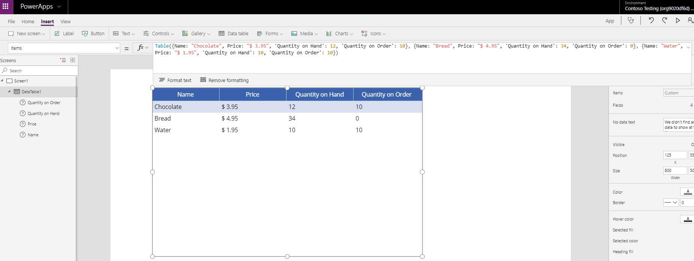
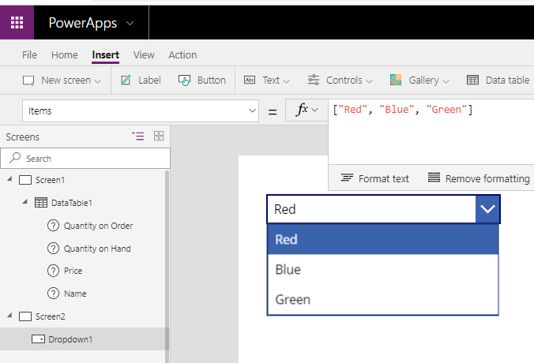

Often your table of data will come from a data source
so you need to create a table manually. 
This might be to populate a **Dropdown** control or to define
information to be used in a **Gallery** or **Data table** control. To
create a table, there is the **Table** function.

The **Table** function allows you to create a table of data that only
exists in the context, which it is used within your app. For example, to
recreate the table shown in the previous section you can use the **Table**
function in the **Items** property of a **Data table**. The formula
would be as follows.

```powerappsfl
Table({Name: "Chocolate", Price: "$ 3.95", 'Quantity on Hand':
12, 'Quantity on Order': 10}, {Name: "Bread", Price: "$ 4.95",
'Quantity on Hand': 34, 'Quantity on Order': 0}, {Name: "Water",
Price: "$ 1.95", 'Quantity on Hand': 10, 'Quantity on Order':
10})
```



Sometimes you need a simpler, single column **Table** for populating a
**Dropdown** control choices. In that instance you can use the short cut
method of **\[ \]** to create a single column table. An example of
creating a single column table with the colors Red, Blue, and Green is
shown below.

```powerappsfl
["Red", "Blue", "Green"]
```

By placing that formula in the Items property of a Dropdown control, you will see the following.


