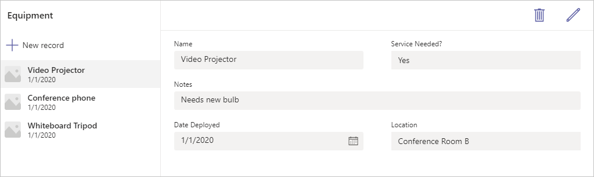

Today's business problems increasingly require modern digital solutions. With a low-code platform, anyone with a great idea can build a digital app. Microsoft Dataverse for Teams allows you to build modern digital apps and deploy them to help you and your team solve those problems.

Each app that you build uses the hero template as the default app layout to help you quickly get your app working. It allows you to list records, create new records, and then drill into existing records to review or make changes.

This module explains how to use Dataverse for Teams to build an app.
