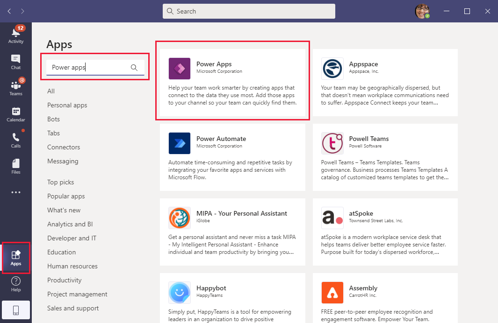
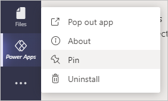
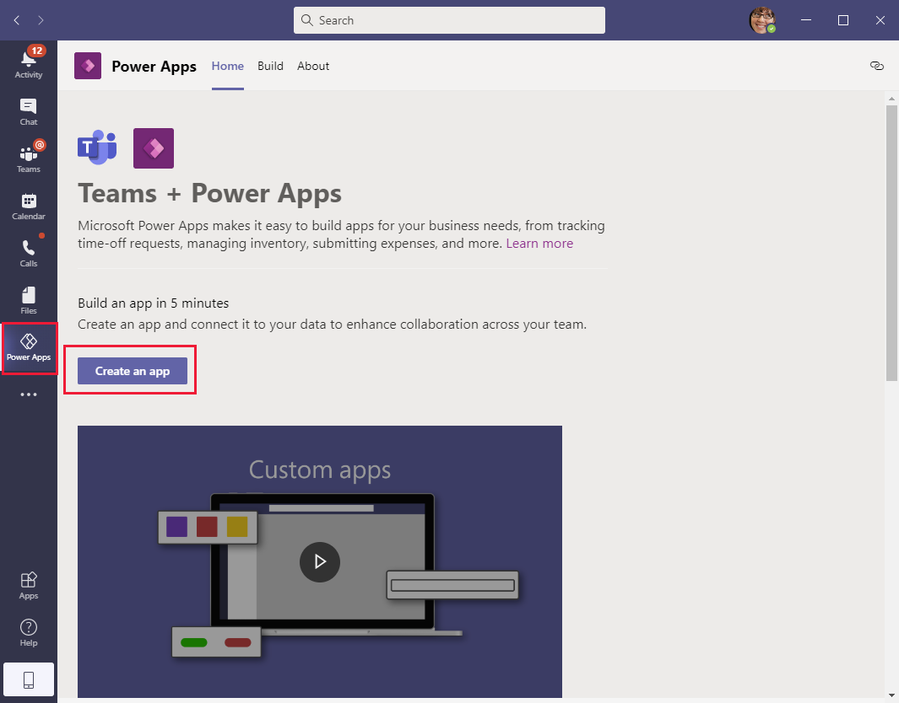
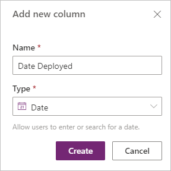
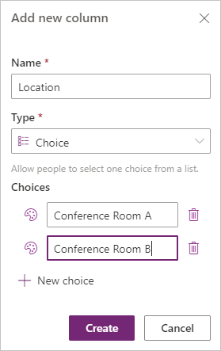
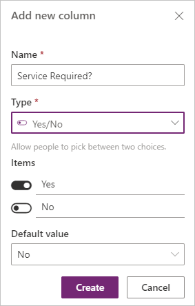
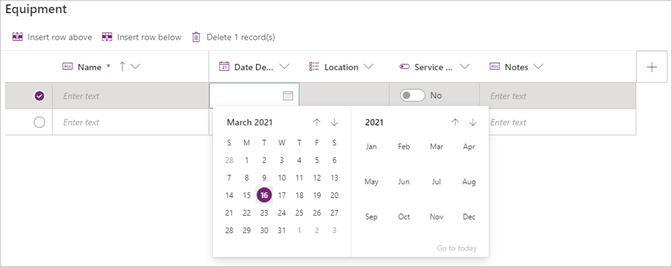
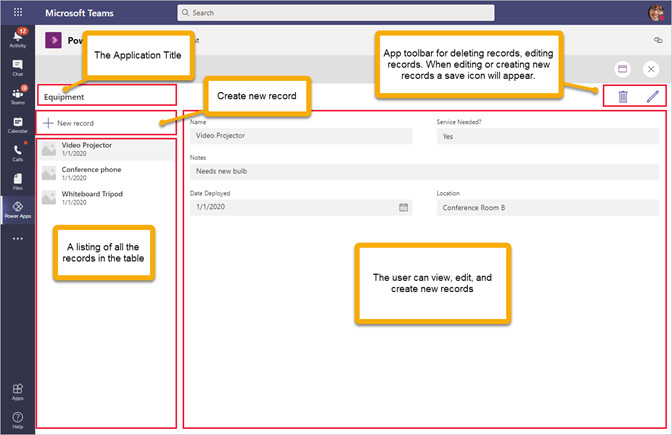

The following steps show how to create an app from Microsoft Teams.

## Step 1: Identify a Microsoft team 

All Dataverse for Teams apps require a Microsoft team to store the Microsoft Power Apps data. Only team members will be able to access your app by default.

## Step 2: Add the Power Apps application to Teams

1. Launch Teams or use your browser to open [Teams](https://teams.microsoft.com).

1. In Teams, select **Apps** in the lower-left corner of the screen.

1. In the search box, enter **Power Apps** and then select it from the search results.

   

1. Select **Open** to install Power Apps.

   > [!NOTE]
   > Pin the app for Power Apps to the app launcher so that you can quickly access it any time. Right-click the Power Apps icon and then select **Pin**. You can also run the app as a separate window from Teams by selecting **Pop out app**.
 
   

## Step 3: Create a new app

After you have installed Power Apps, you can create your first app.

1. From Teams, open the Power Apps application and then select **Start now**.
    
    

1. Select a team for your app and then select **Create**.

1. Enter the name of your app and then select **Save**.

The hero template for your app will display. It's currently empty because you haven't connected a Dataverse table to it.

## Step 4: Create and connect a table to your app

1. Open your new app, select **With data** and then select **Create new table**.

1. Enter a new table name and then select **Create**.

1. Add new columns to your table by selecting **+ New column**.

   For each column, provide a **Name** and then select the **Type** of data that it holds. By choosing the appropriate data type, you'll be able to access intelligent, out-of-the-box features to make your app more manageable for people to use.

   For the table, you need to track the date that the equipment was deployed, the location, whether service is needed, and relevant notes.

   - For tracking the deployment date, use date type of **Date**.
    
     

   - To limit the location options to "Conference Room A" and "Conference Room B," use the **Choice** data type. To add more choices, select **+ New choice**.
    
     

   - To indicate if service is needed, use **Yes/No** as the data type because you only need to switch between two options. This data type limits a user to only two choices.
    
     

   - Use the **Text** data type for the **Notes** column.

     

      The following list of data types is available by using the visual table editor. For a complete list of all available data types and how they work, see the links in the Summary unit at the end of this module.

      |     Data Type    |     Description    |
      |-|-|
      |     Text    |     A single line   of text.    |
      |     Email    |     Text in email   format; will be selectable for the user.    |
      |     URL    |     A hyperlink   in URL format; will be selectable for the user.    |
      |     Phone     |     Text Click-enabled phone numbers to initiate calls.     |
      |     Auto Number    |     Defines an   autogenerated number sequence.    |
      |     Number    |     An integer   (for example, 10 or -10).    |
      |     Date    |     Allows users   to enter or search for a date.    |
      |     Formula     |     Enables Power Fx formula logic for the column     |
      |     Decimal    |     A number with   a decimal point (for example, 1.5 or -1.5).    |
      |     Lookup    |     References a primary column in another table.    |
      |     Choice    |     Allows people to select one choice from a list.    |
      |     Yes/No    |     Allows people to pick between two choices.    |

4. To add data to your table, select **+ New row**. Enter data that you want people to see when they use your app.
    
    Notice how the choice of data type changes the user experience to fit the type of data that is being stored.

    - **Date Deployed** - A calendar can be used to select the **Date**.
    - **Location** - Uses a drop-down list of options that are defined in the **Choice** data type.
    - **Service Required** - The user can select between **Yes/No** with a toggle.
    - **Notes** - The user can enter **Text**.

   

1. Select **Close** to finish editing the table. It might take a few minutes to process the table. After the processing has been completed, the hero template will appear, showing the data loaded into the app.

1. Select **Save** in the toolbar to create the first saved version. After the first save, Power Apps will continue to save automatically every two minutes while you're editing.

## Step 5: Preview and test your app

To preview and test your app, select the **Preview** button in the upper right.

The hero template automatically creates a functioning app with your data. After a data source has been linked, you can instantly view, edit, and delete existing records or create new ones.

>  
