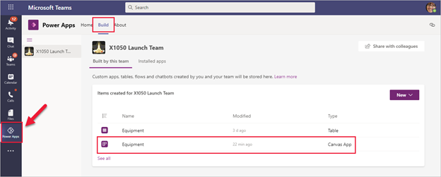
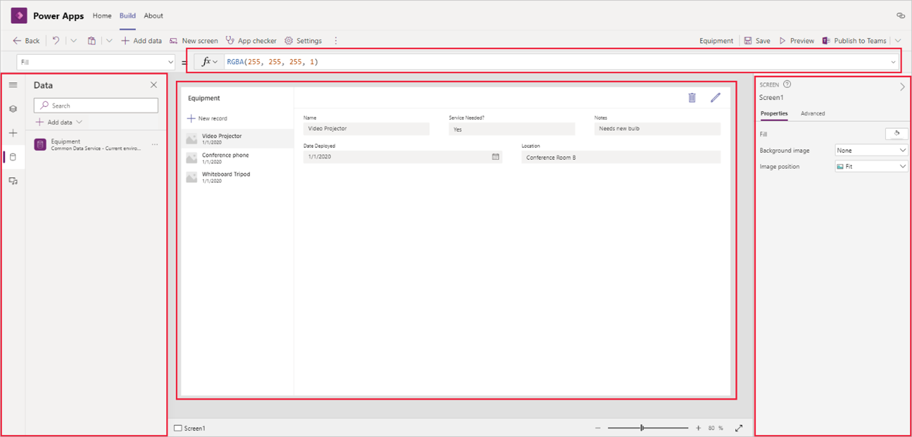
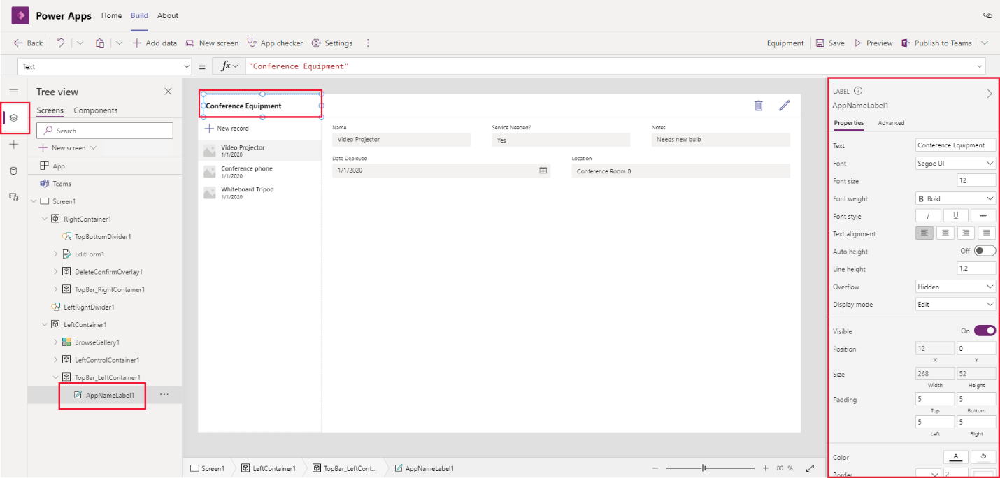
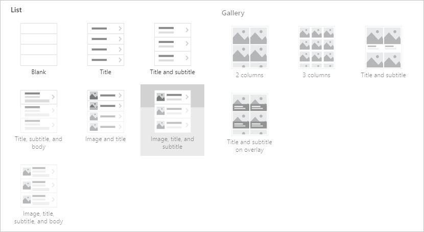
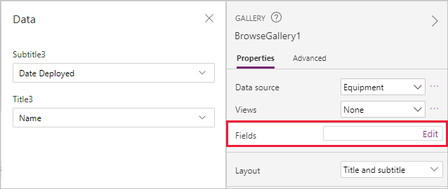
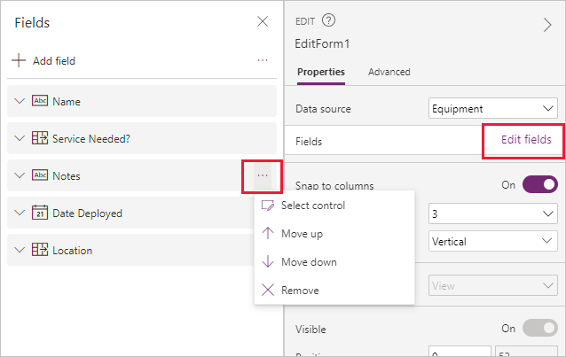

In the previous lesson, you created a new app by using your data that was loaded into Dataverse for Teams. The hero template can quickly make a useful app, but you will often want to customize the app to suit your needs.

For this lesson, you will change the title of the app, the layout of the gallery, and the order of fields.

To start, open Teams by using the desktop client or by browsing [Teams](https://teams.microsoft.com/?azure-portal=true), and then open the app for Power Apps. Select the **Build** tab at the top and then select your app.

Your app will open in Microsoft Power Apps Studio for editing.

> [!NOTE]
> It's always a good idea when you first start editing to select **Save** in the toolbar. After the first save, Power Apps will continue autosaving every two minutes while you are editing.

Power Apps applications are built by using various UI elements that are referred to as **Controls**. Use controls to help create a better experience when your users are navigating and interacting with the app. 

Common controls include:

- **Label** - Display information to the user as text, numbers, dates, or currency.

- **Edit form** - Allows the user to create and edit records and then save them.

- **Text box** - A box where a user can enter data such as text and numbers.

- **Vertical gallery** - Displays multiple records from a data source in a vertical orientation. This control can show multiple types of data for each record.

- **Add icon** - Select from a library of graphical symbols. This control can be configured to respond when a user selects them.

- **Rectangle** - A border shape that can be placed anywhere on the app.

- **Date picker** - Allows the user to select a date by using a calendar pop-up window.

- **Button** - A way for the user to interact with the app.

When you are editing the app, select between the following options in the left column:

-   **Tree view** - Displays a visual hierarchy of all controls in the app.

-   **Insert** - Insert new controls such as labels, buttons, icons, and forms.

-   **Data** - Add more tables from Dataverse for Teams or add a connector to other Microsoft Office 365 services.

-   **Media** - Add images, videos, and audio.

The center of the screen is where you move and edit the components that make up your app. When a control is selected from the tree view or in the app view, the **Properties** pane displays the properties. At the top of the screen is the formula bar, which allows for more editing capabilities.

## Change text in a label

When editing your app, you need to select the control item so that the properties will appear on the right. To change the title that appears in the app, you first need to choose the label that has the text. 

You can choose either of the following actions:

-   Select **Tree view** and then scroll down to select **AppNameLabel1**.
-   Select the title in the app and then **AppNameLabel1** will appear in the **Properties** pane.

After the control item has been selected, you can edit the **Text** properties on the right side of the screen. You can also change other properties such as **Font**, **Font size**, and **Text alignment**. This process can be used to change the text and appearance of any label in the app.

## Change the layout of a gallery

A **gallery** control displays multiple records for the user to view and select from. Each record in the gallery can display multiple types of information. For example, a gallery could show a listing of inventory items that show the name, model number, and price for each. Depending on what you need, galleries come in various vertical and horizontal layouts.

To change the layout of the gallery, select the gallery in the app or find **BrowseGallery1** in the tree view. Under the **Properties** pane, select from various **Layout** options.

To change the content of the gallery's fields, go to the **Properties** pane and select **Edit** next to the **Fields** option. The areas that you can change will depend on the gallery layout that you selected. For each field, use the drop-down list to choose the data.

## Change the order in which fields appear

To change the order in which fields appear, follow these steps:

1. Select the form in the app or find **EditForm1** in the tree view.

1. Under the **Properties** pane, select **Edit fields** next to **Fields**.

1. Right-click the ellipsis next to each field to bring up more options. Select from **Move up**, **Move down**, or **Remove**.
    
    
